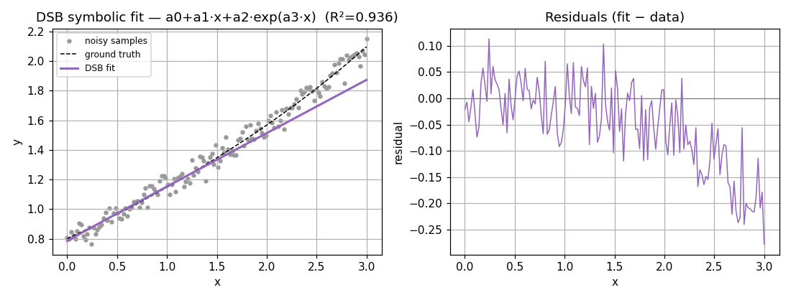

# DSB — Differential Spectra Balance

> Symbolic, analytical reference method. Source:
> [`extra/dt/dsb.py`](../../src/dtfit/extra/dt/dsb.py),
> [`extra/dt/taylor.py`](../../src/dtfit/extra/dt/taylor.py),
> [`extra/dt/solve.py`](../../src/dtfit/extra/dt/solve.py).
> Invoke via `nonline_fit(expr, var, method="dsb", coeffs_poly=...)` or
> `NonlineRegressor(expr, var, method="dsb")` (which runs the polynomial
> pre-fit for you).

DSB is the **foundational method** of the scheme: it is the direct, exact
realization of "two analytic functions are equal iff their differential spectra
are equal." Every other method in `dtfit` is a numeric relaxation of the DSB
balance. It is kept as the **analytical ground truth / derivation tool**, not as
a production fitter (see [Applicability](#where-it-is-best-applied)).

## Mathematical grounding

Let the data be summarized by a polynomial model $P(t)=\sum_{k} c_k t^{k}$
(easily obtained by ordinary least squares — linear in its coefficients). The
differential transform of any analytic $g$ about $t_0=0$ is
$G(k) = \tfrac{H^{k}}{k!}\,g^{(k)}(0)$, i.e. its Maclaurin coefficient scaled by
$H^{k}$.

**The $H$ cancels in the balance.** Each balance equation sets the model
discrete equal to the data discrete *at the same order* $k$, so the common
factor $H^{k}$ appears on both sides and cancels. The balance therefore reduces
to matching **plain Maclaurin coefficients** $a_k = g^{(k)}(0)/k!$. For the
polynomial these are simply its ascending coefficients,

$$
Z(k) \;=\; c_k .
$$

Let the target nonlinear model be $f(t;\theta)$ with unknown parameters
$\theta=(\theta_1,\dots,\theta_m)$. Because we only need Maclaurin coefficients,
its spectrum is obtained by **generic SymPy differentiation**,

$$
F(k;\theta) \;=\; \frac{1}{k!}\,\frac{\partial^{k} f}{\partial t^{k}}\Big|_{t=0},
$$

(see [`taylor_coeffs`](../../src/dtfit/extra/dt/taylor.py)). This is the key
simplification over the original implementation: there is **no table of
closed-form discretes** for $e^{wt},\sin,\cos$, monomials, and no symbolic
"reflection" pass — so DSB now works for *any* differentiable model expression
(rational, logarithmic, mixed, …), not just the handful that had hand-written
rules. DSB then forms the **balance system**

$$
F(k;\theta) - Z(k) \;=\; 0, \qquad k = 0,1,\dots,R,
$$

and solves it for $\theta$.

**Why it is sound.** The differential transform is a linear bijection between an
analytic function and its spectrum on the radius of convergence. If the data
truly come from $f(t;\theta^*)$ and the polynomial captures the spectrum up to
order $R\ge m$, then equating the first $R{+}1$ discretes forces
$f(\cdot;\theta)=f(\cdot;\theta^*)$ on that interval, so the balance recovers
$\theta^*$ up to the model's identifiability. On clean, analytic data this is
an **exact** identification, not an approximation — that is DSB's role as the
reference against which the numeric methods are judged.

When the balance has more equations than unknowns ($R+1 > m$) the system is
overdetermined; DSB then solves the leading $m$ equations symbolically and
**refines** against the full system by nonlinear least squares
([`solve_numeric`](../../src/dtfit/extra/dt/solve.py)).

## Algorithm

1. **Polynomial pre-fit** (in the pipeline / `NonlineRegressor`): fit
   $P(t)=\sum_k c_k t^k$ by OLS; the degree is chosen by BIC with a floor of
   $m-1$ so the transfer system is not underdefined.
2. **Empirical spectrum**: $Z(k)=c_k$ — the polynomial's ascending
   coefficients are the Maclaurin coefficients directly (no $H$ factor).
3. **Model spectrum**: $F(k;\theta)=f^{(k)}(0)/k!$ by generic SymPy
   differentiation (`taylor_coeffs`), one expression per order.
4. **Balance**: form $F(k;\theta)-Z(k)$ for $k=0..R$; drop any
   parameter-free order (e.g. the identically-zero even orders of $\arctan$),
   which would otherwise make the square system inconsistent.
5. **Solve**: `sympy.nonlinsolve` on the leading square subsystem; for the
   overdetermined case, `least_squares` refine over the full balance
   (`solve_numeric`). If the symbolic solver finds nothing, fall back to numeric
   least squares.
6. **Root selection**: discard complex roots and degenerate zero solutions,
   then pick the real candidate with the smallest residual over the full balance
   (`solve_nonline`).
7. **Model**: substitute $\theta$ back into the symbolic expression and
   `lambdify` a callable; an overdetermined balance also yields a parameter
   covariance estimate (`FittingResult.cov`).

## Optimizations and guards

- **Linear pre-fit, nonlinear transfer.** The expensive part (capturing the
  signal shape) is done by *linear* OLS; only the small $m\times m$ transfer to
  nonlinear parameters is nonlinear.
- **Overdetermined fallback** — leading-subsystem symbolic solve + NLLS refine
  on the full balance, so extra discretes improve rather than break the fit.
- **Root filtering** (`solve_nonline`) drops complex and degenerate roots that
  `nonlinsolve` returns, so a usable real solution is selected automatically.
- **Underdefined-system guard**: `nonline_fit` raises if the polynomial carries
  fewer coefficients than the nonlinear spectrum needs, and `NonlineRegressor`
  enforces a degree floor of $m-1$.

## Worked example

`y = a0 + a1·x + a2·exp(a3·x)` on `x∈[0,3]` with 5 % noise — DSB's intended
**additive** form (one term per discrete branch). It produces a faithful curve
fit (R² ≈ 0.95); the residual structure at large `x` shows where a single
exponential term cannot bend enough to follow the data.

## Comparison

**Model data — `y = a0 + a1·x + a2·exp(a3·x)`, x∈[0,3], 5 % noise.** DSB is
evaluated as a *curve fit* (R²). Under noise it does **not** uniquely recover
the four parameters — which is precisely why the numeric LSI/EDA successors
exist.

| method | R² | RMSE | MAPE % | fit (ms) |
|---|---|---|---|---|
| DSB (symbolic ref.) | 0.9526 | 0.08126 | 2.94 | 73.7 |
| LSI (same model) | 0.9976 | 0.01822 | 0.77 | 24.0 |
| SciPy `curve_fit` | 0.9998 | 0.005879 | 0.41 | 0.2 |

## Where it is best applied

**Use DSB for:** analytical derivation and validation — establishing the exact
parameter mapping for a model, generating ground-truth fits on clean/analytic
signals, and serving as the reference the numeric methods are checked against.

**Do not use DSB for** noisy data, production fitting, or any runtime/streaming
path: `sympy.nonlinsolve` has unbounded, input-dependent latency, and the
symbolic solve is sensitive to the polynomial pre-fit's high-order coefficients
(which are ill-conditioned under noise). The numeric successors —
[LSI](lsi.md) (batch accuracy) and [EDA](eda.md) / the
[EqualAreasFilter](equal_areas_filter.md) (robust / real-time) — are the
deployable methods.

### Generic-model support and limitations

Moving to generic Maclaurin coefficients removes the old
`Spectrum.__reflect` restriction entirely: there is no longer a hand-written
discrete table, so models such as `a*exp(b*x)` (a bare product), `a/(1+b*x)`,
`a*log(1+b*x)` or `a0 + a1*atan(a2*x)` are all admissible — anything SymPy can
differentiate.

Two intrinsic caveats remain (unchanged in character from before):

- **Identifiability needs enough orders.** A model whose low Maclaurin orders
  do not separate its parameters (e.g. $\arctan$, whose even orders vanish, so
  amplitude and frequency only split at order 3) requires a higher polynomial
  degree. DSB raises a clear error if too few parameter-bearing orders are
  available rather than returning garbage; raise `poly_degree` / `rank`.
- **Reference, not robust estimator.** The balance is matched against the
  polynomial pre-fit's high-order coefficients, which are ill-conditioned under
  noise. On clean/analytic data DSB identifies parameters well; on noisy data it
  is a *curve fit* and may land in an alternate basin. For real fitting use
  [LSI](lsi.md) / [EDA](eda.md), which fit the raw `(x, y)` directly.
