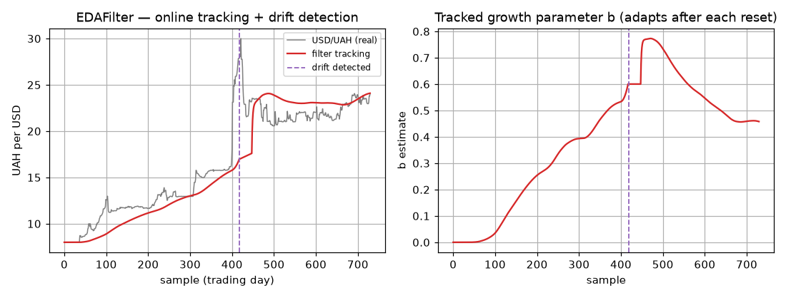

# EDAFilter — recursive (streaming) EDA

> Numeric **online** method — the deployable real-time path. Source:
> [`streaming/_eda.py`](../../packages/dtfit/src/dtfit/streaming/_eda.py).
> Invoke via `dt.EDAFilter(expr, var, p0=, window_size=, ...)` then
> `flt.partial_fit(t, y)` per sample; `flt.predict(x)`, `flt.params_`.

The EDAFilter runs [EDA](eda.md)'s equal-areas identification
**recursively**, one sample at a time, as a Kalman-style estimator. It tracks
**time-varying** parameters online at bounded cost per update and carries a
two-sided **concept-drift detector**. This is the tier that satisfies the
dissertation's hard requirement — bounded per-sample latency, no symbolic solve
on the hot path.

It is the **area-measurement** streaming filter — the online twin of batch
[EDA](eda.md). Its sibling, the [LSIFilter](legendre_filter.md), is the same
recursion with a **spectrum** measurement (use it for oscillatory plants, whose
cycle an area criterion partly cancels). Many streams run in lockstep via a
[FilterBank](filter_bank.md), with a pooled multi-axis fault detector.

## Mathematical grounding

The state is the parameter vector $\theta$, modelled as a random walk
$\theta_{t} = \theta_{t-1} + w_t$, $w_t\sim\mathcal N(0,Q)$ (the process noise
$Q$ is what lets parameters drift). Over the current sliding window of length
$W$, the **measurement** is the EDA area innovation

$$
e \;=\; \underbrace{\int_W y\,dt}_{S_{\exp}} \;-\; \underbrace{\int_W f(t;\theta)\,dt}_{S_{\text{theor}}},
$$

experimental minus model area. Its sensitivity to the parameters is the
**integrated Jacobian** (exactly EDA's)

$$
h_j \;=\; \int_{W} \frac{\partial f}{\partial\theta_j}(t;\theta)\,dt .
$$

The extended-Kalman update is then standard (here $H$ is the measurement
Jacobian, $R$ the measurement-noise covariance):

$$
\begin{aligned}
S &= H\,P\,H^{\top} + R && \text{(innovation covariance)}\\
K &= P\,H^{\top}S^{-1} && \text{(gain)}\\
\theta &\leftarrow \theta + K\,e && \text{(correction)}\\
P &\leftarrow (I - K\,H)\,P + Q && \text{(covariance update)} .
\end{aligned}
$$

**Vector measurement (`n_sub`).** With `n_sub=1` (default) $H$ is the single row
above and the update is the original scalar form. For `n_sub`$=s>1$ the window is
split into $s$ sub-areas, giving a **vector** innovation $e\in\mathbb R^{s}$ and
an $s\times m$ Jacobian $H$ — more independent equations per sample, which
improves observability of coupled multi-parameter models and speeds convergence.
Because sub-areas are smaller, a *fixed* $R$ tuned for the full window becomes
mis-scaled; pairing `n_sub>1` with `adapt_r=True` (a Mehra-style online estimate
of $R$ from the innovation power) keeps it calibrated. The drift detector still
runs on the scalar full-window innovation (the sum of the additive sub-areas),
so its careful calibration is untouched.

Because the measurement is an **area** (an integral), the same noise-robustness
argument as batch EDA applies — the filter corrects against a denoised integral
functional of the window, not against a raw sample. The model and its
derivatives are compiled (`lambdify`) **once in `__init__`**; every
`partial_fit` is pure NumPy/Simpson at $O(W\cdot m)$ cost, so the hot path
contains no SymPy and has bounded latency.

## Guards — drift detection

A single smooth parameter track cannot represent a **structural break** (regime
change). The filter watches the innovation stream for drift and, on detection,
resets its memory so it re-adapts immediately. Two complementary tests run on a
**self-standardized** innovation $z$, and several guards keep them honest:

**Self-standardization (guard against miscalibrated area scale).** The
theoretical innovation covariance $S$ is hard to calibrate for an area
measurement (empirically the raw innovation std was ~0.018 — wildly off the
model $S$, so a naive NIS test never fired). Instead each tested innovation is
standardized by an **EWMA of $e^2$ built from *prior* windows**, not the current
one:

$$
z = \frac{e}{\sqrt{\sigma^2}},\qquad
\sigma^2 \leftarrow (1-\lambda)\,\sigma^2 + \lambda\,e^2,\ \ \lambda=0.25 .
$$

Using the *baseline* scale means a sudden jump shows up as a large $z$ instead
of inflating its own scale and hiding.

**Decimation (guard against autocorrelation false-alarms).** The Kalman update
runs every sample, but the drift statistic is evaluated **only on
non-overlapping windows** (stride $W$). Consecutive sliding-window areas are
heavily autocorrelated; testing every step would make the CUSUM false-alarm
constantly. Decimating to stride $W$ makes the tested innovations approximately
independent.

**Warmup (guard against premature firing).** The first `_warmup_tests` (3)
decimated windows only build the baseline scale and let the filter converge —
the detector is not armed until then.

**Test 1 — NIS (sudden jump).** A normalized-innovation-squared $\chi^2$ test,
$z^2 > \chi^2_{1,\,1-\alpha}$, catches a single large shift. Symmetric in sign
by construction.

**Test 2 — two-sided CUSUM (sustained drift).** Accumulates evidence for a slow,
sustained shift the instantaneous NIS misses, in **both** directions:

$$
g_{\text{hi}} \leftarrow \max(0,\ g_{\text{hi}} + z - k),\qquad
g_{\text{lo}} \leftarrow \max(0,\ g_{\text{lo}} - z - k),
$$

tripping on $g_{\text{hi}} > h$ (drift **up**) or $g_{\text{lo}} > h$ (drift
**down**). $k$ (`cusum_k`, the slack/reference in innovation σ) is the smallest
shift to ignore; $h$ (`cusum_h`) trades false alarms against detection lag.

**On detection — re-adaptation.** `_on_drift` re-arms the filter, then zeroes
both CUSUM arms and the EWMA scale and restarts the warmup. Two re-arm modes:
`drift_reset="full"` (default) resets the covariance to its large prior $P_0$ and
clears the window buffers — fast, but discards the parameter estimate's history;
`drift_reset="inflate"` instead multiplies the covariance by `drift_inflation`
and **keeps** the current estimate and window — a gentler re-adaptation that lets
new data dominate without throwing away hard-won parameter information (useful
for small/partial regime changes). It exposes `n_drifts_`, `drift_flag_` (true
only on the exact step a drift fires) and `last_drift_direction_` (+1 up / −1
down).

## Algorithm (per `partial_fit`)

1. Clear `drift_flag_`; push `(t, y)`, evict the oldest if the window exceeds
   $W$. Return early until the window is full.
2. Compute window areas $S_{\exp}$, $S_{\text{theor}}$ (Simpson) → innovation
   $e$; integrated Jacobian $h$; innovation covariance $S = hPh^\top + R$.
3. Every $W$ full-window steps, run the **drift step** (self-standardize → EWMA
   update → warmup gate → NIS + two-sided CUSUM). If it fires, reset and return.
4. Otherwise apply the Kalman correction $\theta \mathrel{+}= K e$, update $P$.

## Optimizations and guards (summary)

- **Compile-once** model + derivatives; **bounded $O(W\cdot m)$** per update, no
  SymPy on the hot path → real-time safe.
- **Integral (area) measurement** → inherits EDA's noise robustness.
- Drift guards: **self-standardized** innovation, **decimated** testing,
  **warmup**, **NIS + two-sided CUSUM**, **covariance reset** for fast
  re-adaptation. (See above.)
- `update` is an alias for `partial_fit` (recursive-filter naming).

## Worked example

USD/UAH official daily rate, NBU, 2014–2015 hryvnia crisis (≈8 → 24). **Left:**
the filter tracks the depreciation online (one-sample lag) and flags the
**Feb-2015 free-float** as a structural break (dashed line). **Right:** the
tracked growth parameter `b` — it climbs with the depreciation, jumps at the
detected break, and re-adapts after the covariance reset. Detection in *both*
directions is unit-tested on controlled step signals
(`tests/test_streaming.py`).

## Comparison

**Real data — USD/UAH 2014-2015** (NBU daily, 7.99 → 24.00). One-step-ahead
forecasting against the naive random walk, the standard FX benchmark. The filter
flagged **1** structural break.

| method | R² | RMSE | MAPE % |
|---|---|---|---|
| EDAFilter (lag-1 tracking) | 0.7933 | 2.483 | 9.22 |
| EDAFilter (1-step-ahead) | 0.7883 | 2.51 | 9.36 |
| naive random walk (1-step) | 0.9963 | 0.331 | 0.67 |

**Read this honestly.** Daily FX is famously near a random walk, so "tomorrow =
today" is extremely hard to beat one step out — and the filter does **not** beat
it (RW MAPE 0.67 % vs 9.36 %). That is the expected, well-known result, not a
defect. The filter's value is different and not captured by one-step error:
**bounded-cost online tracking of time-varying parameters** plus **structural-break
detection** — it isolates the Feb-2015 regime change automatically, which the
random walk cannot do.

## Where it is best applied

**Use the EDAFilter for:** real-time / streaming control loops
(unmanned/motion control), sensor and economic/currency streams where the model
parameters drift over time, and any setting that needs **bounded per-sample
latency** with **automatic regime-change detection**, on **monotone / saturating**
signals where the cheap area measurement suffices.

**Caveats.** It tracks parameters at a one-sample lag; it is not a point
forecaster that will beat a random walk on near-RW series. For **oscillatory**
plants use the [LSIFilter](legendre_filter.md) (the area measurement partly cancels
a cycle). For an accurate *static* batch fit use [LSI](lsi.md) or [EDA](eda.md).
Tune `window_size` (smoothing vs responsiveness), `q_diag` (drift speed), `r`
(measurement trust) and the CUSUM `cusum_k`/`cusum_h` (detection sensitivity vs
false alarms) to the stream.
