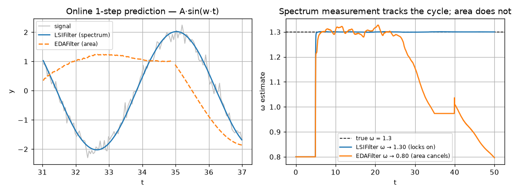

# LSIFilter — recursive (streaming) LSI

> Numeric **online** method. Source:
> [`streaming/_lsi.py`](../../packages/dtfit/src/dtfit/streaming/_lsi.py).
> Invoke via `LSIFilter(expr, var, p0=, window_size=, order=, ...)` then
> `flt.partial_fit(t, y)` per sample; `flt.predict(x)`, `flt.params_`.

The LSIFilter runs [LSI](lsi.md)'s spectral identification **recursively**, one
sample at a time, as an extended-Kalman estimator. It is the streaming twin of the
[EDAFilter](equal_areas_filter.md), differing in **what it measures**: where the
EDAFilter corrects against a single integrated **area** over the sliding window,
the LSIFilter corrects against the window's **orthogonal Legendre spectrum** — a
richer, multi-component measurement. That extra structure is what lets it track
**oscillatory** plants, whose cycle the scalar area criterion partly cancels.

## Mathematical grounding

The state is the parameter vector $\theta$, modelled as a random walk
$\theta_t = \theta_{t-1} + w_t$, $w_t\sim\mathcal N(0,Q)$. Over the current sliding
window of length $W$, the **measurement** is the window's Legendre spectrum (the
first $L{+}1$ coefficients, `order` $=L$):

$$
\beta^{\text{data}} = \Pi\, y_W
\quad\text{(cached projection)},
\qquad
\beta^{\text{model}}(\theta)_j = \int_{W} f(t;\theta)\,P_j(u(t))\,dt
\quad\text{(quadrature)} ,
$$

and the **vector innovation** is their difference

$$
e \;=\; \beta^{\text{data}} - \beta^{\text{model}}(\theta) \;\in\; \mathbb R^{L+1}.
$$

Its sensitivity to the parameters is the **spectral Jacobian** $H\in\mathbb
R^{(L+1)\times m}$, whose column $j$ is the Legendre projection of
$\partial f/\partial\theta_j$ over the window — exactly LSI's model spectrum,
differentiated. The extended-Kalman update is then standard:

$$
\begin{aligned}
S &= H\,P\,H^{\top} + R && \text{(innovation covariance)}\\
K &= P\,H^{\top}S^{-1} && \text{(gain)}\\
\theta &\leftarrow \theta + K\,e && \text{(correction)}\\
P &\leftarrow (I - K\,H)\,P + Q && \text{(covariance update)} .
\end{aligned}
$$

**The measurement-noise covariance is diagonal with the orthonormal weighting**
$R_{jj} = r\,(2j+1)$. This is the streaming counterpart of batch LSI's $1/(2j+1)$
criterion weight: the higher-order Legendre coefficients are noisier, so they are
trusted less. With `adapt_r=True` the base $r$ is rescaled online from an EWMA of
the normalized innovation power (Mehra-style).

Because the empirical spectrum over a (near-)uniform streaming window is a fixed
linear map, the projection $\Pi$ is a **single cached matrix** $\Pi=\text{pinv}(V)$
where $V$ is the Legendre Vandermonde on the normalized in-window positions — so
$\beta^{\text{data}}=\Pi y_W$ is one mat-vec. The model spectrum and its Jacobian
use Gauss–Legendre quadrature on mapped nodes (the model is integrated exactly, as
in batch LSI). The model and its derivatives are compiled (`lambdify`) **once in
`__init__`**; every `partial_fit` is pure NumPy at $O(W\cdot(L{+}m))$ cost with no
SymPy on the hot path — real-time safe.

## Why a spectrum, not an area

A pure area $\int_W y$ over a window spanning roughly an integer number of cycles
of an oscillation is **near zero regardless of amplitude or phase** — the positive
and negative half-cycles cancel — so an area measurement is nearly blind to an
oscillatory model's parameters. The Legendre spectrum keeps the higher orders that
*do* respond to a cycle, so the LSIFilter observes (and tracks) frequency,
amplitude and phase where the EDAFilter cannot. The embedded-control domain study
confirms this split: LSIFilter for oscillatory / sustained-cycle plants, EDAFilter
for monotone / polynomial ones.

## Guards — drift detection

Like the EDAFilter, the LSIFilter watches the innovation stream for **structural
breaks** and re-arms on detection, with the same family of guards (self-calibrated
scales, decimated non-overlapping testing, a warmup). Because the measurement is a
vector, the detector uses two complementary, **self-normalizing** statistics:

- **Spectral-energy jump test (NIS-like).** A scalar energy of the innovation
  vector is standardized by an EWMA of its own prior values and flagged when it
  exceeds a ratio threshold mapped from `alpha` via a $\chi^2$ on the spectrum's
  effective degrees of freedom (with a margin for the heavier tails of an
  EWMA-estimated scale). Catches a sudden shift in *any* spectral component.
- **Two-sided CUSUM** on the **mean (zeroth) coefficient** — the level/area arm —
  accumulating evidence for a slow sustained drift up or down, tripping on
  `cusum_h`. Using a single robust scale per statistic (rather than $L{+}1$
  per-coefficient scales) keeps the test from inheriting the heavy tails of a noisy
  per-coefficient variance estimate.

On detection, `_on_drift` re-arms: `drift_reset="full"` resets the covariance to
its large prior and clears the window; `drift_reset="inflate"` multiplies the
covariance by `drift_inflation` and **keeps** the current estimate (a gentler
re-adaptation). It exposes `n_drifts_`, `drift_flag_`, `last_drift_direction_` and
`last_residual_` (the one-step forecast innovation, used by a
[FilterBank](filter_bank.md)'s fused detector).

## Algorithm (per `partial_fit`)

1. Push `(t, y)`, evict the oldest if the window exceeds $W$. Return early until
   the window is full.
2. Empirical spectrum $\beta^{\text{data}}=\Pi y_W$ (cached mat-vec); model
   spectrum + Jacobian by quadrature → vector innovation $e$ and $H$. Reject a
   non-finite $e$/$H$ (an unbounded model can overflow) keeping the last good
   estimate.
3. Every $W$ full-window steps, run the **drift step** (energy jump + CUSUM on a
   self-standardized innovation). If it fires, re-arm and return.
4. Otherwise apply the EKF correction $\theta \mathrel{+}= K e$, update $P$;
   reject a non-finite update (ill-conditioned $S$).

## Optimizations and guards (summary)

- **Compile-once** model + derivatives; **bounded $O(W\cdot(L{+}m))$** per update,
  no SymPy on the hot path → real-time safe.
- **Cached projection** — the empirical-spectrum mat-vec uses a precomputed
  pseudo-inverse; only the model side is recomputed each step.
- **Orthonormal measurement-noise weighting** $R_{jj}=r(2j+1)$ (optionally adapted
  online) — the streaming form of LSI's $1/(2j+1)$ criterion.
- **Spectral (vector) measurement** → tracks oscillations the area filter cancels.
- Drift guards: **self-standardized** energy + mean-coefficient innovations,
  **decimated** testing, **warmup**, **covariance reset/inflate** re-arming.

## Worked example

A steady `A·sin(w·t)` (truth `w=1.3`) tracked online. **Left:** the LSIFilter's
one-step prediction (spectrum measurement) locks onto the cycle, while the
EDAFilter (area measurement) cannot follow it. **Right:** the tracked frequency —
the LSIFilter converges to `w=1.30`, but the EDAFilter's estimate collapses away
(`w→0.80`) because the window area nearly cancels over a cycle and carries almost
no frequency information. This is the concrete reason the LSIFilter exists.

## Where it is best applied

**Use the LSIFilter for:** real-time tracking of **oscillatory** or
**sustained-cycle** plants (a resonating structure, an AC signal, a damped
oscillator) and any stream where amplitude/frequency/phase drift and must be
followed online with bounded per-sample cost and regime-change detection. It is
the spectrum-measurement sibling of the [EDAFilter](equal_areas_filter.md).

**Caveats.** It is heavier per sample than the EDAFilter (an $(L{+}1)$-vector
update vs a scalar one), so for **monotone / saturating** plants the cheaper
EDAFilter is preferable. Choose `order` to resolve the cycle (more orders =
richer observability, larger update); it is clamped so `order + 1 ≤ window_size`.
Like all the methods it assumes a modest dynamic range over the window. For a
static batch oscillatory fit use [LSI](lsi.md)'s oscillatory recipe.
