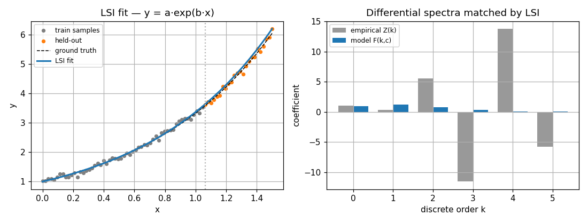
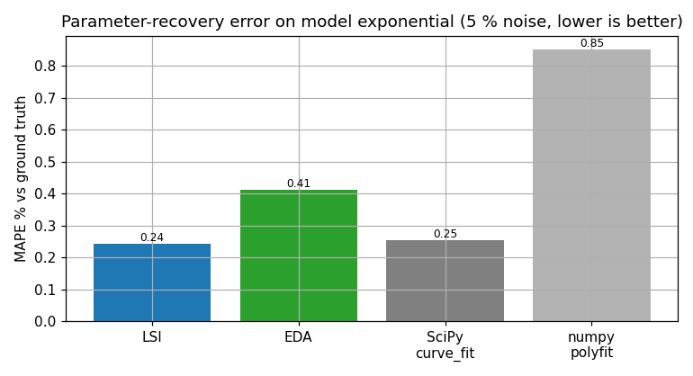

# LSI — Least-Squares Integral

> Numeric batch method, successor to the symbolic DSBI. Source:
> [`methods/_lsi.py`](../../packages/dtfit/src/dtfit/methods/_lsi.py).
> Invoke via `dt.fit_lsi(x, y, expr, var, ...)`,
> or `NonlineRegressor(..., method="lsi")`.

LSI replaces the **exact** spectra balance of [DSB](dsb.md) — which solves
$F(k;\theta)=Z(k)$ symbolically and is brittle under noise — with a **weighted
integral least-squares** discrepancy between the empirical and model spectra. It
fits the raw `(x, y)` directly (no symbolic pre-fit) and is the accurate
batch/offline fitter.

## Mathematical grounding

Consider the function-space $L^2$ reconstruction error over the observation
interval $[0,H]$:

$$
J(\theta) \;=\; \int_{0}^{H}\big[x_{\text{data}}(t) - f(t;\theta)\big]^2\,dt .
$$

Expand both signals in their differential spectra (powers of $t$) and let
$d_k = Z(k) - F(k;\theta)$ be the per-discrete mismatch, so
$x_{\text{data}}(t)-f(t;\theta) \approx \sum_k d_k\,t^{k}$. Then

$$
J(\theta) = \int_{0}^{H}\Big(\sum_k d_k t^{k}\Big)\Big(\sum_j d_j t^{j}\Big)dt
          = \sum_{k}\sum_{j} d_k\,d_j \underbrace{\int_{0}^{H} t^{\,k+j}\,dt}_{=\,H^{k+j+1}/(k+j+1)}
          \;=\; \mathbf{d}^{\!\top} M\,\mathbf{d},
$$

with the **moment (Gram) matrix**

$$
M[k,j] \;=\; \frac{H^{\,k+j+1}}{k+j+1}.
$$

This is the integral-OLS normal-equation form. In the **monomial** spectrum $M$
is a (scaled) Hilbert matrix, whose condition number grows like
$(1+\sqrt2)^{4n}$ — already $\sim10^7$ at order 5 — and the empirical monomial
spectrum from `numpy.polyfit` is itself an ill-conditioned Vandermonde solve.
The original LSI fought this with an exponential discrete weighting
$w_i=e^{-\alpha i}$, which only mitigates a fundamentally ill-posed basis.

### Reconditioning: an orthogonal-polynomial spectrum

The fix is to change basis. Expand the discrepancy in **Legendre polynomials
$L_j$ on the data interval** instead of monomials. Because the $L_j$ are
*orthogonal*, the Gram matrix is **diagonal**,

$$
\int_{x_0}^{x_N} L_i(u(t))\,L_j(u(t))\,dt = \frac{H}{2j+1}\,\delta_{ij},
\qquad u(t)=\frac{2(t-x_0)}{H}-1,
$$

so the continuous $L^2$ criterion collapses to a perfectly conditioned diagonal
sum of squared coefficient residuals,

$$
J(\theta) \;=\; \sum_{j} \frac{H}{2j+1}\,\big(\beta_j^{\text{data}} - \beta_j^{\text{model}}(\theta)\big)^2 .
$$

The Hilbert matrix is gone. The **empirical** Legendre coefficients
$\beta_j^{\text{data}}$ come from `numpy.polynomial.Legendre.fit` (a
well-conditioned orthogonal-basis least squares, not a raw Vandermonde), and the
**model** coefficients $\beta_j^{\text{model}}(\theta)$ are obtained by
Gauss–Legendre quadrature of the model — so the model is *integrated exactly*
rather than Taylor-truncated. The $1/(2j+1)$ factor down-weights high orders
intrinsically; the optional `alpha` adds a further $e^{-\alpha j}$ if desired.

Because this is a least-squares relaxation rather than an exact solve, LSI keeps
the differential-transformation structure of DSB while gaining noise tolerance —
at the cost of DSB's closed-form analytic property — and now does so on a
numerically stable basis.

## Algorithm

1. **Parse** the model `expr`; collect the free parameters $\theta$.
2. **Pre-filter** (optional, default on): Savitzky–Golay smoothing of `y`
   (window ≤ 11, cubic).
3. **Order**: `k_star` (default 5) or `"auto"` (BIC of the data fit).
4. **Empirical spectrum**: Legendre coefficients $\beta^{\text{data}}$ =
   `Legendre.fit(x, y, order).coef` on the interval $[x_0,x_N]$.
5. **Model spectrum**: $\beta_j^{\text{model}}(\theta)$ by Gauss–Legendre
   quadrature of the `lambdify`-ed model at fixed nodes (compiled once).
6. **Diagonal weight** $\sqrt{H/(2j+1)\cdot e^{-\alpha j}}$ on the coefficient
   residual $\beta^{\text{data}}-\beta^{\text{model}}(\theta)$.
7. **Solve** the weighted residual:
   - **unbounded**: Levenberg–Marquardt;
   - **bounded** (`bounds=` given): two-stage global search —
     `differential_evolution` then `L-BFGS-B` polish.
8. **Return** the fitted $\theta$, a `lambdify`-ed callable model, and a
   parameter covariance estimate (`FittingResult.cov`) from the residual
   Jacobian.

## Optimizations and guards

- **Orthogonal (Legendre) basis** — the integral criterion becomes a diagonal,
  perfectly conditioned sum of squares; no Hilbert matrix, no Cholesky.
- **Conditioned empirical spectrum** — `Legendre.fit` replaces the raw
  `numpy.polyfit` Vandermonde.
- **Exact model integration** — Gauss–Legendre quadrature of the model (not a
  Taylor truncation) for its spectral coefficients.
- **Two-stage global optimization** with bounds (`differential_evolution` →
  `L-BFGS-B`) escapes the local minima that plague exponential/transcendental
  fits; without bounds, LM from the supplied/unit start.
- **Automatic order selection** (`k_star="auto"`) by BIC.
- **Non-finite guard** — a parameter vector producing non-finite spectra is
  penalized (`1e6` residual) rather than crashing the solver.

## Worked example

`y = a·exp(b·x)` (truth `a=1.0, b=1.2`), 5 % noise, fit on the first 70 %, the
rest held out. **Left:** LSI recovers the exponential and extrapolates onto the
held-out tail. **Right:** the differential spectra LSI balances — note how the
empirical high-order discretes ($k\ge3$) blow up under noise while the model
discretes stay small; the exponential weighting is what keeps the low-order
match dominant.

## Comparison

**Model data — `y = a·exp(b·x)`, ground truth a=1.0, b=1.2, 5 % noise, n=80.**
Error is against the *clean* signal (true parameter recovery).

| method | recovered params | R² | RMSE | MAPE % | fit (ms) |
|---|---|---|---|---|---|
| **LSI** | a=1.000, b=1.203 | 0.9999 | 0.01133 | 0.24 | 15.3 |
| EDA | a=1.002, b=1.203 | 0.9999 | 0.01641 | 0.41 | 3.4 |
| SciPy `curve_fit` | a=1.000, b=1.204 | 0.9999 | 0.01305 | 0.25 | 0.1 |
| numpy.polyfit (deg 5) | — | 0.9997 | 0.02302 | 0.85 | 0.1 |

**Real data — COVID-19 Ukraine** (cumulative confirmed, 28-day take-off,
548→8617 cases), exponential `y = a·exp(b·t)`:

| method | R² | RMSE | MAPE % |
|---|---|---|---|
| **LSI** | 0.9877 | 275.1 | 13.00 |
| EDA | 0.8506 | 960.1 | 9.39 |
| SciPy `curve_fit` | 0.9879 | 273.5 | 13.34 |

LSI lands within a few percent of the NLS gold standard on model data and tracks
the real growth curve at single-digit MAPE; on the COVID window its *lowest*
in-sample MAPE comes from spreading error across the whole curve rather than
chasing the tail (where `curve_fit` minimizes squared error and so shows a
higher MAPE but higher R²). Unlike `polyfit`, LSI returns interpretable model
parameters $(a,b)$, not opaque polynomial coefficients.

## Where it is best applied

**Use LSI for:** accurate **batch / periodic-refit** fitting of models
nonlinear in their parameters (exponential, transcendental, mixed) on noisy
real data, especially when you want a global search over bounded parameters and
interpretable coefficients. It is the accuracy tier of the three production
methods.

**Caveats.** The empirical spectrum is a Maclaurin fit about 0, so LSI needs a
**modest dynamic range** — normalize a wide domain (e.g. to `[0, 1.5]`) and
scale the series to O(1) before fitting; an extreme range makes the high-order
polyfit ill-conditioned. For real-time/streaming use the
[EDAFilter](equal_areas_filter.md); for the most noise-robust batch fit
with few parameters, [EDA](eda.md).
