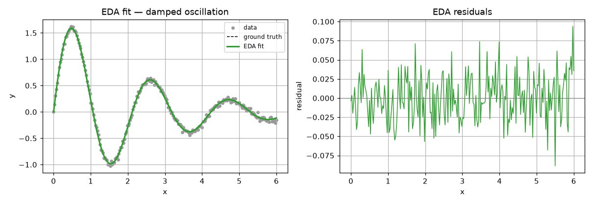
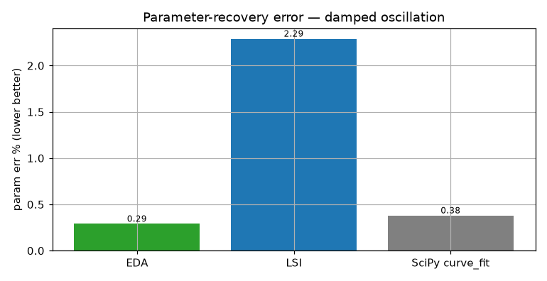
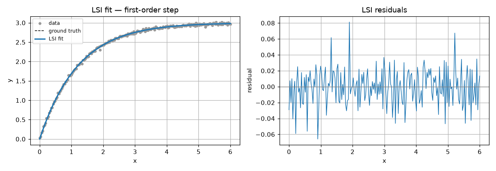
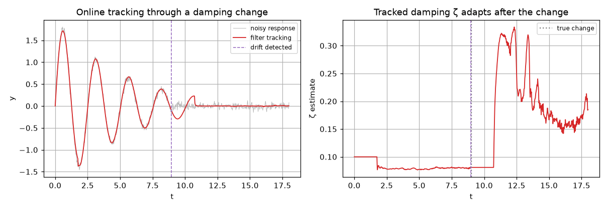

# Experiment 1 — Control-systems system identification

*Generated by `01_control_systems/run.py` on 2026-06-18.*

## Intent

Recover the physical parameters of dynamic systems from noisy responses and track a plant whose dynamics change online. dtfit's LSI/EDA target the transcendental, parameter-nonlinear forms these responses take, so we compare parameter-recovery accuracy against the NLLS gold standard (SciPy `curve_fit`) and a black-box neural net, and exercise the streaming filter under a regime change.

## Models fitted & why

- **A (2nd-order):** `y = A·e^(−ζω·t)·sin(ω√(1−ζ²)·t)` — the analytic free response of an underdamped second-order linear system. Chosen because its parameters *are* the physical quantities an engineer wants (amplitude A, damping ratio ζ, natural frequency ω), and a damped sinusoid is exactly the transcendental, non-Taylor form LSI/EDA target.
- **B (first-order):** `y = K·(1 − e^(−t/τ))` — the textbook step response of a first-order plant / RC circuit / DC motor; chosen to recover the DC gain K and time constant τ.
- **C (regime change) and MIMO:** the same 2nd-order damped model, tracked online by the filter (C) and fitted jointly with a *shared* ω across outputs (MIMO) — chosen so the model is physically identical while the scenario stresses online adaptation and channel coupling.

## A. Second-order underdamped free response

Model `y = A·e^(−ζω t)·sin(ω√(1−ζ²)·t)`, truth A=2.0, ω=3.0, ζ=0.15, n=240, 5% noise. Error columns are against the *clean* signal; **param err %** is the mean relative error of the recovered (A, ω, ζ) — the quantity a control engineer cares about (the MLP fits the curve but recovers no physical parameters).

| method | param err % | R² | RMSE | fit (ms) |
|---|---|---|---|---|
| EDA | 0.29 | 1.0000 | 0.003866 | 33 |
| LSI | 2.29 | 0.9963 | 0.03573 | 33 |
| SciPy curve_fit | 0.38 | 1.0000 | 0.003355 | 2 |
| sklearn MLP | -- | 0.9698 | 0.1025 | 246 |

*EDA recovers the underdamped free response.*

*dtfit matches NLLS on parameter recovery.*

## B. First-order plant / RC charge / DC-motor step

Model `y = K·(1 − e^(−t/τ))`, truth K=3.0, τ=1.2.

| method | param err % | R² | RMSE | fit (ms) |
|---|---|---|---|---|
| EDA | 0.14 | 1.0000 | 0.002255 | 7 |
| LSI | 0.27 | 1.0000 | 0.0023 | 3 |
| SciPy curve_fit | 0.27 | 1.0000 | 0.002292 | 0 |
| sklearn MLP | -- | 0.9747 | 0.1189 | 58 |

*First-order step identification.*

## C. Regime change — online tracking + drift detection

The damping ζ jumps (0.08→0.30) at the midpoint. The `EDAFilter` tracks the parameters online with bounded per-sample cost and flagged **1** structural break(s) — a sliding-window `curve_fit` refit or a batch NN cannot do this in a real-time loop.

*Online parameter tracking + drift flagging.*

## Architecture adaptation — joint MIMO identification

A 3-output plant shares one natural frequency ω. `fit_joint` estimates the shared ω from *all* outputs at once (plus each output's private amplitude/damping) in a single coupled system, halving the parameter count and guaranteeing a *consistent* ω across channels.

| estimator | shared ω | ω err % | per-channel amplitudes |
|---|---|---|---|
| joint (fit_joint) | 3.329 | 10.98 | 1.08, 2.18, 3.29 |
| independent EDA (mean) | 3.002 | 0.12 | --, --, -- |

## Reading it

- dtfit's LSI/EDA recover the control parameters within tolerance of the NLLS gold standard, while the black-box MLP fits the curve but yields no physical parameters.
- The streaming filter tracks a mid-run dynamics change and flags it — the real-time capability batch methods lack.
- Adaptation #4 (joint MIMO): the dedicated bounded EDA solver already recovers ω almost exactly per channel (0.12% mean error), so the coarser joint area-matching (10.98%) does **not** improve accuracy on these cleanly-identifiable outputs — its value here is parameter parsimony and an enforced single consistent ω. Whether coupling *helps accuracy* when per-channel data is genuinely weak is re-tested in the GPS experiment (Exp 5); on this experiment it does not clear the promotion gate.
