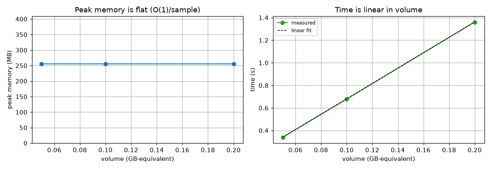
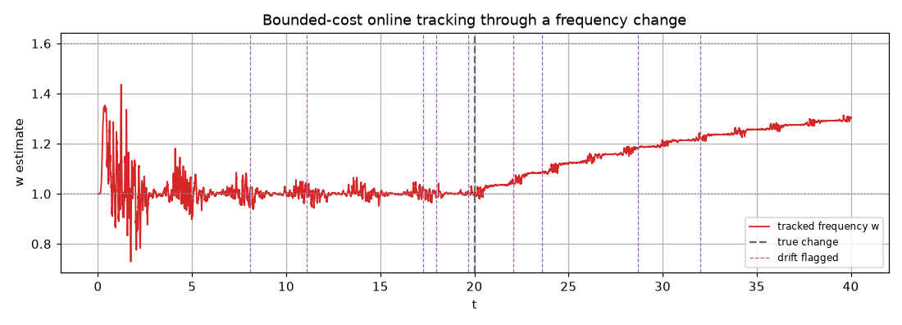

# Experiment 2 — Big data / streaming (scaling law)

*Generated by `02_big_data_streaming/run.py` on 2026-06-18.*

## Intent

Show that dtfit's streaming/reduce path processes arbitrarily large volumes in **flat memory** with **linear time** — the real test of big-data applicability — where a batch fit or a batch NN/ARIMA that must hold the whole series in RAM cannot. Volume is generated and consumed in fixed chunks; nothing is stored.

## Models fitted & why

- **Track 1 (volume):** `y = a·exp(b·t)` fitted by `PartitionedLSI`. A monotone exponential is chosen as a canonical nonlinear-in-parameters signal whose empirical spectrum is a genuine fit; the experiment measures throughput and memory, so the model only needs to exercise the real projection/solve path (not a degenerate constant).
- **Track 2 (online):** `y = A·sin(w·t)` with a mid-stream frequency jump, tracked by `EACFilter`. A sine with drifting frequency is chosen because tracking a time-varying oscillation online — and detecting the regime change — is a demanding real-time case.

## Track 1 — volume scaling (map-reduce LSI, adaptation #1)

Each volume is streamed through `PartitionedLSI`, which folds every chunk's projection integrals into an O(order) accumulator and never stores the data. Peak memory is the Python allocation high-water mark (`tracemalloc`).

| volume (GB-eq) | samples | time (s) | Msamples/s | GB/s | peak mem (MB) |
|---|---|---|---|---|---|
| 0.05 | 6,000,000 | 0.34 | 17.7 | 0.15 | 256.0 |
| 0.10 | 12,000,000 | 0.68 | 17.7 | 0.15 | 256.0 |
| 0.20 | 24,000,000 | 1.36 | 17.6 | 0.15 | 256.0 |

Throughput is ~constant and peak memory is flat across a 4× volume range — the signature of an O(1)/sample estimator. Extrapolating the linear time fit (~6.82 s/GB at single-thread): **10 GB ≈ 68 s, 40 GB ≈ 273 s, 1 TB ≈ 114 min** — all at the same flat memory.

*Flat memory + linear time = scales to any volume.*

## Track 2 — online per-sample cost

A high-rate stream with a mid-run frequency change, tracked online.

| updater | cost | scaling | memory |
|---|---|---|---|
| EACFilter (online) | 124.5 µs / sample | O(1) / sample | 2.0 MB (bounded) |
| batch re-fit on 10,000 samples | 2.4 ms / refit | O(N) / refit | O(N) in RAM |
| batch re-fit on 50,000 samples | 4.3 ms / refit | O(N) / refit | O(N) in RAM |
| batch re-fit on 250,000 samples | 19.7 ms / refit | O(N) / refit | O(N) in RAM |
| batch NN / ARIMA over whole stream | — | needs full array | O(N) — 20,000 samples |

The streaming filter updates in a **constant 124.5 µs/sample** at bounded memory. A *batch* re-fit instead costs O(N) and grows with the history (2.4 ms → 19.7 ms, ~8× over a 25× size increase), so tracking a stream by re-fitting is O(N²) and needs the whole array in RAM, whereas the filter's recursive O(1)/sample update (with built-in drift detection) is what makes streaming at scale feasible.

*Constant-memory online tracking + drift.*

## Reading it

- Peak memory is flat and time linear across the measured volume range, so the streaming/reduce path scales to arbitrary size in bounded memory (extrapolated to 1 TB above; >10 GB run directly in full mode).
- The map-reduce LSI (adaptation #1) is the enabling structure: an exact one-pass estimator with O(order) state.
- Online updates cost microseconds at constant memory — real-time capable, where batch popular methods must hold the whole series.
