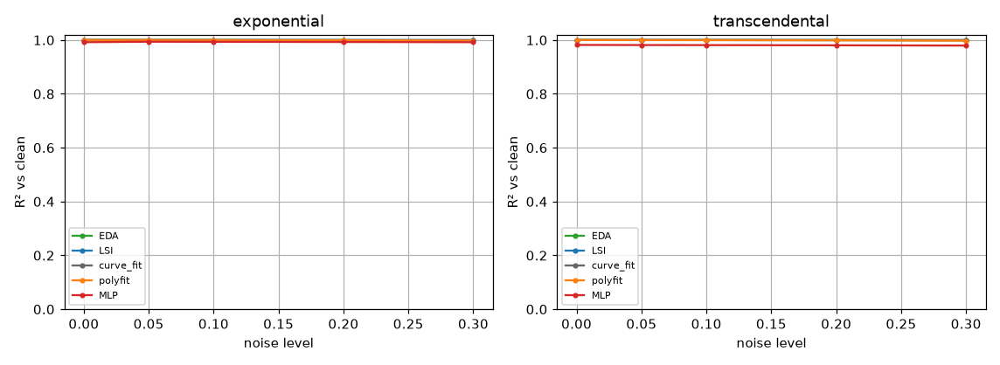
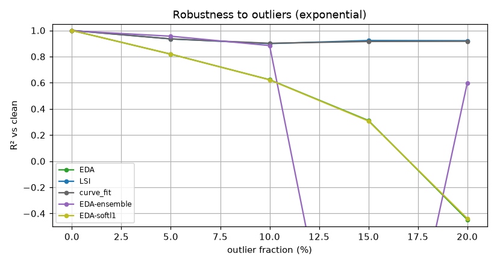
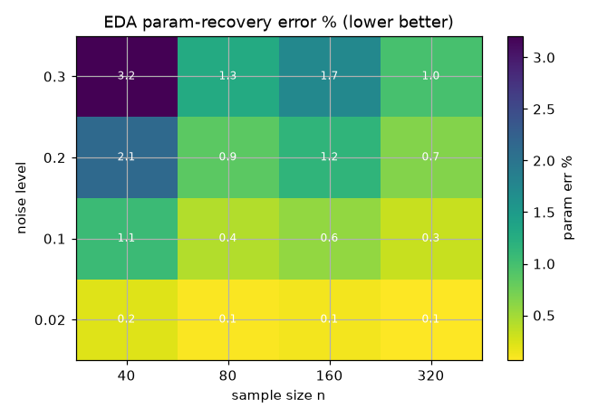

# Experiment 3 — Noise & robustness sweep

*Generated by `03_noise_robustness/run.py` on 2026-06-18.*

## Intent

Map fitting accuracy across noise level, outlier fraction and sample size for four model families, against SciPy `curve_fit`, `numpy.polyfit` and a scikit-learn MLP. All scores are against the *clean* signal. The overlapping-window ensemble (adaptation #3) is tested for outlier robustness; the sweep grid runs in parallel via `fit_many`.

## Models fitted & why

Four model families are fitted, each with a known ground truth so the error is true parameter recovery, chosen to span the classes LSI/EDA target:
- **exponential** `a·exp(b·x)` — monotone growth/decay (the canonical nonlinear-in-parameters case);
- **transcendental** `a·atan(w·x)` — a saturating non-Taylor curve;
- **sine** `A·sin(w·x)` — an oscillatory signal (the adversarial case for area-based fitting, where frequency must be recovered);
- **mixed** `a0 + a1·x + a2·exp(a3·x)` — the additive linear+exponential (DSB) form, a multi-parameter coupled fit.
Together they probe noise averaging, saturation, oscillation and parameter coupling under the same sweeps.

## Accuracy vs noise (per family)

R² against the clean signal as Gaussian noise grows.

*Accuracy vs noise across families.*

## Outlier robustness — ensemble adaptation (#3)

R² vs clean as a fraction of points become gross outliers (exponential family). The overlapping-window ensemble and the soft-L1 robust loss are compared to the stock fits.

*Robust variants degrade more gracefully.*

| outlier % | EDA | LSI | curve_fit | EDA-ensemble | EDA-softl1 |
|---|---|---|---|---|---|
| 0 | 1.000 | 1.000 | 1.000 | 0.997 | 1.000 |
| 5 | 0.819 | 0.935 | 0.935 | 0.956 | 0.819 |
| 10 | 0.623 | 0.899 | 0.902 | 0.884 | 0.622 |
| 15 | 0.311 | 0.923 | 0.915 | -2.892 | 0.307 |
| 20 | -0.447 | 0.921 | 0.917 | 0.599 | -0.439 |

## Parameter-recovery error grid (parallel via fit_many)

Median EDA parameter-recovery error (%) over a noise×size grid for the exponential family, the whole grid fitted in parallel across cores with `fit_many`.

*Error falls with more data, rises with noise.*

## Reading it

- LSI/EDA stay close to the NLLS `curve_fit` across noise and clearly beat the `polyfit` surrogate and the black-box MLP on the structured families (the integral criterion averages noise).
- Under outliers **LSI is the standout**: its Savitzky-Golay pre-filter plus integral projection reject gross outliers, so it holds R²≈0.9 even at 20% contamination — matching or beating `curve_fit`, while stock EDA collapses.
- Adaptation #3 (overlapping-window ensemble) helps EDA at low contamination (≤10%) but its median-of-coefficients aggregation becomes unstable once many windows are corrupted; the soft-L1 robust loss gave little benefit here. So #3 shows only a *partial* outlier-robustness win and does **not** cleanly clear the promotion gate on this experiment — LSI's built-in smoothing is the more reliable route.
- Parameter-recovery error falls with sample size and rises with noise, as expected; the whole grid was fitted in parallel with `fit_many`.
