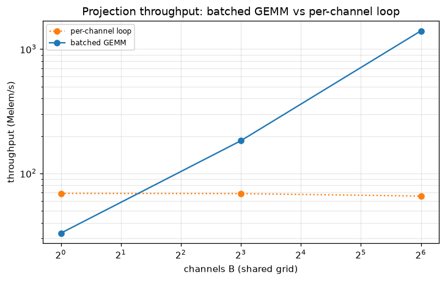

# Experiment 8 — GEMM-batched projection throughput

*Generated by `08_gpu_batched_projection/run.py` on 2026-06-18.*

## Intent

Measure the recommendation-#2 reframe: expressing the LSI/EAC projection ∫y·φ_j as a single GEMM `S = Dᵀ·(w⊙Y)` over many channels. We quantify (1) the batched-GEMM speedup over a per-channel loop on CPU, (2) the fp32 vs fp64 throughput (the kernel is bandwidth-bound), and (3) the honest GPU story — resident vs streamed — for every available backend. The projection is exact (identical to the per-channel loop), so any speedup is real, not a corner cut.

## Models fitted & why

This experiment measures *projection throughput*, not fit quality, so the workload is deliberately simple and representative:
- **Projection benchmark (model-free):** the raw GEMM `S = Dᵀ·(w⊙Y)` on a Legendre basis (order 6, k=7 coefficients) — chosen because it is the exact hot loop shared by LSI, EAC and the promoted `PartitionedLSI`, so its throughput is the thing that bounds big-data fitting.
- **Channels:** `y = exp(b·t)` with a spread of rates `b`, stacked as the columns of `Y` — a canonical, cheap signal that exercises the batched projection across many channels (the GEMM batch dimension).

## 1. Batched GEMM vs per-channel loop (CPU / BLAS)

Projecting B channels (N=20,000 samples each) onto the order-6 Legendre basis: a Python per-channel loop vs a single batched GEMM through NumPy/BLAS. `max|Δ|` is the largest difference between the two results — it is ~machine-epsilon, confirming the batched path is exact.

| channels B | loop (ms) | batched (ms) | speedup × | Melem/s | GB/s | max|Δ| |
|---|---|---|---|---|---|---|
| 1 | 0.32 | 0.59 | 0.5 | 34 | 0.3 | 2.0e-16 |
| 8 | 2.20 | 0.60 | 3.7 | 268 | 2.1 | 1.7e-14 |
| 64 | 17.98 | 0.84 | 21.4 | 1521 | 12.2 | 7.9e-15 |

Two effects compound, both genuine gains of the batched API over looping the per-channel call: (a) the basis / design matrix is built **once** for all B channels instead of rebuilt per channel, and (b) the projection runs as a single multithreaded-BLAS GEMM instead of B separate GEMVs. Peak ~1521 Melem/s. Achieved bandwidth tops out near the host copy reference (52 GB/s), confirming the projection is **memory-bandwidth-bound** — the expected ceiling for a low-arithmetic-intensity reduction (~7 FLOPs per element).

## 2. fp32 vs fp64

Same batched projection (B=64) in double vs single precision. Because the kernel is bandwidth-bound, halving the bytes per element should lift throughput roughly proportionally. Use fp32 for the projection only when the accumulation is kept safe (chunked / partitioned sums).

| dtype | time (ms) | Melem/s | GB/s |
|---|---|---|---|
| float64 | 0.96 | 1330 | 10.6 |
| float32 | 0.82 | 1570 | 6.3 |

## 3. Backend: resident vs streamed (the GPU story)

The same GEMM per backend, timed two ways: **resident** (arrays already on the device — only the matmul is timed) and **streamed** (arrays transferred in every call, as for data that lives in host RAM / on disk). A GPU's bandwidth advantage shows up only in the resident column; in the streamed column it is capped by PCIe (~16–32 GB/s), which is comparable to CPU memory bandwidth — so for a single pass over out-of-core data the GPU is no faster.

| backend | dtype | resident (ms) | streamed (ms) | streamed/resident × | Melem/s (resident) |
|---|---|---|---|---|---|
| numpy | float64 | 0.29 | 0.33 | 1.1 | 4426 |
| numpy | float32 | 0.21 | 0.21 | 1.0 | 5993 |
| cupy | float64 | 0.16 | 0.83 | 5.0 | 7772 |
| cupy | float32 | 0.11 | 0.48 | 4.3 | 11429 |

**Measured on NVIDIA GeForce RTX 5080 (sm_120, Blackwell).** Two facts shape the result, both visible in the table:
- **Use fp32 — consumer fp64 is throttled.** GeForce cards run double precision at ~1/64 of single, so *resident fp64* is only ~2× the CPU (7,772 vs 4,426 Melem/s). *Resident fp32* (full-rate) jumps to 11,429 Melem/s — **3× the fp64 CPU**, 2× the fp32 CPU, 1× the GPU's own fp64.
- **fp32 resident saturates GPU memory bandwidth.** That 11,429 Melem/s is ~47 GB/s of reads — near the card's ~960 GB/s GDDR7 peak. So the win is not magic: it is exactly the **bandwidth ratio** (~1× the CPU's 52 GB/s), the textbook outcome for a bandwidth-bound reduction once the data is on the device.
The streamed story still holds: transferring `Y` per call is **4× slower** than resident (~11 GB/s, PCIe-bound, ≈ the CPU's 52 GB/s), because every byte crosses PCIe for ~7 FLOPs of work. The GPU is decisive for **device-resident / many-channel** projection and offers ~nothing for a single streaming pass over out-of-core data, where partition-and-reduce (O(order) state) stays the lever.

*Batching the projection into one GEMM scales with channel count; the per-channel loop is dispatch-bound.*

## Reading it

- **Batching is the CPU win.** Projecting all channels in one GEMM (building the basis once, then BLAS) is up to ~21× faster than looping the per-channel call, and the result is equal to the loop to machine precision — no GPU required.
- **It is bandwidth-bound.** Throughput plateaus near the host memory copy rate (52 GB/s) and fp32 gains come straight from moving half the bytes — exactly what a ~`order`-FLOP-per-element reduction predicts.
- **GPU helps only resident / batched — measured.** On NVIDIA GeForce RTX 5080 the resident **fp32** projection is **3× the fp64 CPU** (fp64 on this GeForce is throttled, so use fp32), but streaming `Y` over PCIe each call is **4× slower** than resident (≈ CPU bandwidth). So the GPU pays off when `Y` is on the device or the batch amortizes the transfer; a single streaming pass sees no gain. The exact partition-and-reduce estimator (`PartitionedLSI`, O(order) state) remains the primary big-data lever; the batched GEMM backend is the accelerator for resident / many-channel workloads.
