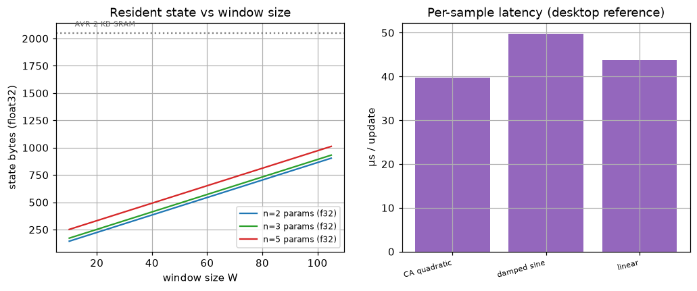

# Experiment 9 — embedded / low-resource footprint

*Generated by `09_embedded_footprint/run.py` on 2026-06-18.*

## Intent

Can the streaming filter run on the microcontroller you would attach to a GPS module (Arduino / STM32 / ESP32 class)? We measure the three things that decide it — **per-sample latency**, **resident state memory**, and **what actually ports to C** — and size the deployable state against real MCU parts. The honest framing: NumPy does not run on an AVR, so latency here is the desktop reference for the algorithm shape, while the memory figure is the exact C-struct size that does deploy.

## 1. Per-sample latency & throughput (all package filters)

Mean wall-clock cost of one steady-state update on this desktop (warmed window, 1500 timed updates), and the sustainable sample rate it implies, for every online estimator in the package plus the Kalman reference. The recurrence is O(1) in stream length, so this is flat for the whole stream. A GPS fix arrives at ~1–10 Hz; the headroom is several orders of magnitude.

| estimator | config | size | µs / update | max samples/s (1 core) |
|---|---|---|---|---|
| EACFilter | CA quadratic (GPS axis) | n=3, W=15 | 33.6 | 29,774 |
| EACFilter | damped sine (control ID) | n=3, W=50 | 38.5 | 25,945 |
| EACFilter | linear (range smoother) | n=2, W=20 | 30.3 | 33,020 |
| LSIFilter | damped sine | n=3, W=50, ord=5 | 40.9 | 24,423 |
| CA Kalman (3-axis) | reference | dim=3 | 28.41 | 35,205 |

`FilterBank` is just K of these run together (one per axis/channel/satellite), so its cost and memory are K× a single filter — e.g. the 3-axis GPS tracker is 3 `EACFilter`s. The Legendre filter is the heaviest per step (it projects onto `order+1` orthogonal moments for extra observability); the Kalman is the lightest (no window, no integral). All sit far under any real-time budget.

## 2. Resident state memory — the deployable C struct

The bytes that must persist between samples. For a minimal C port this is a **fixed-size, no-malloc struct**: the `t,y` ring buffer (2·W words), the estimate `p` (n), covariance `P` (n²), process-noise diagonal `Q` (n), and ~8 detector/measurement scalars — i.e. `2W + n² + 2n + 8` words. It does **not grow with stream length** (the defining property of a real-time estimator). Shown in float64 (the reference) and float32 (a natural embedded choice; the integration kernels carry fine at single precision for these window sizes).

| config | size | state words | float64 | float32 | FLOPs/update |
|---|---|---|---|---|---|
| CA quadratic (GPS axis) | n=3, W=15 | 53 | 424 B | 212 B | ~527 |
| damped sine (control ID) | n=3, W=50 | 123 | 984 B | 492 B | ~1,647 |
| linear (range smoother) | n=2, W=20 | 56 | 448 B | 224 B | ~388 |

**`LSIFilter` (the other filter).** Its *mutable* RAM state has the same shape — `2W + n² + n + 9` words (121 words = 484 B float32 at n=3, W=50) — so its **SRAM** footprint is essentially the same as the area filter. It additionally precomputes ~440 words of **read-only** projection/quadrature tables (the orthogonal-basis Vandermonde + Gauss-Legendre nodes); those are constants that belong in **flash/PROGMEM**, not SRAM. So it buys extra observability (an `order+1`-dimensional measurement) for more flash and a little more compute — not more RAM. **The CA Kalman is the leanest of all**: 36 mutable words (144 B float32 for 3 axes) because it keeps **no history window** — the honest cost of dtfit's integral measurement is exactly that window buffer.

For contrast, one *Python* filter object (warmed) holds ≈ **78 KB** of interpreter/NumPy objects — hundreds of times the 424 B algorithmic state. That gap is pure Python/NumPy overhead and is exactly what a C port removes; it is **not** what runs on the MCU.

## 3. Fit on real microcontrollers (3-axis GPS tracker)

A full 3-axis tracker is three independent filters: **636 B** (float32) / **1,272 B** (float64) of state, and ≈ 1,581 FLOPs per GPS epoch. Whether a part fits is a **memory** question (the state must live in SRAM alongside everything else) far more than a compute one — even a pessimistic soft-float estimate keeps the per-epoch compute orders of magnitude under a 10 Hz budget. Compute time is a rough estimate (effective MFLOP/s, soft-float-penalised where there is no FPU); memory fit is exact.

| MCU | SRAM | MHz | FPU | state f32 (fits if <50% SRAM) | compute/epoch (<100 ms budget) |
|---|---|---|---|---|---|
| AVR ATmega328 (Uno/Nano) | 2 KB | 16 | no (soft) | 636 B → ✓ | ~31.62 ms → ✓ |
| ARM Cortex-M0+ (SAMD21/Zero) | 32 KB | 48 | no (soft) | 636 B → ✓ | ~5.27 ms → ✓ |
| ARM Cortex-M4F (STM32F4/Teensy) | 192 KB | 168 | yes | 636 B → ✓ | ~0.05 ms → ✓ |
| ESP32 (Xtensa LX6 FPU) | 520 KB | 240 | yes | 636 B → ✓ | ~0.04 ms → ✓ |

## 4. Comparison with existing methods

How the streaming filters stack up against the alternatives you might deploy for the same online job. The deciding axes for embedded are **(a) does resident state grow with the stream**, **(b) per-update compute**, and **(c) can it adapt on-device** (vs. train-offline-only). State is the 3-axis / equivalent figure in float32.

| method | resident state (f32) | grows w/ stream? | per-update compute | on-device adaptation |
|---|---|---|---|---|
| dtfit `EACFilter` ×3 | ~636 B | no (fixed window) | 1× (34 µs) | yes — recursive |
| dtfit `LSIFilter` | ~484 B + flash tables | no (fixed window) | ~1.2× | yes — recursive |
| CA Kalman ×3 (gold standard) | ~144 B | no (no window) | 0.85× | yes — recursive |
| sliding-window `curve_fit` (LM) | ~window only | no (fixed window) | ~2× (62 µs) | refit from scratch / step |
| batch fit / NN over full history | **O(N) — unbounded** | **yes → eventually OOM** | O(N) / refit | n/a (not streaming) |
| offline-trained MLP (lag10, h16) | ~772 B weights | no | inference only | **no — train offline** |

- **The recursive estimators (dtfit filters + Kalman) are the embeddable class**: fixed sub-KB state, O(1)/sample compute, and they *learn on the device*. The **Kalman is the leanest** (no window) and dtfit's filters cost one window buffer more — the price of an integral measurement that buys robustness to noise and a nonlinear-in-parameters model.
- **Re-fitting a window with `curve_fit` every step** costs ~2× a recursive update *here* — modest, because the warm-started Levenberg-Marquardt converges in a step or two on this easy linear-in-parameters quadratic and scipy call overhead dominates. The real objections are that it puts a **full nonlinear optimizer in the embedded loop** (far more code than a recursive update, and no clean C path), and that its cost grows with window size and model nonlinearity rather than staying O(1). **A batch fit / NN over the whole history is the one that does not fit at all**: its state grows with the stream and eventually exhausts RAM — the failure mode streaming structurally avoids.
- **Neural nets are a different deployment model**: a small MLP/LSTM has a fixed, modest weight footprint and fast inference, but it must be **trained offline** — it cannot adapt to a new regime on the MCU the way the recursive filters do. For a self-contained sensor that calibrates and tracks in the field, the recursive filters are the natural fit.

*Left: resident state is small and grows only linearly with window size (flat in stream length). Right: per-sample latency on the desktop reference path.*

## Reading it

- **Memory is tiny and fixed.** A 3-axis GPS tracker needs ≈ 636 B (float32) of resident state — it fits comfortably on a Cortex-M0+/M4/ESP32 and is feasible even on a 2 KB AVR if that part is doing little else. Crucially the state does **not grow with the stream**, so there is no creeping-RAM failure mode.
- **Compute is never the bottleneck for GPS-rate data.** At a few thousand FLOPs per epoch and a 1–10 Hz fix rate, even a soft-float MCU has orders of magnitude of headroom; the desktop path already runs each update in ≈ 34 µs.
- **What you actually deploy is a C recurrence, not this code.** The Python/NumPy reference carries hundreds of KB of interpreter overhead that does not exist in a C port; the integration hot loops are already C (`dtfit._native`). For a *fixed* model (e.g. the CA quadratic) the model and Jacobian are trivial polynomials to hand-code, and the Kalman algebra is a handful of small fixed-size matrix ops — no dynamic allocation, no SymPy, no BLAS.
- **Versus the alternatives, the recursive estimators are the embeddable class.** dtfit's filters and the Kalman all carry fixed sub-KB state and adapt on-device; the Kalman is leanest (no window), dtfit pays one window buffer for its integral measurement, and the Legendre filter trades flash (constant projection tables) for observability without extra RAM. A batch fit / NN over the full history is the one that structurally does not fit (O(N) state); a small NN fits but cannot learn a new regime in the field.
- **float32 is the natural embedded choice** and halves the state; for these window sizes the integral/projection conditioning is benign enough that single precision is fine (unlike the batch GEMM throughput case in Exp 8, this is bounded-window, not a 10⁹-element reduction).
- **The honest caveat:** these are *projections* from a desktop-measured algorithm plus exact state-size arithmetic, not measurements on silicon. A real port would confirm the soft-float compute estimate and verify numerical behaviour at float32 on the target — but the memory verdict (small, fixed, fits) is exact and is the figure that usually decides embedded feasibility.
