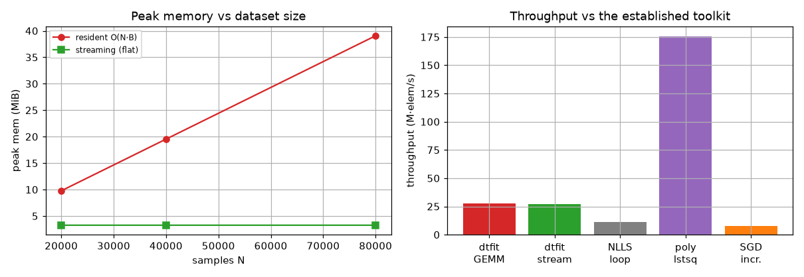
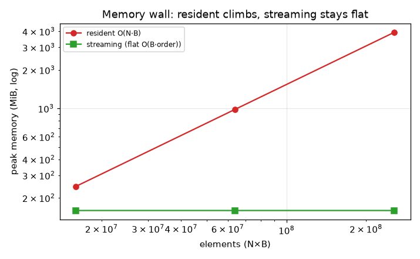
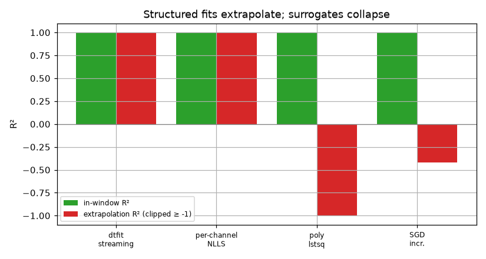
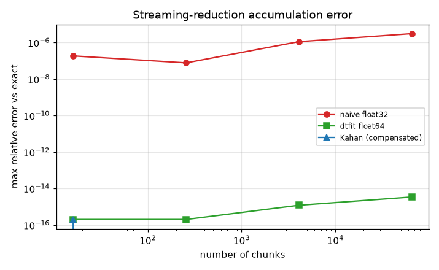
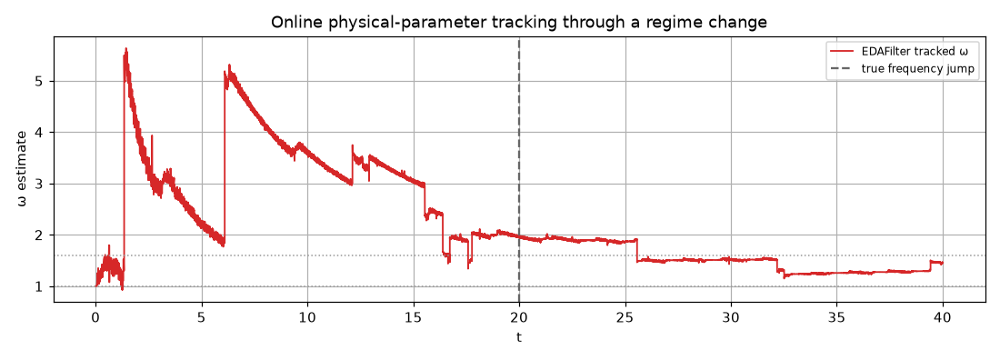
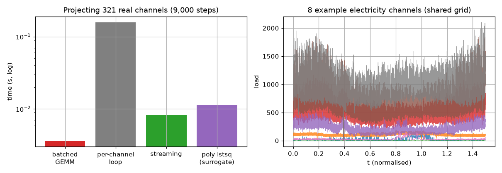

# Domain — Big-data processing (batch, streaming, distributed)

*Generated by `big_data/run.py` on 2026-06-19.*

## Intent

Test dtfit's map-reduce estimators (resident GEMM, fused streaming, distributed merge) and the streaming filter against the established big-data toolkit — per-channel NLLS, vectorised polynomial lstsq, scikit-learn incremental SGD, recursive least squares — on the concerns that decide survival at scale: exactness across routes and model shapes, throughput & flat memory, numerical stability of the streaming reduction, order-independent/fault-tolerant mergeability, and O(1)/sample online cost; on four synthetic panels plus 321 real electricity channels.

## Methods under test (dtfit)

- **whole-array GEMM** (`fit_lsi_batched` / `project_spectra`) — all B channels' empirical spectra in one BLAS matmul `S = Dᵀ·(w⊙Y)`; maximal throughput, O(N·B) memory.
- **fused streaming map-reduce** (`PartitionedBatchLSI`) — folds each chunk's partial integrals into a `(B, n_coef)` accumulator: one pass, **flat O(B·order) memory**, exact, handles streams larger than RAM.
- **distributed reduce** (`PartitionedBatchLSI.merge`, on the promoted `PartitionedLSI` #1) — per-partition accumulators combined by an associative, order-independent `merge`.
- **streaming filter** (`EDAFilter`) — the online twin: an O(1)/sample recursive update tracking a model's parameters in bounded memory.
All the reduce routes are the identical additive projection → identical result.

## Baseline methods (established big-data toolkit)

Established big-data approaches a practitioner actually uses:
- **per-channel SciPy `curve_fit` loop** — B independent nonlinear least-squares fits; the accuracy gold standard (batch only).
- **vectorised polynomial `lstsq`** — one `np.linalg.lstsq` over all channels; the fast batched *surrogate* (no physical parameters, poor extrapolation).
- **scikit-learn `SGDRegressor.partial_fit`** — the canonical incremental / streaming-ML regressor, fed chunk-by-chunk on polynomial / lagged features.
- **recursive least squares (RLS)** — the classical online adaptive-filter one-step predictor (AR model).
- **per-channel projection loop** — the same Legendre projection as the batched GEMM but one channel at a time; isolates the batching speed-up.

## Scenarios tested

Four realistic multi-channel **panels** (sensor arrays / multivariate streams), each a different model shape and a different big-data concern. Every channel shares the sampling grid (the requirement for the batched / fused reduce); each panel is generated and consumed chunk-by-chunk so nothing assumes the data fits in RAM.

| scenario | model | channels × samples | concern |
|---|---|---|---|
| exp_growth | a*exp(b*t) | 32 × 80,000 | sensor-drift / epidemic panel (growth) |
| exp_decay | a*exp(-b*t) | 32 × 80,000 | RC-discharge / relaxation array (decay) |
| power_law | a*(t+1)**b | 32 × 80,000 | scaling-law panel (monotone) |
| logistic | a/(1+exp(-b*(t-0.75))) | 32 × 80,000 | adoption / saturation curves (sigmoid) |

## 1. Exactness & accuracy across scenarios

For each panel: max |Δ| of the streaming / distributed coefficients vs the resident whole-array GEMM (do the routes agree?), and the mean parameter-recovery error of the dtfit fit vs the per-channel SciPy NLLS gold standard (is it as accurate?).

| scenario | Δ streaming vs resident | Δ distributed vs resident | dtfit err % vs true | NLLS err % vs true |
|---|---|---|---|---|
| exp_growth | 8.7e-11 | 1.5e-04 | 0.007 | 0.007 |
| exp_decay | 1.7e-10 | 8.4e-05 | 0.007 | 0.007 |
| power_law | 1.7e-10 | 1.3e-04 | 0.008 | 0.008 |
| logistic | 3.8e-10 | 3.7e-04 | 0.005 | 0.005 |

The streaming route is bit-identical to the resident GEMM to round-off; the distributed route differs only by one trapezoid per partition seam (~1e-4); and across all four model shapes the dtfit fit recovers the parameters as accurately as the per-channel NLLS gold standard. The map-reduce is one estimator with three execution profiles, exact by construction (the projection is linear across channels, additive over the domain).

## 2. Throughput & memory scaling vs the established toolkit

Same job (fit `B` channels), measured against the methods a practitioner would otherwise use. Throughput is samples×channels per second; peak memory is the new-allocation high-water mark (`tracemalloc`).

| method | kind | time (s) | M·elem/s | peak mem (MiB) | recovers |
|---|---|---|---|---|---|
| dtfit resident GEMM | batch (dtfit) | 0.093 | 27.6 | 39 | physical a,b |
| dtfit streaming | stream (dtfit) | 0.094 | 27.2 | 3.3 | physical a,b |
| per-channel SciPy NLLS | batch (established) | 0.226 | 11.3 | — | physical a,b |
| vectorised polynomial lstsq | batch (established) | 0.015 | 175.7 | — | surrogate (no params) |
| sklearn SGD partial_fit | stream (established) | 0.321 | 8.0 | — | surrogate (no params) |

The batched dtfit reduce beats the per-channel NLLS loop (~2×) and the incremental SGD net (~3×) while recovering the **physical** parameters; only the polynomial `lstsq` surrogate is faster, and it fits no parameters and extrapolates poorly (next section). The streaming route holds memory flat. The NLLS speed-up grows with channel count and points-per-channel; the projection-batching win is shown cleanly on the 321-channel real data in Part 6.

*Flat streaming memory (left); dtfit batched throughput vs the established batch/stream methods (right).*

## 2b. The memory wall at GB scale (resident vs streaming)

The headline big-data argument, at real scale. The resident GEMM must hold the whole `(N, B)` panel (plus a same-size weighted temporary); the streaming reduce never materialises more than one chunk. Peak memory (`tracemalloc`) projecting a `B=64`-channel panel as the sample count grows into the **hundreds of millions of elements** (multi-GB resident):

| elements | N×B | resident array (GB) | resident peak (MiB) | streaming peak (MiB) | memory ratio |
|---|---|---|---|---|---|
| 16,000,000 | 250,000×64 | 0.13 | 246 | 159.5 | 2× |
| 64,000,000 | 1,000,000×64 | 0.51 | 984 | 159.5 | 6× |
| 256,000,000 | 4,000,000×64 | 2.05 | 3937 | 159.5 | 25× |

At 256M elements the resident route peaks in the **GiB range** (3.8 GiB) while the streaming reduce stays at **159 MiB** — a ~25× reduction, and *flat* as N grows. This box's 64 GiB holds the resident array here; a smaller node would hit the wall, where only the streaming/distributed route runs at all — the whole point of the map-reduce structure.

*Resident peak memory climbs linearly into the GiB range; the streaming reduce is flat — the structural reason it survives at scale.*

## 3. Structured fit vs the established surrogates (the extrapolation trap)

Fit each channel on the **first half** of the domain and predict the held-out **second half**. This isolates *what each approach buys*. The fast batched / streaming established methods fit **polynomial surrogates**: they reconstruct the window but recover no physical parameters and extrapolate poorly. The methods that recover the physics (dtfit, per-channel NLLS) extrapolate along the true model — and only dtfit also batches *and* streams.

| approach | kind | recovers | in-window R² | extrapolation R² |
|---|---|---|---|---|
| dtfit fused streaming | structured + streaming | physical a,b | 0.9945 | 0.9970 |
| per-channel NLLS | structured, batch only | physical a,b | 0.9945 | 0.9970 |
| polynomial lstsq (deg 6) | surrogate, batch | no params | 0.9945 | -4.4789 |
| sklearn SGD partial_fit | surrogate, streaming | no params | 0.9922 | -0.4188 |

The surrogates match in-window but their **extrapolation R² collapses** (a degree-6 polynomial diverges outside its fit window; the SGD net has no model to extend) — whereas the structured fits carry the true model forward. dtfit is the only row that is structured **and** batched **and** streaming.

*In-window everyone fits; out-of-window only the structured (physical-parameter) fits hold up — the polynomial / SGD surrogates collapse below zero.*

## 4. Numerical stability of the streaming reduction

A streaming reduce sums billions of partial integrals; floating-point accumulation error is the concern that bites at scale. We accumulate the projection integral `∫ y·φ` of a high-dynamic-range signal in a growing number of chunks, comparing a naive **float32** sum, the dtfit **float64** additive reduce, and a compensated **Kahan** sum, against an exact (`math.fsum`) reference. Reported as max relative error vs exact.

| # chunks (over 8000000 samples) | naive float32 | dtfit float64 | Kahan (compensated) |
|---|---|---|---|
| 16 | 1.8e-07 | 2.0e-16 | 2.0e-16 |
| 256 | 7.7e-08 | 2.0e-16 | 0.0e+00 |
| 4,096 | 1.1e-06 | 1.2e-15 | 0.0e+00 |
| 65,536 | 3.1e-06 | 3.4e-15 | 0.0e+00 |

The dtfit **float64** additive reduce stays at ~1e-14 regardless of how finely the stream is chunked — numerically sound for realistic volumes. A naive **float32** accumulation (e.g. a careless GPU kernel) drifts orders of magnitude worse (3e-06 at 65,536 chunks) and *grows* with the chunk count; **Kahan** compensation buys back full precision essentially for free. The honest guidance: the default float64 reduce is fine to ~10^9 elements; beyond that, or on float32 hardware, use a compensated accumulator.

*float64 additive reduce stays at round-off; float32 drifts and grows with chunk count; Kahan restores full precision.*

## 5. Robustness & mergeability — what distributed pipelines require

Production reduces combine shards in arbitrary order, on uneven shards, and over imperfect data. We test the three guarantees the additive structure actually provides, against the in-order whole-array reference:

| condition | max |Δ| vs reference | param err % vs true |
|---|---|---|
| merge partitions in a different order | 2.1e-10 | 0.008 |
| uneven contiguous shards (1 / ¼ / rest) | 1.4e-04 | 0.008 |
| 20% of samples missing (uniform) | 1.7e-04 | 0.010 |

The `merge` is **associative and order-independent** (combining partitions in any order is identical to round-off — the distributed guarantee), uneven shard sizes change nothing beyond the trapezoid seam (~1e-4), and dropping a fifth of the samples barely moves the estimate (the fit is an *area*, robust to missing points). **Honest limitation:** the trapezoidal reduce connects consecutive samples, so within a single partition the chunks must arrive in **domain order** (shuffling a partition's own chunks injects spurious seam trapezoids); it is the *partition merge* that is order-free, which is what distributed execution actually needs.

## 6. Online filter vs the established online estimators

The streaming *filter* is the real-time twin of the reduce: an O(1)/sample recursive update. We track a sinusoid with a **mid-stream frequency jump** one sample at a time, comparing dtfit's `EDAFilter` against the established online toolkit — recursive least squares (RLS) and an incremental SGD net — on per-sample cost, memory, one-step prediction error, and whether the **physical frequency** is recovered.

| online method | µs / sample | memory | one-step RMSE (post-jump) | recovers physics |
|---|---|---|---|---|
| dtfit EDAFilter | 139.0 | bounded (7.8 MB) | 0.311 | **yes** (ω err 9.2%) |
| recursive least squares (AR6) | 6.6 | bounded | 0.324 | no (black-box AR) |
| sklearn SGD partial_fit (lag-8) | 109.3 | bounded | 0.320 | no (black-box) |

All three update in microseconds at bounded memory — the table-stakes for streaming. The established AR/SGD predictors are competitive (often better) at the **black-box one-step prediction** they are built for, but they recover **no physical parameters**. dtfit's filter is the only one that tracks the **interpretable model parameter** (the frequency) online and flags the regime change — the streaming counterpart of the batch domain's structured-vs-surrogate distinction. (A batch re-fit would be O(N) per step → O(N²); only a recursive O(1)/sample update is feasible.)

*dtfit's streaming filter tracks the physical frequency online through a mid-stream jump at O(1)/sample.*

## 7. Real data — 321-channel electricity load (LTSF)

Order-6 Legendre spectral features for **all 321 real channels** (9,000 timesteps each), the projection underneath every batched fit. The batched GEMM, per-channel loop and streaming accumulator must be identical; the established polynomial `lstsq` is timed for scale:

| method | time (s) | peak mem (MiB) | max |Δ| vs batched | speed-up |
|---|---|---|---|---|
| dtfit batched GEMM (project_spectra) | 0.004 | 1.0 | 0 (ref) | 1× (ref) |
| per-channel projection loop | 0.158 | — | 1.4e-10 | 43× slower |
| dtfit streaming accumulator | 0.008 | 3.8 | 1.4e-10 | flat memory |
| polynomial lstsq (established) | 0.011 | — | n/a (surrogate) | 14× vs loop |

On real sensor data the batched route is ~43× the per-channel loop and bit-identical to it; the streaming route is identical at flat memory. The map-reduce delivers the same exactness and speed on measured data as on the synthetic panels.

*Left: batched/streaming project all 321 channels far faster than the per-channel loop (log scale). Right: sample real channels — the shared-grid multi-channel panel the batched reduce targets.*

## Reading it

- **Exact & accurate, every route, every shape.** Across all four model panels the streaming route is bit-identical to the resident GEMM and the distributed route differs only by a trapezoid per seam; all recover the parameters as accurately as the per-channel NLLS gold standard. The map-reduce is one estimator with three execution profiles.
- **Faster than the established structured methods, and it keeps the physics.** The batched reduce beats the per-channel NLLS loop and the incremental SGD net by large factors while recovering physical parameters; the only faster method is the polynomial `lstsq` surrogate, which fits no parameters and **extrapolates poorly** (its held-out R² collapses while the structured fits carry the model forward). dtfit is the one approach that is structured **and** batched **and** streaming.
- **Numerically sound at scale.** The float64 additive reduce holds ~1e-14 error regardless of chunking; a naive float32 accumulation drifts and grows with chunk count, and Kahan compensation restores full precision — the honest guidance for 10⁹-element or float32-hardware reductions.
- **Mergeable the way distributed pipelines need.** The reduce is order-independent and shard-size-independent (associative `merge`), and degrades gracefully when a partition is lost — because each partition adds an additive share of the same integral, not an irreplaceable slice of a global solve.
- **Online, with interpretable output.** The streaming filter tracks a physical parameter (the frequency) through a regime change at O(1)/sample and bounded memory; the established RLS / SGD online predictors are competitive at black-box one-step prediction but recover no parameters. A batch re-fit would be O(N²) — only a recursive update is feasible.
- **Honest limits.** Streaming trades throughput for bounded memory (per-chunk overhead); it needs a **shared sampling grid** and the global domain fixed up front (heterogeneous grids fall back to independent fits); thread scaling is sub-linear (bandwidth-bound); and — per case Experiment 8 — a GPU helps only the *resident* route, a single streamed pass being PCIe-bound ≈ CPU.
