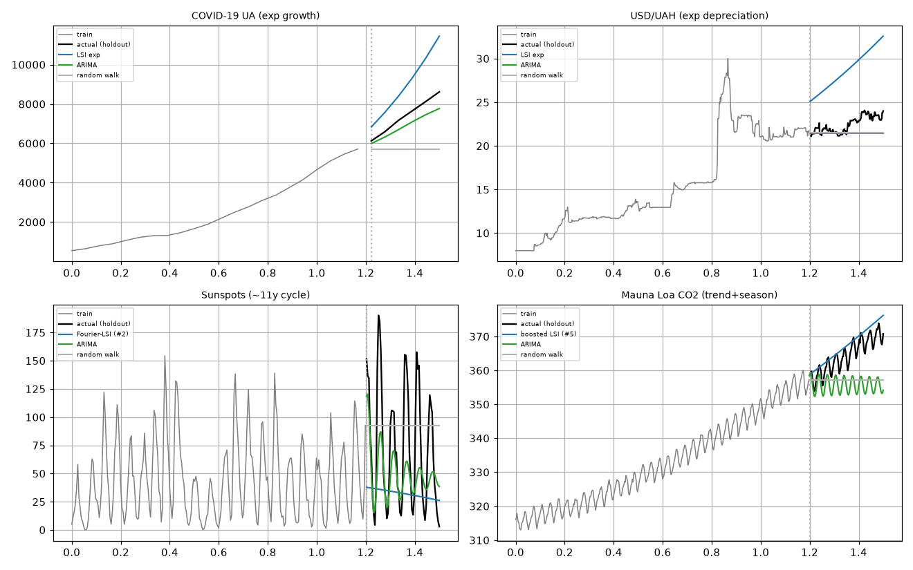
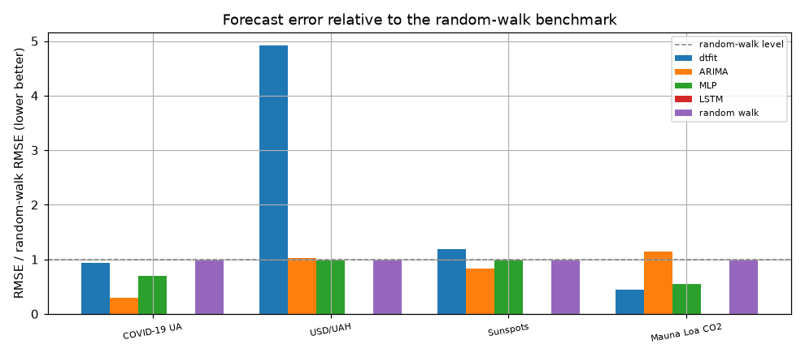

# Experiment 4 -- Real-world forecasting (train/holdout)

*Generated by `04_realworld_forecasting/run.py` on 2026-06-18.*

## Intent

Fit a structured dtfit model on the first 80% of four real series and forecast the last 20%, compared to ARIMA, a scikit-learn MLP, a PyTorch LSTM and the random-walk benchmark. dtfit is a parametric fit-then-extrapolate forecaster; we report honestly where its structure helps and where the general learners win.

## Models fitted & why

Each series is fitted with the parametric form its structure suggests (dtfit needs a model; the choice reflects the domain):
- **COVID-19 / USD-UAH:** `a.exp(b.x)` -- early epidemic growth and a currency-crisis depreciation are textbook exponential-in-parameters regimes.
- **Sunspots:** `c + A.sin(w.x + p)` via **Fourier-basis LSI (#2)** -- a dominant ~11-year cycle, so an offset + single harmonic on the Fourier basis (the natural orthogonal basis for periodic data).
- **Mauna Loa CO_2:** **stage-wise boosting (#5)** = quadratic trend `a0 + a1.x + a2.x²` (LSI) + seasonal `A.sin(w.x + p)` (LSI) -- CO_2 is a smooth rising trend plus an annual cycle, which the additive composite captures.
The point is honest: where the chosen form matches the physics dtfit extrapolates well; where it doesn't (or the series is irregular) the general learners win.

## Forecast accuracy on the 20% holdout

### COVID-19 UA (exp growth)

| method | RMSE | MAPE % | R^2 |
|---|---|---|---|
| LSI exp | 1764 | 20.91 | -3.245 |
| ARIMA | 545.7 | 6.37 | 0.594 |
| MLP | 1309 | 15.82 | -1.340 |
| random walk | 1876 | 21.55 | -3.803 |

### USD/UAH (exp depreciation)

| method | RMSE | MAPE % | R^2 |
|---|---|---|---|
| LSI exp | 6.425 | 27.71 | -50.118 |
| ARIMA | 1.336 | 4.51 | -1.211 |
| MLP | 1.286 | 4.32 | -1.048 |
| random walk | 1.307 | 4.40 | -1.115 |

### Sunspots (~11y cycle)

| method | RMSE | MAPE % | R^2 |
|---|---|---|---|
| Fourier-LSI (#2) | 66.62 | 92.97 | -0.593 |
| ARIMA | 46.91 | 80.05 | 0.210 |
| MLP | 55.05 | 73.28 | -0.088 |
| random walk | 56.05 | 254.25 | -0.127 |

### Mauna Loa CO2 (trend+season)

| method | RMSE | MAPE % | R^2 |
|---|---|---|---|
| boosted LSI (#5) | 3.772 | 0.84 | 0.402 |
| ARIMA | 9.826 | 2.37 | -3.056 |
| MLP | 4.747 | 1.06 | 0.053 |
| random walk | 8.641 | 2.01 | -2.136 |

*Forecasts vs holdout (shaded split) per series.*

*Error relative to random walk (1.0 = tie).*

## Reading it

Best method (lowest holdout RMSE) per series:

- **COVID-19 UA (exp growth)** -> ARIMA
- **USD/UAH (exp depreciation)** -> MLP
- **Sunspots (~11y cycle)** -> ARIMA
- **Mauna Loa CO2 (trend+season)** -> boosted LSI (#5)

The parametric dtfit models win where the series has clear nonlinear structure to extrapolate (exponential growth/decay, a clean cycle), and the Fourier-LSI (#2) and boosting (#5) adaptations let it express the cyclic / trend+season series. On irregular dynamics the general learners (ARIMA/LSTM) are competitive or better -- dtfit is a structured extrapolator, not a universal forecaster, and the table reflects that honestly.
