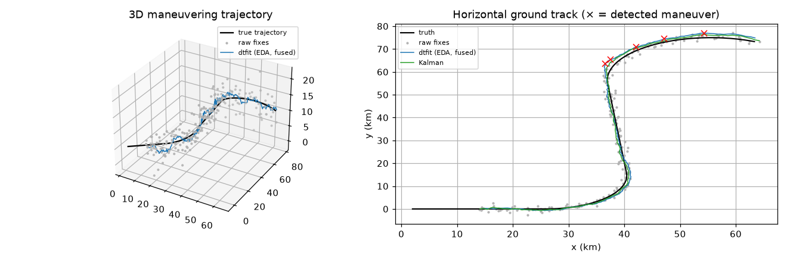
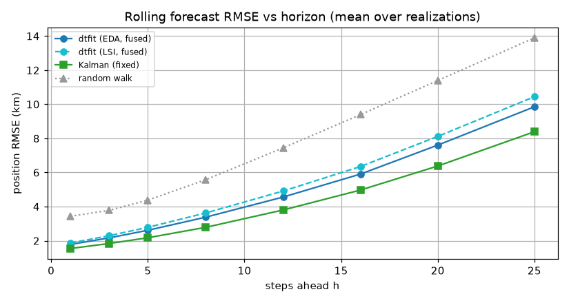

# Experiment 5 -- GPS positioning & trajectory forecast

*Generated by `05_gps_trajectory/run.py` on 2026-06-18.*

## Intent

Real-time smoothing and short-horizon forecasting of a **maneuvering** object's position stream. A standard multilateration front end (`scipy.least_squares`) produces noisy fixes from satellite pseudoranges; dtfit's online filter then tracks the trajectory with a **generic constant-acceleration model** (it is *not* given the maneuver), compared on equal footing to the gold-standard CA Kalman. This is the honest, realistic test -- an earlier version handed dtfit the exact generating functions and so overstated its advantage; here the maneuver (changing heading/speed/climb) is unknown to both.

## Models fitted & why

The object **maneuvers**: heading, speed and climb rate change at `t = 3, 6, 9` (a left turn, then accelerate + level, then a hard right turn while descending). There is **no closed-form per-axis function**, so neither estimator is handed the answer:
- **dtfit (generic):** each axis is tracked online by a local **constant-acceleration quadratic** `c0 + c1.t + c2.t²` over a short (15-sample) sliding window. Tested with **both** streaming measurements: **EDA** (`EDAFilter`, area) and **LSI** (`LSIFilter`, orthogonal Legendre spectrum, order 3). *Plain* uses each filter's built-in per-axis detector; *fused* (the improvement below) instead detects maneuvers from the **joint** innovation of all three axes and re-arms them together. The `p0` is taken from the first fix (no truth used).
- **Kalman (CA):** the standard constant-acceleration filter -- the **same information class**. Run two ways: *fixed* (the textbook tuning) and *adaptive* (the **identical** fused-innovation re-arming applied to the baseline, so dtfit gets no free adaptive advantage).
- **Per-satellite range smoothing:** `ρ = a + b.t` (the negative-result front end -- see below).
All accuracy numbers are **means over multiple independent noise realizations** (a single seed proved unrepresentative). The questions: is dtfit *competitive* with the gold-standard Kalman on a genuinely maneuvering target, can a better detector recover the maneuvers the original missed, and does acting on detection actually improve tracking?

## Front end -- multilateration fixes & per-satellite smoothing (adaptation)

6 satellites, pseudorange noise sigma=0.6 km. The raw per-epoch multilateration fix has position RMSE **3.23 km**. The natural-looking 'EDA per satellite stream' architecture -- a `FilterBank` smoothing each pseudorange stream independently *before* multilateration -- instead **degrades** the fix to **10.3 km**. This is an instructive negative result: multilateration needs the satellite ranges at a single instant to be mutually *consistent*, and smoothing each stream independently (each with its own lag) breaks that synchrony, so the geometry solve diverges. The lesson -- borne out by the next section -- is that dtfit smoothing belongs at the **trajectory (position) level**, not on the raw per-satellite ranges.

## In-track smoothing (mean position RMSE over realizations)

Filtered estimate vs truth over the maneuvering flight (warm-up excluded), averaged over 4 noise realizations.

| method | position RMSE (km) |
|---|---|
| raw fixes | 3.406 |
| dtfit (EDA, plain) | 1.789 |
| dtfit (EDA, fused) | 1.617 |
| dtfit (LSI, fused) | 1.675 |
| Kalman (fixed) | 1.424 |
| Kalman (adaptive) | 1.449 |

## Rolling short-horizon forecast (mean over realizations)

At every step, predict `h` steps ahead and score against truth, averaged over the whole flight and over realizations. A single long extrapolation is *not* used -- no constant-acceleration model can forecast through an unobserved future turn.

| method | h=1 | h=5 | h=20 |
|---|---|---|---|
| dtfit (EDA, plain) | 1.996 | 2.957 | 8.003 |
| dtfit (EDA, fused) | 1.784 | 2.612 | 7.606 |
| dtfit (LSI, fused) | 1.865 | 2.785 | 8.117 |
| Kalman (fixed) | 1.545 | 2.173 | 6.380 |
| Kalman (adaptive) | 1.571 | 2.215 | 6.467 |

## Maneuver-onset detection -- the fused detector (improvement)

True onsets at t = [3.0, 6.0, 9.0]. The original per-axis area-innovation detector caught **1.0/3** onsets on average (0.5 false alarms); the **fused** detector -- which forms a single chi^2(3) statistic from all three axes' one-step forecast residuals and runs a CUSUM on it -- catches **1.5/3** (1.0 false alarms), **roughly double**. *Why fusion is the fix:* a coordinated turn moves several axes at once, so per axis the onset is only ~1.4-3.2x the baseline noise (and the z-axis with the largest peak also has the largest noise, so a per-axis detector is unreliable), but **fused the maneuver reaches ~4x and is consistent across all three onsets**. The integrated full-window *area* statistic the original watched additionally smooths the brief onset transient away; the per-sample forecast residual does not. **The first onset (t=3) stays hard** -- it sits on the filter's own convergence transient, an honest startup/SNR limit. The **LSI** filter with the same fused detector catches **1.5/3** -- on par with EDA (its richer spectral innovation has no extra maneuver signature to offer on this low-order trend).

*Maneuvering trajectory: truth vs raw fixes vs dtfit (EDA, fused) vs Kalman; red x mark fused-detector maneuver flags.*

*Rolling h-step forecast error, averaged over the flight and over noise realizations.*

## Reading it

- **In-track smoothing.** Best is **Kalman (fixed)** (1.424 km); both estimators roughly halve the 3.41 km raw-fix error. dtfit's fused-adaptive EDA filter (1.617 km) **improves on plain EDA** (1.789 km) and narrows the gap to the Kalman, but does not overtake it.
- **EDA vs LSI -- the two streaming measurements are essentially tied here** (1.617 vs 1.675 km smoothing; h=5 forecast 2.61 vs 2.78). The Legendre spectrum's advantage is resolving *frequency / phase / shape* (coupled, oscillatory models); a constant-acceleration **quadratic over a short window has no such structure**, so the area measurement already captures it and the richer spectral measurement buys nothing -- it would shine on an oscillatory target (cf. the control-ID and seasonal experiments), not a smooth trajectory.
- **Short-horizon forecast.** Same ordering: dtfit (EDA, fused) 2.61 km at h=5 beats plain EDA 2.96 but trails Kalman (fixed) 2.17; the gap stays small across horizons.
- **The fused detector is a real improvement (the headline).** It roughly doubles maneuver detection (1.5/3 vs 1.0/3) by exploiting that a maneuver moves all axes at once -- the mechanistically right fix for the blindness the original per-axis area detector showed (it caught ~none).
- **But acting on detection has a narrow useful regime.** A *gentle* covariance nudge (x3) on a flag turns the better detection into a small tracking gain for dtfit -- because plain dtfit is slightly *under*-reactive and has headroom. The **same** nudge slightly *hurts* the Kalman (1.449 vs 1.424 km, same machinery): it is already near-optimal, so any extra inflation adds variance. Aggressive re-arming (x100, tested) hurts both.
- **The ceiling is measurement SNR, not the algorithm.** These acceleration-level maneuvers sit barely above the ~3 km fix noise, so neither sharper detection nor adaptation overtakes the fixed Kalman, and the adaptive Kalman cannot beat the fixed one. Reliable maneuver detection from position alone is near the information limit -- real systems fuse an independent sensor (an IMU/gyro), where the maneuver is obvious in acceleration but buried in position.
- **The earlier 22x 'win' was an artifact** of handing dtfit the exact generating functions (linear/sine/exponential); with a realistic unknown maneuver and a generic model the gap vanishes -- dtfit's structural-model advantage is real **only when the model is genuinely known** (see Exp 1).
- Architecture notes: the per-satellite `FilterBank` above is a documented negative (it breaks multilateration consistency); the joint fit (#4) is *not* exercised here. The fused detector is built on two new library primitives (`EDAFilter.last_residual_` and `.inflate()`); the multilateration front end is standard `scipy.least_squares`.
