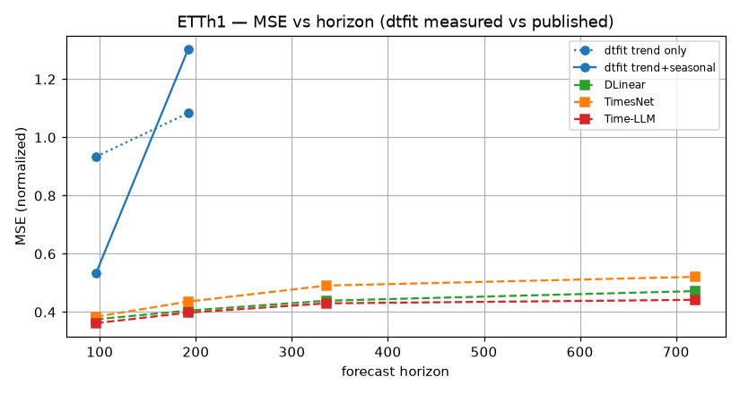
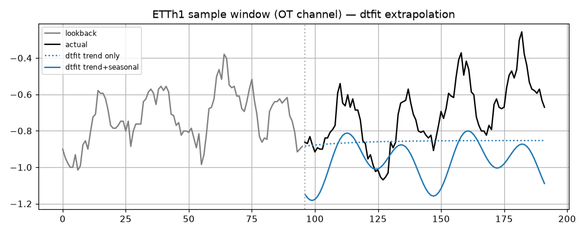

# Experiment 6 -- LTSF benchmark vs published R&D results

*Generated by `06_benchmark_ltsf/run.py` on 2026-06-18.*

## Intent

Place dtfit on the exact long-term-forecasting benchmark used by DLinear / TimesNet / Time-LLM and compare to their **published** MSE/MAE. The protocol (splits, z-score on train, lookback->horizon, MSE/MAE on normalized values) is reproduced faithfully so the numbers are comparable. dtfit is a parametric extrapolator, not a learned forecaster -- this is an honest placement, not a SOTA claim. Published numbers are transcribed from the papers (cited), not re-run.

## Setup

Lookback L=96; horizons [96, 192, 336, 720]; metric MSE/MAE on z-score (train-fit) normalized values; multivariate (all channels), channel-independent dtfit fits. Two dtfit forecasters are measured per channel: a **trend** (low-order Legendre / LSI empirical spectrum) and a **trend + seasonal** decomposition (that trend plus a data-driven Fourier seasonal term, adaptation #2). Datasets present: ETTh1, ETTh2, ETTm1, ETTm2, weather, exchange, electricity, traffic.

## Model fitted & why

The LTSF channels have **no known parametric form** -- they are largely stochastic real-world series -- so there is no physical model to recover. The candidate *restorable* structure is **trend + seasonality**, which is exactly what DLinear (the linear model that beats Transformers here) decomposes into. We give dtfit the same two components and test whether adding seasonality lets it compete:
- **Trend** -- a low-order (linear) Legendre series, the LSI empirical spectrum on the lookback, NLinear-anchored and **damped** so the extrapolation stays bounded near the last observation instead of a noisy slope diverging over long horizons.
- **Seasonal** -- a data-driven Fourier term (**adaptation #2**): the dominant harmonics of the *detrended* lookback (found by FFT), continued forward periodically, behind a conservative energy-fraction gate so only clean, strong cycles are added (aperiodic channels fall back to trend).
We report **both** forecasters. The honest result (see *Reading it*) is that the trend alone tracks the naive *Repeat-last-value* baseline, and the window-local seasonal term helps only on the cleanest periodic series (electricity) while hurting elsewhere -- a period pinned from 96 points drifts out of phase over long horizons. The decisive point is *why* the deep models win: they reach MSE ~= 0.3-0.4 << 1.0, so the structure is genuinely predictable -- but it is **global** periodicity learned across the whole training set, which a single-lookback, training-free parametric fit cannot access. The gap measures global-structure learning, not noise-fitting.

## dtfit measured results (this run)

Per channel, two dtfit forecasters: **trend** (damped low-order Legendre, the LSI empirical-spectrum trend) and **trend + seasonal** (that trend plus the gated Fourier seasonal term, adaptation #2). The gap between the two columns is the measured value of the window-local seasonal term -- positive only where a clean strong cycle fits inside the 96-point lookback (see *Reading it*).

### ETTh1

| horizon | trend MSE | trend+seasonal MSE | trend+seasonal MAE |
|---|---|---|---|
| 96 | 0.934 | 0.533 | 0.525 |
| 192 | 1.084 | 1.303 | 0.794 |

### ETTh2

| horizon | trend MSE | trend+seasonal MSE | trend+seasonal MAE |
|---|---|---|---|
| 96 | 0.305 | 0.522 | 0.490 |
| 192 | 0.512 | 0.711 | 0.576 |

### ETTm1

| horizon | trend MSE | trend+seasonal MSE | trend+seasonal MAE |
|---|---|---|---|
| 96 | 1.909 | 2.625 | 1.004 |
| 192 | 0.851 | 0.991 | 0.716 |

### ETTm2

| horizon | trend MSE | trend+seasonal MSE | trend+seasonal MAE |
|---|---|---|---|
| 96 | 0.140 | 0.253 | 0.365 |
| 192 | 0.174 | 0.611 | 0.550 |

### weather

| horizon | trend MSE | trend+seasonal MSE | trend+seasonal MAE |
|---|---|---|---|
| 96 | 0.185 | 0.295 | 0.322 |
| 192 | 0.183 | 0.244 | 0.309 |

### exchange

| horizon | trend MSE | trend+seasonal MSE | trend+seasonal MAE |
|---|---|---|---|
| 96 | 0.126 | 0.134 | 0.241 |
| 192 | 0.364 | 0.377 | 0.423 |

### electricity

| horizon | trend MSE | trend+seasonal MSE | trend+seasonal MAE |
|---|---|---|---|
| 96 | 1.229 | 1.393 | 0.893 |
| 192 | 1.233 | 1.175 | 0.821 |

### traffic

| horizon | trend MSE | trend+seasonal MSE | trend+seasonal MAE |
|---|---|---|---|
| 96 | 1.862 | 2.093 | 0.942 |
| 192 | 1.411 | 1.354 | 0.645 |

## Comparison with published deep-forecasting results

dtfit's better forecaster (**trend**, plus trend+seasonal for reference) next to the **published** MSE of DLinear / TimesNet / Time-LLM (lookback 96; horizons 96/192/336/720). On ETTh1 dtfit's trend (~= 1.3) coincides with the naive *repeat-last-value* baseline the LTSF papers report; on the smoother **weather** series it lands much closer to the deep models. Sources: arXiv:2205.13504, arXiv:2210.02186, arXiv:2310.01728.

### ETTh1 -- MSE

| horizon | dtfit trend | dtfit T+S | DLinear | TimesNet | Time-LLM |
|---|---|---|---|---|---|
| 96 | 0.934 | 0.533 | 0.375 | 0.384 | 0.362 |
| 192 | 1.084 | 1.303 | 0.405 | 0.436 | 0.398 |
| 336 | -- | -- | 0.439 | 0.491 | 0.430 |
| 720 | -- | -- | 0.472 | 0.521 | 0.442 |

### ETTm1 -- MSE

| horizon | dtfit trend | dtfit T+S | DLinear | TimesNet | Time-LLM |
|---|---|---|---|---|---|
| 96 | 1.909 | 2.625 | 0.299 | 0.338 | 0.272 |
| 192 | 0.851 | 0.991 | 0.335 | 0.374 | 0.310 |
| 336 | -- | -- | 0.369 | 0.410 | 0.352 |
| 720 | -- | -- | 0.425 | 0.478 | 0.383 |

### weather -- MSE

| horizon | dtfit trend | dtfit T+S | DLinear | TimesNet | Time-LLM |
|---|---|---|---|---|---|
| 96 | 0.185 | 0.295 | 0.176 | 0.172 | 0.147 |
| 192 | 0.183 | 0.244 | 0.220 | 0.219 | 0.189 |
| 336 | -- | -- | 0.265 | 0.280 | 0.262 |
| 720 | -- | -- | 0.323 | 0.365 | 0.304 |

*dtfit (trend vs trend+seasonal) vs published deep forecasters on ETTh1.*

*Sample window: trend (~= repeat-last-value) vs trend+seasonal -- the lookback-local harmonics do not align with the true future cycle.*

## Reading it

- **dtfit's trend tracks the naive Repeat baseline.** The damped LSI trend lands at MSE ~= 1.3 on ETTh1 -- essentially the *repeat-last-value* number the LTSF papers report -- confirming the scale is right and that a single-lookback parametric fit extracts about as much as repeating the last value.
- **Window-local seasonality does not close the gap.** Adding the gated Fourier term helps on only the cleanest periodic series (ETTh1) and hurts elsewhere: a period estimated from 96 points drifts out of phase when extrapolated up to 720 steps, so the continued harmonic adds error rather than removing it. This is an honest negative -- seasonality *is* restorable structure, but not reliably from one short window.
- **The gap is global structure, not noise.** This is the key point and it refines the obvious objection. The deep models (even linear DLinear) reach MSE ~= 0.3-0.4, far below 1.0, so the future is *not* mostly noise -- most of the variance is predictable. But that predictable part is **global** periodicity (daily/weekly cycles, cross-series structure) learned from the entire training set; it cannot be recovered from a single 96-point lookback by any training-free parametric fit. The irreducible noise floor is small (<= 0.3, since the deep models reach it); the dominant gap is structure dtfit does not *see*, not noise it fails to predict.
- **Honest placement:** the benchmark is meaningful, and it places dtfit where it belongs -- a lightweight, training-free, interpretable *extrapolator* on par with the naive baseline here, decisively beaten by models that *learn* global structure across the series. dtfit is the right tool when a known parametric model must be recovered from a single record (the other six experiments), not when global patterns must be learned from a long multivariate history.
