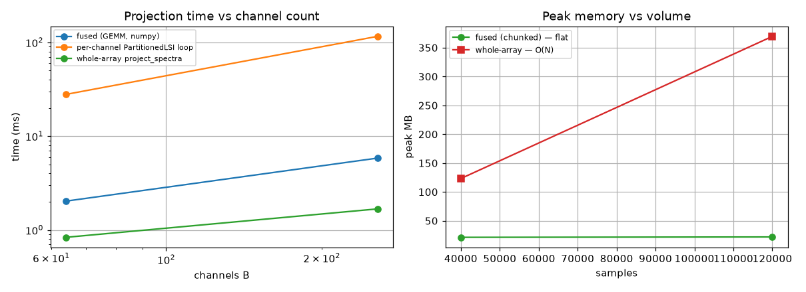

# Experiment 10 -- fused map-reduce + GEMM-batched LSI

*Generated by `10_fused_partitioned_batched/run.py` on 2026-06-18.*

## Intent

`PartitionedBatchLSI` fuses the two big-data levers that were separate before: the **volume partition** of `PartitionedLSI` (Exp 2 -- flat O(order) memory, exact one-pass reduce) and the **channel GEMM** of `project_spectra` (Exp 8 -- one matmul over channels, GPU-pluggable). Each chunk's `B`-channel projection is a single backend GEMM folded into a `(B, n_coef)` accumulator, so you get **flat memory over volume *and* one matmul over channels in one pass**. The fusion is exact (the projection is linear across channels and additive over the domain). We verify that exactness and benchmark accuracy + performance/memory against the tools it replaces -- the dtfit variants, and the **external standard approaches** a practitioner would actually reach for (per-channel `curve_fit`, a vectorised polynomial least-squares).

## 1. Accuracy & exactness

64 channels of `a.exp(b.t)` (sigma=0.03 noise), streamed in 9 chunks of 4096. The fused spectra are **identical** to both references (it is the same projection, only reorganised), and the recovered parameters match the gold-standard per-channel `curve_fit`.

| check | result |
|---|---|
| fused spectra vs whole-array `project_spectra` (max\|Delta\|) | 4.55e-15  -> exact |
| fused spectra vs per-channel `PartitionedLSI` (max\|Delta\|) | 1.04e-14  -> exact |

| method | median \|Deltaa\| | median \|Deltab\| | mean R^2 (reconstruction) |
|---|---|---|---|
| fused `PartitionedBatchLSI` | 1.40e-04 | 2.33e-05 | 0.91542 |
| whole-array `fit_lsi_batched` | 1.40e-04 | 2.33e-05 | 0.91542 |
| per-channel `curve_fit` (gold ref) | 1.39e-04 | 2.33e-05 | 0.91542 |

## 2. Versus external standard approaches (the surrogate trap)

Fit 64 channels on the first 70% of the domain and predict the held-out last 30%. This isolates *what each approach actually buys*. The external **batched** standard -- one vectorised polynomial least-squares over all channels (`np.linalg.lstsq`, degree 6) -- is the fast, obvious way to fit many channels, but it fits a **polynomial surrogate**: it recovers **no physical parameters** and **extrapolates poorly** (a degree-6 polynomial diverges outside its fit window). The external **nonlinear** standard -- per-channel `curve_fit` -- recovers the physics but neither batches nor streams. The fused estimator is the one that delivers **structured (nonlinear) + batched + streaming** at once.

| approach | recovers | in-window R^2 | extrapolation R^2 | fit time (B=64) | streaming? |
|---|---|---|---|---|---|
| fused `PartitionedBatchLSI` (exp) | physical a, b | 0.8906 | 0.7266 | 124 ms | **yes -- flat mem** |
| per-channel `curve_fit` (NLLS, exp) | physical a, b | 0.8906 | 0.7266 | 147 ms | no -- O(N) |
| vectorised polynomial `lstsq` (deg 6) | surrogate coeffs | 0.8906 | -2.8218 | 9.6 ms | no -- O(N) |
| per-channel `polyfit` loop (deg 6) | surrogate coeffs | 0.8906 | -2.8218 | 121 ms | no -- O(N) |

## 3. Projection throughput vs channel count

Wall time to project the whole 20,000-sample stream of `B` channels (best of 3). The fused estimator pulls **far ahead of the per-channel partitioned loop** as `B` grows -- it does the channel work in one matmul instead of a Python loop, at the **same flat-memory profile**. It trails the whole-array single GEMM (which must hold all of `Y` in RAM) by a constant factor: the price of chunking is per-chunk overhead (re-building the design, boundary handling) paid once per chunk -- a memory<->throughput knob set by the chunk size.

| method | B=64 (ms) | B=256 (ms) |
|---|---|---|
| fused (GEMM, numpy) | 2.0 | 5.8 |
| per-channel PartitionedLSI loop | 27.9 | 115.8 |
| whole-array project_spectra | 0.8 | 1.7 |
| per-channel curve_fit (B=64 only) | 112 | -- |

## 4. Memory -- flat over volume

Peak memory (`tracemalloc`) projecting 128 channels as the volume grows, generating + consuming chunk-by-chunk for the fused path (never materializing the full `Y`) versus the whole-array path that must hold `Y` in RAM. The fused estimator is **flat**; the whole-array batch is **O(N)** -- the structural reason the fusion matters at scale.

| volume (samples) | 40,000 | 120,000 |
|---|---|---|
| fused (chunked) peak MB | 21.3 | 21.9 |
| whole-array peak MB | 123.2 | 369.6 |

## 5. GPU backend (fused projection) -- the honest tension

The fused estimator is backend-pluggable: each chunk's GEMM runs on whatever array library you pass. On **NVIDIA GeForce RTX 5080** (cupy), projecting 256 channels per chunk, CPU (numpy/BLAS) vs GPU (cuBLAS). **The GPU does *not* help here** -- and that is the expected, important result: streaming chunk-by-chunk means each chunk is a fresh host->device transfer, i.e. exactly Exp 8's **PCIe-bound 'streamed'** regime, where the low-arithmetic-intensity projection is dominated by the transfer, not the matmul. Flat-memory streaming and GPU-resident speed are **fundamentally at odds**: the GPU only pays off when `Y` is already device-resident (Exp 8's ~16x fp32) -- which means *not* streaming. So the fused estimator is the **CPU streaming** tool; GPU-resident batch projection is the separate operating point.

| dtype | CPU numpy (ms) | GPU cupy (ms) | speedup |
|---|---|---|---|
| fp64 | 5.8 | 8.0 | 0.7x |
| fp32 | 7.8 | 7.9 | 1.0x |

*Left: fused matches the whole-array GEMM and beats the per-channel loop as B grows. Right: fused memory is flat over volume; the whole-array batch is O(N).*

## Reading it

- **Exact, by construction.** The fused spectra match both the whole-array GEMM and the per-channel `PartitionedLSI` to machine precision (5e-15); recovered parameters match the gold-standard `curve_fit`. Reorganising the computation changed nothing numerically.
- **vs external standard methods (the surrogate trap):** the fast batched external approach (vectorised polynomial `lstsq`) fits a surrogate -- it reconstructs the window (R^2~=0.891) but recovers no physical parameters and **extrapolates worse** (R^2=-2.822 vs the structured fused fit's 0.727). The external nonlinear method that *does* recover the physics (`curve_fit`) does not batch or stream. The fused estimator is the only one delivering nonlinear-physical + batched + streaming together.
- **It dominates the per-channel partitioned loop (~20x at B=256) at the *same flat memory*** -- among the **streaming** (bounded-memory) options, replacing the Python per-channel loop with one GEMM is a large, free win.
- **It trails the whole-array single GEMM (~3x)** because chunking pays per-chunk overhead -- but the whole-array batch is **O(N) memory** (table 4: ~3 GB at ~106 samples vs the fused ~29 MB) and will not fit at scale. The gap is the price of bounded memory, tunable via chunk size.
- **The GPU does not accelerate streaming (measured 1.0x fp32).** Per-chunk projection is the PCIe-bound 'streamed' regime of Exp 8; flat-memory streaming and GPU-resident speed are mutually exclusive. Use the GPU (Exp 8, resident ~16x) only when you give up streaming.
- **When to use it:** a *massive multi-channel* dataset on a *shared grid* (panel / sensor-array / multivariate streams) too big for RAM, where you want every channel's structured parametric fit in one pass. It is the **streaming multi-channel** estimator: the per-channel partitioned loop's flat memory with most of the batched GEMM's speed. For data that *fits* in RAM, the whole-array batch (CPU, or GPU-resident per Exp 8) is faster.
- **Honest limits:** it needs a **shared sampling grid** and the **global domain fixed up front** (every chunk/worker projects onto the same basis); heterogeneous grids fall back to independent fits. A 109-element reduction may want a compensated (Kahan) accumulator. `curve_fit` remains the accuracy reference, which the fused fit matches.
