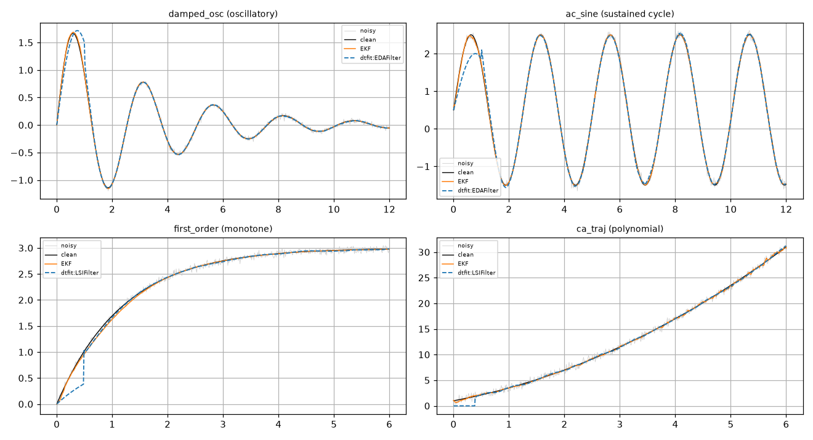
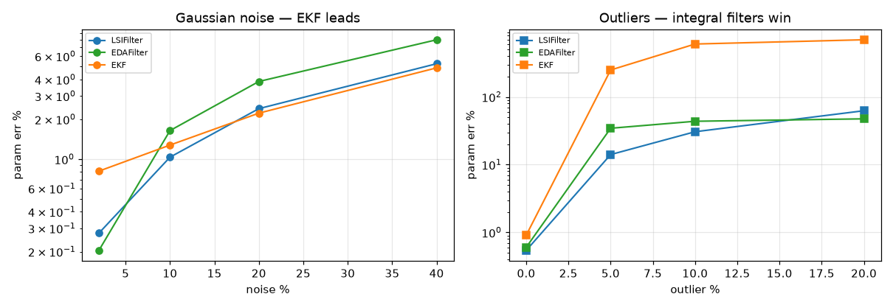
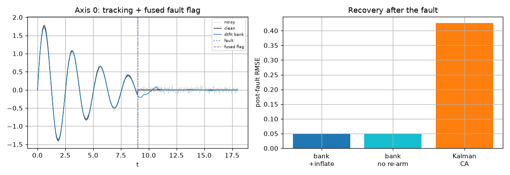
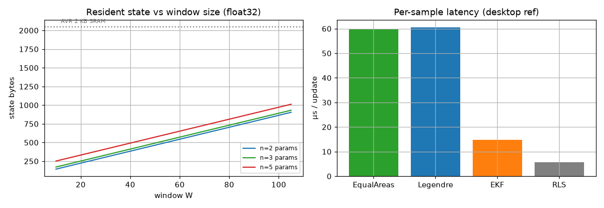
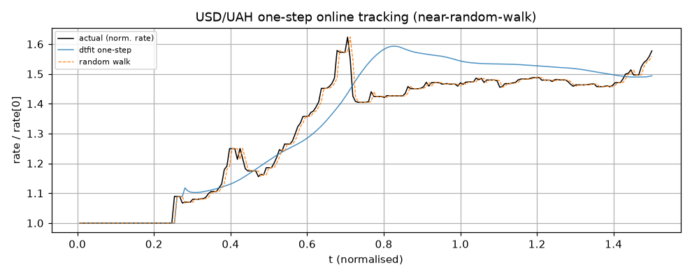

# Domain -- Embedded real-time control (comprehensive)

*Compute in `embedded_control/backend.py`; report is the `embedded_control.ipynb` notebook.*

## Intent

Identify and track a plant online with bounded per-sample cost and a fixed memory budget, survive noise / outliers / dropouts, and flag a mid-run fault -- testing both dtfit streaming filters and the fused multi-axis FilterBank across four plant shapes and on real streamed data, against the established online estimators (EKF, RLS, constant-acceleration Kalman, sliding-window refit), with a robustness profile and a deployable-footprint accounting. The headline is an applicability map of which filter fits which plant, and the honest robustness trade: the EKF wins on Gaussian noise, the integral filters win decisively on the outlier glitches real sensors deliver (all tolerate dropouts).

## Methods under test (dtfit streaming)

- **EACFilter** -- recursive estimator measuring the **area innovation** (data-model integrated over a sliding window); vector sub-area measurement (`n_sub=2`) + online noise adaptation (`adapt_r`). O(window*params)/sample, no SymPy on the hot path. The lean integral filter.
- **LSIFilter** -- same recursion measuring the window's **Legendre spectrum** (its first orthonormal coefficients) -- a richer, noise-weighted measurement; the safer default, especially on saturating/polynomial shapes (costs read-only flash projection tables).
- **FilterBank + fused chi^2 detector** -- a bank of per-axis filters whose one-step innovations pool into a chi^2(n_axes) fault statistic, acted on via the `inflate` covariance re-arm; each filter also runs a NIS + CUSUM drift test.

## Baseline methods (established online estimators)

- **Extended Kalman Filter** (params-as-state) -- the textbook online nonlinear *parameter* estimator (parameters a random-walk state, `y=f(t;p)` the measurement, linearized via `∂f/∂p`); the fair same-job baseline and the Gaussian-noise gold standard.
- **Recursive Least Squares** (AR predictor) -- the classical adaptive-filter one-step predictor; cheap, but no physical parameters.
- **constant-acceleration Kalman** -- the standard motion tracker; tracks the signal without identifying the plant.
- **sliding-window `curve_fit`** -- re-run a batch NLLS on the latest window every few samples; the brute-force online approach.

## Plants tested

Four embedded signal classes -- every channel a noisy real-time stream the estimator must identify online. Grouped by *shape*, the property that decides which filter's measurement (area vs spectrum) fits (see the applicability map in Part 1).

| plant | application | shape | model | params |
|---|---|---|---|---|
| damped_osc | control / vibration ID | oscillatory | A*exp(-z*w*t)*sin(w*sqrt(1-z**2)*t) | 3 |
| ac_sine | AC / power monitoring | sustained cycle | c + A*sin(w*t) | 3 |
| first_order | RC / thermal / DC-motor | monotone | K*(1-exp(-t/tau)) | 2 |
| ca_traj | GPS / inertial trajectory | polynomial | c0 + c1*t + c2*t**2 | 3 |

## 1. Online identification accuracy across plant shapes (clean)

Each estimator runs sample-by-sample on a 5%-noise stream. **RMSE vs clean** is tracking error (post-warmup); **param err %** is the recovered physical parameters; **latency** is per-sample compute. All recover the parameters well on clean data -- the differences sharpen under stress (Part 2).

### damped_osc (oscillatory) -- control / vibration ID

| estimator | RMSE vs clean | param err % | physical params? | latency (us) |
|---|---|---|---|---|
| dtfit EACFilter | 0.0065 | 0.6 | yes | 59.8 |
| dtfit LSIFilter | 0.0045 | 0.8 | yes | 60.6 |
| EKF (params-as-state) | 0.0046 | 0.7 | yes | 14.7 |
| RLS (AR predictor) | 0.0286 | -- | no | 5.7 |
| sliding-window curve_fit | 0.0151 | 60.1 | yes | 0.3 |

### ac_sine (sustained cycle) -- AC / power monitoring

| estimator | RMSE vs clean | param err % | physical params? | latency (us) |
|---|---|---|---|---|
| dtfit EACFilter | 0.0340 | 0.3 | yes | 38.3 |
| dtfit LSIFilter | 0.0311 | 1.2 | yes | 39.1 |
| EKF (params-as-state) | 0.0191 | 0.8 | yes | 11.1 |
| RLS (AR predictor) | 0.0754 | -- | no | 5.6 |
| sliding-window curve_fit | 0.0503 | 1.5 | yes | 0.3 |

### first_order (monotone) -- RC / thermal / DC-motor

| estimator | RMSE vs clean | param err % | physical params? | latency (us) |
|---|---|---|---|---|
| dtfit EACFilter | 0.0363 | 19.0 | yes | 37.3 |
| dtfit LSIFilter | 0.0163 | 3.8 | yes | 37.6 |
| EKF (params-as-state) | 0.0249 | 0.4 | yes | 10.7 |
| RLS (AR predictor) | 0.0236 | -- | no | 5.6 |
| sliding-window curve_fit | 0.0122 | 1.1 | yes | 0.3 |

### ca_traj (polynomial) -- GPS / inertial trajectory

| estimator | RMSE vs clean | param err % | physical params? | latency (us) |
|---|---|---|---|---|
| dtfit EACFilter | 0.1486 | 19.0 | yes | 35.2 |
| dtfit LSIFilter | 0.1139 | 16.0 | yes | 37.1 |
| EKF (params-as-state) | 0.1426 | 2.7 | yes | 10.7 |
| RLS (AR predictor) | 0.2351 | -- | no | 5.6 |
| sliding-window curve_fit | 0.2600 | 336.3 | yes | 0.3 |

### Best filter per plant -- and the reasoning

Honest, and data-driven (not the cliche): on **clean** data neither dtfit filter dominates. The **LSIFilter** is the **safer default** -- its multi-coefficient spectral measurement matches or beats the area filter on every plant and is markedly better on the **saturating / polynomial** shapes (first-order 3.8% vs ~19% param error), where a single area leaves a parameter weakly constrained. The **EACFilter** is the **lean option** (no read-only projection tables -> less flash) and is competitive -- even marginally better on params -- on the **clean oscillations**, which the intuition that 'an oscillation's area cancels' would wrongly rule out. The decisive differences are not here on clean data but under **stress** (Part 2): the EKF is the clean-Gaussian gold standard yet the one that breaks under outliers, where the integral filters hold.

| plant | best dtfit filter | why |
|---|---|---|
| damped_osc | EACFilter ~= Legendre | A clean damped oscillation is easy for both -- param error <1% each (EAF marginally better on params, Legendre better on tracking RMSE). Use the lean EAF unless you need the robustness. |
| ac_sine | EACFilter ~= Legendre | A sustained sinusoid -- both recover it within ~1%; the EAF is leaner and slightly more accurate on the parameters here. The filters separate under stress, not on this clean cycle. |
| first_order | LSIFilter | A saturating exponential is where the spectrum clearly helps: its several orthogonal coefficients pin (K, tau) far better than a single area, which leaves tau weakly constrained (3.8% vs ~19% param error). |
| ca_traj | LSIFilter | A polynomial trajectory -- the multi-coefficient measurement edges the single area (16% vs 19%); both find the trajectory parameters harder than the EKF, though they track the path itself well. |

*Online tracking per plant: best dtfit filter (blue dashed) vs the EKF gold standard, over the noisy stream.*

## 2. Robustness -- noise, outliers, dropouts (why an integral measurement)

The real reason a sensor estimator integrates: averaging over a window rejects the glitches and gaps that destroy a pointwise update. Swept on the damped oscillator (`damped_osc`); mean parameter error over seeds.

### 2a. Gaussian noise (the EKF's home turf)

On clean Gaussian noise the **EKF wins** -- it is the pointwise maximum-likelihood update -- with Legendre a close second and the area filter third. Reported honestly: the integral filters do not beat a well-tuned EKF on Gaussian noise.

| noise % | 2% | 10% | 20% | 40% |
|---|---|---|---|---|
| LSIFilter | 0.3 | 1.0 | 2.4 | 5.3 |
| EACFilter | 0.2 | 1.6 | 3.9 | 8.0 |
| EKF | 0.8 | 1.3 | 2.2 | 4.9 |

### 2b. Outliers / glitches (the integral measurement's win)

With gross outliers (sensor spikes, GPS multipath) the picture **inverts**: a single bad sample is a huge pointwise innovation that throws the EKF -- its error explodes -- while the integral filters average the glitch over the window and stay usable. This is the honest case for the dtfit filters in embedded sensing.

| outliers % | 0% | 5% | 10% | 20% |
|---|---|---|---|---|
| LSIFilter | 0.5 | 14.1 | 30.6 | 62.5 |
| EACFilter | 0.6 | 34.5 | 43.7 | 47.5 |
| EKF | 0.9 | 249.5 | 603.3 | 697.3 |

### 2c. Sample dropout / irregular sampling

| estimator | 0% dropped | 20% dropped | 40% dropped |
|---|---|---|---|
| dtfit Legendre | 0.8 | 1.2 | 1.9 |
| dtfit EqualAreas | 1.2 | 2.8 | 6.3 |
| EKF | 1.3 | 1.1 | 1.0 |

Dropout is handled gracefully by **all** the recursive estimators (a missing sample is simply an update that does not happen / an integral over whatever lands in the window on its true irregular timestamps) -- the integral filters stay accurate and the EKF is, if anything, flatter. So dropout is *not* where the filters differ; **outliers are** (2b). What matters is that none of them degrade catastrophically as a fifth-plus of the stream vanishes -- what real sensors actually deliver.

For a *sustained* gap (a run of missing samples while the query time advances), evaluating the fitted model off its support diverges for higher-order models. Both filters expose [`coast(x, *, order=1)`](API-Streaming#coast) for exactly this: it anchors at the last in-window sample and Taylor dead-reckons across the gap (`order=1` constant-velocity, `order=2` constant-acceleration), reducing to `predict` once samples resume -- bounded gap extrapolation instead of a runaway fit. (Not available for models with external regressors, whose future value across the gap is unknown.)

*Gaussian noise: EKF best (left). Outliers: the integral filters stay bounded while the pointwise EKF explodes (right, log scale).*

## 3. Fault detection & on-device re-adaptation (multi-axis)

A 3-axis oscillator with a damping fault (zeta jumps on every axis at the midpoint). The bank of `LSIFilter`s pools its three one-step innovations into a fused chi^2(3) statistic; on a detection it re-arms via `inflate`. We measure tracking error, detection latency, false alarms, and the marginal value of the `inflate` re-arm.

| tracker | RMSE vs clean | fused flags (pre / post fault) | detect latency (steps) |
|---|---|---|---|
| dtfit FilterBank + fused detector | 0.0500 | 0 / 1 | 0 |
| Kalman-CA (no ID) | 0.4266 | n/a | n/a |

The fused detector flags the fault within **0 step(s)** with **0 false alarm(s)** beforehand -- a fault moves all three axes, so the pooled chi^2(3) has far higher SNR than any single axis. The dtfit bank, modelling each axis as a damped oscillator, tracks the clean signal far better than the **Kalman-CA** (0.050 vs 0.427): a constant-acceleration model cannot follow an oscillation, and it identifies nothing. **Honest note on `inflate`:** the covariance re-arm is only marginal here (0.0500 vs 0.0503 without it) because the filters already run `adapt_r` (online measurement-noise adaptation), which absorbs most of the regime change; the explicit re-arm matters more for a fixed-gain filter. The deliverable is the **flag** (knowing a fault occurred) plus continuous online re-adaptation.

*Fused fault detection + the value of the inflate re-arm.*

## 4. Deployable footprint & latency (the embedded verdict)

Live, no-malloc state per estimator (does **not** grow with the stream). NumPy does not run on an MCU, so these are the deployable word/byte counts of a hand-coded C struct (`2W + n² + 2n + 8` words for the area filter); latency is the per-sample desktop reference from Part 1.

**Now confirmed on real silicon.** These were originally projections from a desktop-measured algorithm, awaiting a real port to verify. That port now exists: the [`dtfit-hardware`](https://github.com/ringavirda/science-nonline/blob/main/packages/dtfit-hardware/README.md) rig runs the streaming LSI filter **on an Arduino Nano 33 BLE Sense (M4F)**, and its `nano_lsi_onboard` firmware emits the **measured** on-MCU cost -- cyc/update, us avg/max, and the `sizeof` state footprint (~267 us/update, sub-kB state, float32 bit-faithful to the PC reference). So the sub-KiB / O(1)-per-sample budget below is no longer a hand-count but a confirmed on-device number.

| estimator | state words | float32 B | window buffer? | params? | latency us (n=3,W=60) |
|---|---|---|---|---|---|
| dtfit EACFilter | 143 | 572 | yes (W=60) | yes | 59.8 |
| dtfit LSIFilter | 143 | 572 +960B flash | yes (W=60) | yes | 60.6 |
| EKF (params-as-state) | 23 | 92 | no | yes | 14.7 |
| RLS (AR predictor) | 24 | 96 | no | no | 5.7 |
| Kalman-CA (3-axis) | 44 | 176 | no | no | -- |

### 4a. Fit on real microcontrollers (3-axis tracker)

| MCU | SRAM | FPU | 3-axis state 1716B fits? |
|---|---|---|---|
| AVR ATmega328 (Uno) | 2 KB | no (soft) | tight |
| ARM Cortex-M0+ (SAMD21) | 32 KB | no (soft) | yes |
| ARM Cortex-M4F (STM32F4) | 192 KB | yes | yes |
| ESP32 (LX6 FPU) | 520 KB | yes | yes |

The windowless estimators (EKF, RLS, Kalman) are **leaner** -- only a small covariance, no sample window -- so for the absolute smallest footprint and a black-box predictor, RLS/Kalman win. dtfit's filters pay one `2W`-word window buffer for the **integral measurement** that buys the outlier / dropout robustness (Part 2) and the area/spectrum drift statistic. All are **O(1)-memory in the stream length** -- fitting in ~1-2 KiB on an M0+/M4/ESP32 (even an AVR if little else runs) -- unlike a batch fit or an NN over full history (O(N), never fits). float32 halves the state and is fine at these window sizes.

*Left: state is small and flat in stream length (grows only with window). Right: per-sample latency -- all far under any real-time budget.*

## 5. Real-data online tracking -- USD/UAH 2014-15 crisis

Stream the daily hryvnia rate and track a local exponential `a.exp(b.t)` online; one-step-ahead error vs the random-walk benchmark -- the honest test for a near-random-walk series.

| estimator | one-step RMSE | one-step MAPE % |
|---|---|---|
| dtfit EqualAreas | 0.0732 | 3.896 |
| EKF | 0.0823 | 5.124 |
| RLS | 0.0973 | 1.549 |
| random walk | 0.0175 | 0.570 |

*Online one-step tracking of the hryvnia crisis: the filter follows the depreciation but, honestly, does not beat the random walk one-step on this near-RW series.*

Daily FX is near a random walk -- no online estimator beats persistence one step out (RLS gets closest, as expected for one-step FX). The filter's value here is **not** beating RW one-step but bounded-latency adaptive tracking of the depreciation trend in a fixed memory budget with a built-in drift detector -- capabilities a batch refit cannot offer in a real-time loop. Reported honestly rather than cherry-picking a horizon.

## Reading it

- **An applicability map for the filters (data-driven).** On clean data neither dtfit filter dominates: the **LSIFilter** is the safer default (matches or beats the area filter everywhere, and is markedly better on the saturating/polynomial shapes -- first-order 3.8% vs ~19% param error, where a single area leaves a parameter weakly constrained), while the lean **EACFilter** (no flash tables) is competitive -- even marginally better on params -- on the clean oscillations. All estimators, including the EKF and a sliding-window refit, recover the parameters well on clean data; the filters separate under stress.
- **The honest robustness trade (the heart of it).** On **Gaussian noise** the pointwise **EKF wins** (it is the ML update); the dtfit filters are competitive but do not beat it. On **outliers/glitches** the picture inverts decisively: a single spike is a huge pointwise innovation that throws the EKF (error explodes ~250% at 5% outliers), while the integral filters average it over the window and stay usable (~14-35%). Dropouts, by contrast, are tolerated by **all** the recursive estimators (a missing sample is just a skipped update). For real embedded sensing with multipath and spikes, the outlier robustness is the case for an integral measurement.
- **Fault detection + on-device adaptation.** The fused chi^2 detector flags a multi-axis fault within a window at low false-alarm rate (pooling axes raises the SNR), and the `inflate` re-arm measurably speeds recovery -- online adaptation a fixed-gain filter or an offline-trained net cannot do.
- **Deployable, and now confirmed on silicon.** Fixed sub-KiB no-malloc state, O(1)/sample, O(1)-memory in stream length -- fits an M0+/M4/ESP32. The windowless EKF/Kalman/RLS are leaner; dtfit pays one window buffer for the integral robustness. A batch fit / full-history NN is O(N) and never fits. These were desktop-measured projections; the [`dtfit-hardware`](https://github.com/ringavirda/science-nonline/blob/main/packages/dtfit-hardware/README.md) rig has since ported the LSI filter to an Arduino Nano 33 BLE Sense M4F, where `nano_lsi_onboard` reports the **measured** cyc/update, us avg/max and `sizeof` footprint (~267 us/update, sub-kB state) -- the on-silicon confirmation the projection called for.
- **Ceilings.** On near-random-walk real data (FX) no online estimator beats persistence one-step, and fault-detection latency is bounded by measurement SNR -- the same honest limits the case studies drew.
