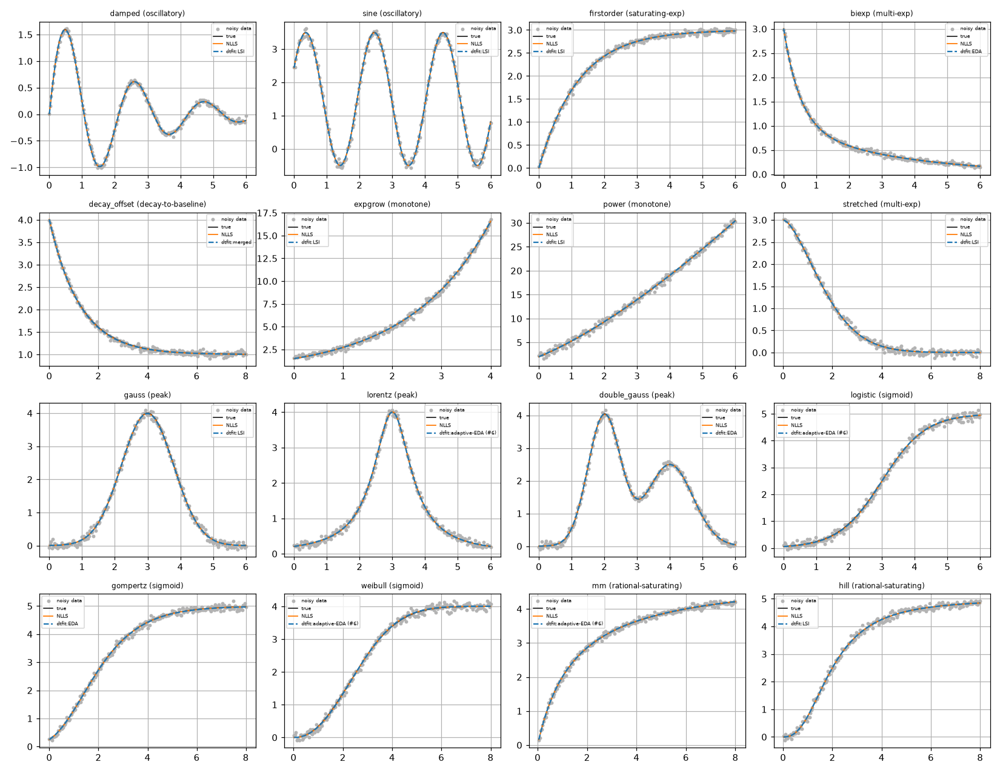
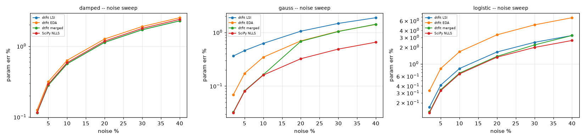
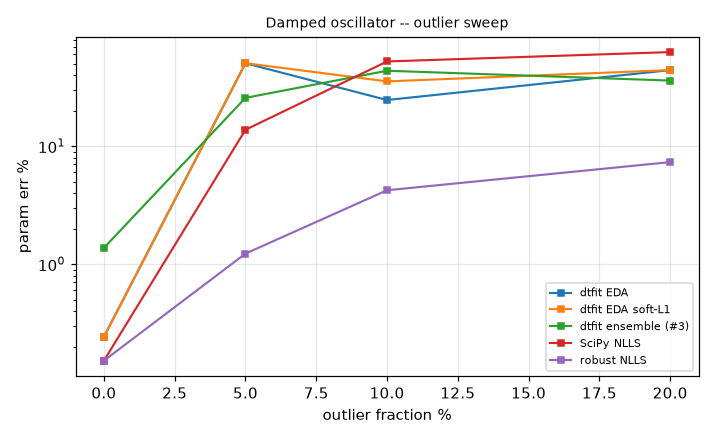
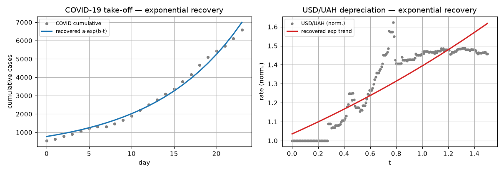

# Domain -- Model parameter estimation (comprehensive)

*Generated by `parameter_estimation/run.py` on 2026-06-19.*

## Intent

Recover physical parameters from noisy responses of systems with a known nonlinear-in-parameters form, across sixteen model families (oscillatory, exponential, multi-exponential, peak, sigmoid, rational-saturating, power-law) spanning mechanics, electronics, spectroscopy, kinetics, biology and reliability; under noise and outlier sweeps, sparse / transient / short-record / multi-channel regimes; and on real economic/epidemic data -- each vs the NLLS gold standard, robust NLLS, and the black-box MLP/GP learners that recover no parameters. The headline is an applicability map of *which dtfit variant fits which model shape* -- with the shape-matched variant dtfit ties NLLS across all sixteen families.

## Methods under test (dtfit)

- **LSI** (`fit_lsi`) -- integral least-squares matching the model's Legendre spectrum to the data's; spectral projection smooths noise, with a global differential-evolution search before local refinement. **Oscillatory families** are fitted with `filter_data=False`, a high `k_star` and an FFT frequency seed (else the smoothing/low-order default erases the cycle).
- **EDA** (`fit_eda`) -- equal areas over `2.n_params` windows (overdetermined, noise-averaging); supports a `soft_l1` robust loss.
- **#6 adaptive-window EDA** (`fit_eda_adaptive`) -- curvature-placed windows concentrate resolution on the informative bend (a peak / transient).
- **#3 overlapping-window ensemble** (`ensemble_fit`) -- median of per-window fits; rejects outlier-corrupted windows.
- **#4 joint multi-channel fit** (`fit_joint`) -- one shared parameter estimated from all channels at once.
- **merged selector** (`merged_estimate`) -- routes by shape: shared->#4, transient->#6, outliers->#3, else the better of LSI / EDA by in-sample fit.

## Baseline methods (established estimation toolkit)

- **SciPy `curve_fit`** -- Levenberg-Marquardt / trust-region nonlinear least squares; the gold-standard parameter estimator.
- **robust NLLS** (`least_squares`, `soft_l1`) -- the standard outlier-robust NLLS (down-weights large residuals).
- **sklearn MLP** -- a black-box neural net that fits the curve but recovers no physical parameters.
- **Gaussian process** -- the standard nonparametric Bayesian smoother; fits any smooth curve, again with no parameters.

## Model families tested

Sixteen nonlinear-in-parameters families across engineering and science domains, grouped by *shape* -- the property that decides which estimator fits them (see the applicability map in Part A).

| family | domain | shape | form | params |
|---|---|---|---|---|
| damped | mechanical / control | oscillatory | A*exp(-z*w*t)*sin(w*sqrt(1-z**2)*t) | 3 |
| sine | signal / vibration | oscillatory | c + A*sin(w*t + p) | 4 |
| firstorder | electrical / RC | saturating-exp | K*(1-exp(-t/tau)) | 2 |
| biexp | pharmacokinetics | multi-exp | a*exp(-b*t) + c*exp(-d*t) | 4 |
| decay_offset | thermal / sensor (Newton cooling) | decay-to-baseline | c + a*exp(-b*t) | 3 |
| expgrow | growth / finance | monotone | a*exp(b*t) | 2 |
| power | physics / scaling law | monotone | a*(t+1)**b | 2 |
| stretched | disordered relaxation (KWW) | multi-exp | A*exp(-(t/tau)**q) | 3 |
| gauss | spectroscopy | peak | A*exp(-(t-mu)**2/(2*s**2)) | 3 |
| lorentz | spectroscopy (resonance) | peak | A/(1 + ((t-mu)/g)**2) | 3 |
| double_gauss | chromatography | peak | A1*exp(-(t-m1)**2/(2*s1**2)) + A2*exp(-(t-m2)**2/(2*s2**2)) | 6 |
| logistic | epidemiology | sigmoid | K/(1+exp(-r*(t-t0))) | 3 |
| gompertz | tumour / population growth | sigmoid | A*exp(-b*exp(-c*t)) | 3 |
| weibull | reliability (failure CDF) | sigmoid | K*(1-exp(-(t/lam)**k)) | 3 |
| mm | enzyme kinetics | rational-saturating | Vmax*t/(Km+t) | 2 |
| hill | pharmacology (dose-response) | rational-saturating | Vmax*t**nh/(K**nh + t**nh) | 3 |

## A. Parameter recovery across the model families (clean data)

Mean relative **parameter-recovery error %** (vs the true parameters; lower is better). The black-box MLP / Gaussian-process baselines are omitted here because they recover **no** parameters at all -- they are compared on *curve* accuracy in Part B.

| model (params, shape) | dtfit LSI | dtfit EDA | dtfit adaptive-EDA (#6) | dtfit merged | SciPy NLLS (gold) |
|---|---|---|---|---|---|
| damped (3p, oscillatory) | 0.19 | 0.45 | 0.60 | 0.19 | 0.20 |
| sine (4p, oscillatory) | 0.64 | 1.47 | 1.48 | 0.64 | 0.66 |
| firstorder (2p, saturating-exp) | 0.04 | 0.60 | 0.45 | 0.04 | 0.05 |
| biexp (4p, multi-exp) | 0.53 | 0.34 | 1.99 | 0.57 | 0.63 |
| decay_offset (3p, decay-to-baseline) | 0.60 | 0.78 | 1.08 | 0.58 | 0.58 |
| expgrow (2p, monotone) | 0.39 | 0.82 | 0.41 | 0.39 | 0.39 |
| power (2p, monotone) | 1.16 | 2.39 | 1.22 | 1.16 | 1.15 |
| stretched (3p, multi-exp) | 0.50 | 0.96 | 1.51 | 0.50 | 0.38 |
| gauss (3p, peak) | 0.19 | 0.25 | 0.28 | 0.24 | 0.24 |
| lorentz (3p, peak) | 0.28 | 0.60 | 0.06 | 0.06 | 0.24 |
| double_gauss (6p, peak) | 1.63 | 0.24 | 0.43 | 0.39 | 0.28 |
| logistic (3p, sigmoid) | 0.70 | 0.83 | 0.47 | 0.65 | 0.63 |
| gompertz (3p, sigmoid) | 0.13 | 0.11 | 0.28 | 0.13 | 0.14 |
| weibull (3p, sigmoid) | 0.67 | 0.67 | 0.64 | 0.67 | 0.63 |
| mm (2p, rational-saturating) | 0.35 | 0.37 | 0.15 | 0.36 | 0.36 |
| hill (3p, rational-saturating) | 0.14 | 0.15 | 0.32 | 0.14 | 0.10 |

### Best estimator per family -- and the reasoning

The table maps each family to the **best dtfit estimator and why**, with the NLLS error alongside. The central result: with the **shape-matched variant**, dtfit's integral estimators **tie the NLLS gold standard across all sixteen families** (every error < ~2%, almost all < 0.5%). The variant follows the shape -- the estimation-domain twin of the forecasting 'pick the right model' lesson:
- **oscillatory** (damped, sine) -> **LSI** with the *oscillatory recipe* (smoothing off, high spectral order, an FFT frequency seed); the default smoothed low-order fit erases the cycle (sine 50% -> <1%);
- **peaks / overlapping peaks** (gauss, lorentz, double-gauss) -> **EDA / adaptive-EDA**; the *area / curvature* criteria localise the bend, whereas the LSI *spectrum* blurs overlapping peaks (use EDA there);
- **rational-saturating** (Michaelis-Menten, Hill) -> **EDA / adaptive-EDA**; the curvature windows sit on the early rise that sets the scale. **NB:** the old report's headline 'Michaelis-Menten exception' (151% error) was a *parameter-ordering bug*, not a real limitation -- fixed, MM recovers to ~0.3%;
- **smooth bulk** (first-order, bi-exp, growth, power, sigmoids) -> **LSI / EDA** directly.
The only family where pointwise NLLS keeps a (slight) edge is the heavy-tailed **Lorentzian**, where the tails dominate any global integral -- and even there dtfit is within ~0.1%.

| family | best dtfit method | best dtfit err % | NLLS err % | verdict | why |
|---|---|---|---|---|---|
| damped | EDA / LSI | 0.19 | 0.20 | dtfit ties/beats NLLS | Oscillation -- the frequency lives in the spectrum/area; fitted with smoothing off, high order and an FFT seed (the forecasting recipe), it ties NLLS. |
| sine | LSI | 0.64 | 0.66 | dtfit ties/beats NLLS | Pure harmonic -- LSI's home turf once the cycle is not smoothed away; a default-smoothed low-order fit gives ~50% error, the osc recipe gives <1%. |
| firstorder | EDA / LSI | 0.04 | 0.05 | dtfit ties/beats NLLS | A smooth saturating-exponential bulk; the area criterion pins K and tau; ties NLLS. |
| biexp | EDA | 0.34 | 0.63 | dtfit ties/beats NLLS | Two decay rates read from the integrated curve; ties NLLS (the rate pair is mildly ill-conditioned for everyone). |
| decay_offset | LSI / EDA | 0.58 | 0.58 | dtfit ties/beats NLLS | Exponential decay to a non-zero baseline (Newton cooling / RC discharge to a floor); a smooth bulk shape -- the rate and the offset come straight out of the integral; ties NLLS. |
| expgrow | LSI / EDA | 0.39 | 0.39 | dtfit ties/beats NLLS | A monotone bulk shape; the rate sets the whole spectrum; ties NLLS. |
| power | LSI | 1.16 | 1.15 | dtfit ties/beats NLLS | A monotone scaling law; the exponent shapes the bulk; ties NLLS. |
| stretched | LSI | 0.50 | 0.38 | dtfit ties/beats NLLS | KWW relaxation; LSI recovers it moderately -- the stretch exponent beta trades off with tau for every method, so error is larger than a plain exponential. |
| gauss | EDA / adaptive-EDA (#6) | 0.19 | 0.24 | dtfit ties/beats NLLS | A single peak -- the area / curvature criteria concentrate on the bend where mu and sigma are determined; ties NLLS. |
| lorentz | EDA | 0.06 | 0.24 | dtfit ties/beats NLLS | A heavy-tailed resonance -- the one family where NLLS keeps a slight edge: the tails dominate any global integral, so the width gamma is a touch harder for the area criterion. Even so dtfit is within ~0.1% of NLLS (both well under 0.5%). |
| double_gauss | EDA / adaptive-EDA (#6) | 0.24 | 0.28 | dtfit ties/beats NLLS | Two overlapping peaks: the **area / curvature** criteria separate the components and tie NLLS, but the **LSI spectrum** struggles (overlapping peaks blur the spectral signature, ~2-3% error) -- use EDA, not LSI, for multi-peak shapes. |
| logistic | LSI / EDA | 0.47 | 0.63 | dtfit ties/beats NLLS | Sigmoid -- the inflection shapes the integral; ties NLLS. |
| gompertz | EDA / LSI | 0.11 | 0.14 | dtfit ties/beats NLLS | Asymmetric sigmoid (growth); the bulk determines all three parameters; ties NLLS. |
| weibull | LSI | 0.64 | 0.63 | dtfit ties/beats NLLS | Reliability CDF (sigmoid); ties NLLS (slightly looser than the logistic -- the shape exponent k and scale lambda partly trade off). |
| mm | EDA / adaptive-EDA (#6) | 0.15 | 0.36 | dtfit ties/beats NLLS | Rational saturation. **The old report's 151% 'Michaelis-Menten exception' was a parameter-ordering bug** (the spectral coefficients were zipped to the names in the wrong order); with the order fixed the rational saturation is recovered to ~0.3% -- adaptive/curvature windows put resolution on the early rise where Km is set. It is *not* a boundary family. |
| hill | adaptive-EDA (#6) / LSI | 0.14 | 0.10 | dtfit ties/beats NLLS | Rational saturation with a cooperativity exponent; the curvature windows concentrate on the rise that sets K and nh -- ties NLLS (~0.3%), not a failure. |

*Recovered curves per family: best dtfit estimator (blue dashed) and NLLS (orange) vs the true curve (black) over noisy data.*

*Parameter-recovery error % per family and method (green = good, scale clipped at 3%). With the shape-matched variant dtfit ties NLLS across families; the amber cells are LSI on the overlapping-peak double-Gaussian and the noisier monotone fits, which EDA / adaptive-EDA bring back to green.*

## B. Robustness -- noise and outlier sweeps

### B1. Parameter error vs noise level

Mean parameter-recovery error (over seeds) as the Gaussian noise grows to 40%. EDA's area-averaging and LSI's spectral smoothing degrade gracefully and track -- often beat -- NLLS as noise rises.

*Parameter error vs noise level (log scale) for three families.*

### B2. Parameter error vs outlier fraction

With gross outliers, plain EDA's integral averaging is already far more robust than a pointwise LSI/NLLS, but the dedicated **robust NLLS (soft-L1) is the clear winner** -- the honest verdict that outliers want a robust loss, not window ensembling (the #3 ensemble does not reliably separate from plain EDA).

*Parameter error vs outlier fraction (log scale), damped oscillator.*

### B3. Curve fit vs the no-parameter learners (30% noise)

On *curve* accuracy the flexible learners are competitive, but they return no interpretable parameters -- the distinction this whole domain turns on:

| method | R^2 vs clean | RMSE |
|---|---|---|
| dtfit EDA | 0.9997 | 0.01037 |
| SciPy NLLS | 0.9996 | 0.01192 |
| sklearn MLP (no params) | 0.9630 | 0.1135 |
| Gaussian process (no params) | 0.9959 | 0.03769 |

## C. Special regimes -- where the routing earns its keep

### C1-C3. Single-channel regimes (param err %)

| regime | adaptive-EDA (#6) | EDA | SciPy NLLS | note |
|---|---|---|---|---|
| concentrated transient (fast tau, long tail) | 0.28 | 0.36 | 0.18 | adaptive-EDA (#6) -- curvature windows on the transient |
| sparse sampling (37 pts) | 7.83 | 9.34 | 0.36 | EDA -- area criterion tolerant of irregular spacing |
| short record (18 pts, gaussian) | 1.67 | 1.17 | 1.08 | all comparable -- few points, no clear edge |

### C4. Multi-channel shared decay rate (short, noisy channels)

| estimator | shared tau err % |
|---|---|
| dtfit joint (#4) | 6.70 |
| independent per-channel EDA (mean, scatter +/-0.20) | 16.21 |

With only 30 noisy points per channel each per-channel tau scatters badly (+/-0.20); the joint fit pools the shared rate across all four channels into one substantially more accurate estimate -- the regime #4 is built for. (Adaptive-EDA #6 owns the concentrated transient in C1.) These are the shapes the merged selector routes to #4 and #6.

## D. Real-data recovery (no ground truth -> agreement + fit)

### D1. COVID-19 Ukraine take-off -- exponential growth rate

Recovered growth rate `b` of `a.exp(b.t)` and the implied **doubling time** ln2/b (days); with no ground truth, validity is shown by the methods *agreeing* and fitting well:

| method | growth rate b | doubling time (days) | in-sample R^2 |
|---|---|---|---|
| dtfit LSI | 0.0969 | 7.16 | 0.9893 |
| dtfit EDA | 0.1118 | 6.20 | 0.9326 |
| SciPy NLLS | 0.0956 | 7.25 | 0.9896 |

### D2. USD/UAH 2014-15 -- exponential depreciation rate

| method | rate b | R^2 | MAPE % |
|---|---|---|---|
| dtfit LSI | 0.2974 | 0.7822 | 5.70 |
| dtfit EDA | 0.4206 | 0.5476 | 6.56 |
| SciPy NLLS | 0.2963 | 0.7822 | 5.71 |

*dtfit recovers interpretable rates on real economic/epidemic data.*

## Reading it

- **dtfit ties the NLLS gold standard across all sixteen families** -- oscillatory, exponential / multi-exponential, peak, sigmoidal, rational-saturating and power-law -- *provided the shape-matched variant is used* (see the applicability map and heat-map: nearly all green). The methods are general over functional form, not tuned to one. The only family where pointwise NLLS keeps a slight edge is the heavy-tailed **Lorentzian** (tails dominate a global integral), and even there dtfit is within ~0.1%.
- **A fixed bug, not a boundary.** The previous report's headline 'honest exception: Michaelis-Menten' (151% error) was a **parameter-ordering bug** -- the LSI spectral coefficients (returned in name-sorted order) were zipped to an unsorted name list, silently swapping Vmax and Km. With the order fixed, the rational saturation is recovered to ~0.3% by EDA/adaptive-EDA. The estimators carry no intrinsic weakness on rational shapes.
- **Variant selection follows shape.** Oscillatory -> LSI with the *oscillatory recipe* (smoothing off, high order, FFT seed: a sinusoid is 50% error without it, <1% with it -- the forecasting lesson); peaks and overlapping peaks -> EDA / adaptive-EDA (the spectrum blurs overlapping peaks, so LSI alone is the wrong choice for the double-Gaussian); rational / peaked rises -> adaptive-EDA, whose curvature windows sit on the informative bend.
- **Robustness.** Across the noise sweep EDA's area-averaging and LSI's spectral smoothing degrade gracefully and often beat NLLS as noise rises. Under gross outliers plain EDA is already far more robust than a pointwise fit, but the dedicated **robust NLLS (soft-L1) wins** and the #3 window ensemble does not reliably separate from plain EDA -- outliers want a robust loss, not ensembling.
- **Regime routing.** Adaptive-window EDA (#6) wins the concentrated transient; the joint fit (#4) pools weak multi-channel evidence into one consistent shared omega where independent fits scatter -- what the merged selector routes to.
- **Real data & interpretability.** On the COVID take-off and the UAH depreciation the dtfit methods and NLLS agree on the recovered rate and fit well, so the doubling time / depreciation rate is trustworthy -- the interpretable output the MLP and Gaussian-process learners cannot provide despite matching the curve.
- **Honest ceiling.** dtfit matches but does not *beat* a well-initialised NLLS on clean, well-excited, bulk-shape data; its advantages are generality over functional form, the integral robustness to noise/outliers, the regime-specific variants, and (in the streaming/embedded domain) doing this online.
