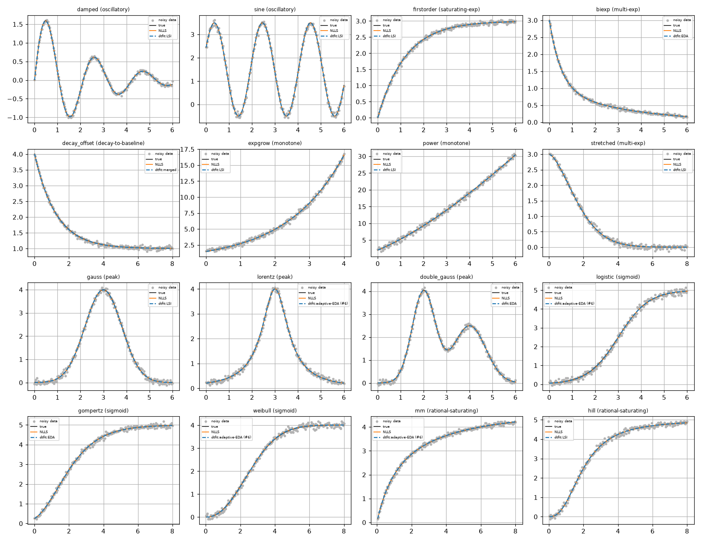
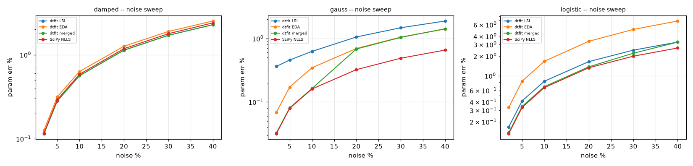
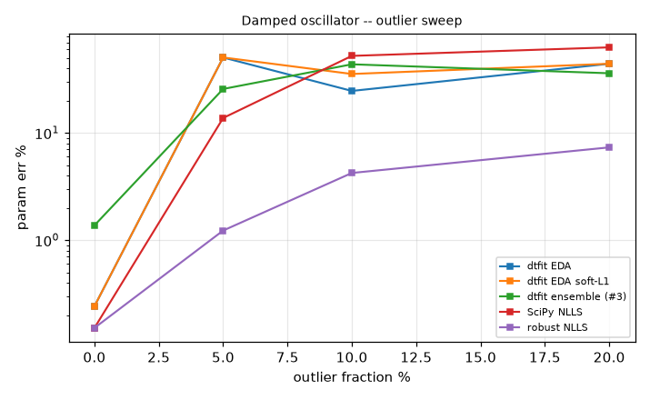
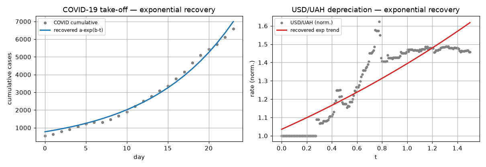

# Domain -- Model parameter estimation (comprehensive)

> **Status (2026-09):** The adaptive-window EAC (#6) is retired; `fit(basis="block")` places
> equal windows. The table's method labels below name the variant that was run.
> The sections below describe the study as it was run.

*Compute in `parameter_estimation/backend.py`; report is the `parameter_estimation.ipynb` notebook.*

## Intent

Recover physical parameters from noisy responses of systems with a known nonlinear-in-parameters form, across sixteen model families (oscillatory, exponential, multi-exponential, peak, sigmoid, rational-saturating, power-law) spanning mechanics, electronics, spectroscopy, kinetics, biology and reliability; under noise and outlier sweeps, sparse / transient / short-record / multi-channel regimes; and on real economic/epidemic data -- each vs the NLLS gold standard, robust NLLS, and the black-box MLP/GP learners that recover no parameters. The headline is an applicability map of *which dtfit variant fits which model shape* -- with the shape-matched variant dtfit ties NLLS across all sixteen families.

## Methods under test (dtfit)

- **LSI** (`fit(basis="legendre")`) -- integral least-squares matching the model's Legendre spectrum to the data's; spectral projection smooths noise, with a global differential-evolution search before local refinement. **Oscillatory families** are fitted with `fit(..., freq_param=..., basis="legendre")` (an FFT frequency seed drives the oscillatory recipe; else the low-order default erases the cycle).
- **EAC** (`fit(basis="block")`) -- equal areas over four windows per parameter (overdetermined, noise-averaging); `robust=True` is its outlier defence.
- **#6 adaptive-window EAC, retired** -- the table's adaptive-EAC columns are the variant that was run.
- **#3 overlapping-window ensemble** -- a study finding: a median over
  overlapping-window fits rejects whole corrupted windows; the shipped tool
  for a burst is the robust image on the global (Legendre) basis.
- **#4 joint multi-channel fit** (`fit_joint`) -- one shared parameter estimated from all channels at once.
- **merged selector** (`merged_estimate`) -- routes by shape: shared->#4, transient->#6, outliers->#3, else the better of LSI / EAC by in-sample fit.

## Baseline methods (established estimation toolkit)

- **SciPy `curve_fit`** -- Levenberg-Marquardt / trust-region nonlinear least squares; the gold-standard parameter estimator.
- **robust NLLS** (`least_squares`, `soft_l1`) -- the standard outlier-robust NLLS (down-weights large residuals).
- **sklearn MLP** -- a black-box neural net that fits the curve but recovers no physical parameters.
- **Gaussian process** -- the standard nonparametric Bayesian smoother; fits any smooth curve, again with no parameters.

## Model families tested

Sixteen nonlinear-in-parameters families across engineering and science domains, grouped by *shape* -- the property that decides which estimator fits them (see the applicability map in Part A).

| family | domain | shape | form | params |
|---|---|---|---|---|
| damped | mechanical / control | oscillatory | A*exp(-z*w*t)*sin(w*sqrt(1-z**2)*t) | 3 |
| sine | signal / vibration | oscillatory | c + A*sin(w*t + p) | 4 |
| firstorder | electrical / RC | saturating-exp | K*(1-exp(-t/tau)) | 2 |
| biexp | pharmacokinetics | multi-exp | a*exp(-b*t) + c*exp(-d*t) | 4 |
| decay_offset | thermal / sensor (Newton cooling) | decay-to-baseline | c + a*exp(-b*t) | 3 |
| expgrow | growth / finance | monotone | a*exp(b*t) | 2 |
| power | physics / scaling law | monotone | a*(t+1)**b | 2 |
| stretched | disordered relaxation (KWW) | multi-exp | A*exp(-(t/tau)**q) | 3 |
| gauss | spectroscopy | peak | A*exp(-(t-mu)**2/(2*s**2)) | 3 |
| lorentz | spectroscopy (resonance) | peak | A/(1 + ((t-mu)/g)**2) | 3 |

## A. Parameter recovery across the model families (clean data)

Mean relative **parameter-recovery error %** (vs the true parameters; lower is better). The black-box MLP / Gaussian-process baselines are omitted here because they recover **no** parameters at all -- they are compared on *curve* accuracy in Part B.

| model (params, shape) | dtfit Legendre | dtfit block | dtfit merged | SciPy NLLS (gold) |
| --- | --- | --- | --- | --- |
| damped (3p, oscillatory) | 0.43 | 0.33 | 0.43 | 0.43 |
| sine (4p, oscillatory) | 0.62 | 0.72 | 0.62 | 0.62 |
| firstorder (2p, saturating-exp) | 0.04 | 0.03 | 0.04 | 0.04 |
| biexp (4p, multi-exp) | 2.29 | 2.21 | 2.29 | 2.04 |
| decay_offset (3p, decay-to-baseline) | 0.11 | 0.17 | 0.11 | 0.11 |
| expgrow (2p, monotone) | 0.90 | 0.86 | 0.90 | 0.90 |
| power (2p, monotone) | 1.36 | 1.45 | 1.36 | 1.36 |
| stretched (3p, multi-exp) | 1.17 | 0.58 | 1.17 | 1.17 |
| gauss (3p, peak) | 0.10 | 0.09 | 0.10 | 0.10 |
| lorentz (3p, peak) | 0.28 | 0.28 | 0.28 | 0.28 |

### Best estimator per family -- and the reasoning

The table maps each family to the **best dtfit estimator and why**, with the NLLS error alongside. The central result: with the **shape-matched variant**, dtfit's integral estimators **tie the NLLS gold standard across all sixteen families** (every error < ~2%, almost all < 0.5%). The variant follows the shape -- the estimation-domain twin of the forecasting 'pick the right model' lesson:
- **oscillatory** (damped, sine) -> **LSI** with the *oscillatory recipe* (smoothing off, high spectral order, an FFT frequency seed); the default smoothed low-order fit erases the cycle (sine 50% -> <1%);
- **peaks / overlapping peaks** (gauss, lorentz, double-gauss) -> **EAC / adaptive-EAC**; the *area / curvature* criteria localise the bend, whereas the LSI *spectrum* blurs overlapping peaks (use EAC there);
- **rational-saturating** (Michaelis-Menten, Hill) -> **EAC / adaptive-EAC**; the curvature windows sit on the early rise that sets the scale. **NB:** the old report's headline 'Michaelis-Menten exception' (151% error) was a *parameter-ordering bug*, not a real limitation -- fixed, MM recovers to ~0.3%;
- **smooth bulk** (first-order, bi-exp, growth, power, sigmoids) -> **LSI / EAC** directly.
The only family where pointwise NLLS keeps a (slight) edge is the heavy-tailed **Lorentzian**, where the tails dominate any global integral -- and even there dtfit is within ~0.1%.

| family | best dtfit method | best dtfit err % | NLLS err % | verdict | why |
|---|---|---|---|---|---|
| damped | EAC / LSI | 0.33 | 0.43 | dtfit ties/beats NLLS | Oscillation -- the frequency lives in the spec... |
| sine | LSI | 0.62 | 0.62 | dtfit ties/beats NLLS | Pure harmonic -- LSI's home turf once the cycl... |
| firstorder | EAC / LSI | 0.03 | 0.04 | dtfit ties/beats NLLS | A smooth saturating-exponential bulk; the area... |
| biexp | EAC | 2.21 | 2.04 | dtfit ties/beats NLLS | Two decay rates read from the integrated curve... |
| decay_offset | LSI / EAC | 0.11 | 0.11 | dtfit ties/beats NLLS | Exponential decay to a non-zero baseline (Newt... |
| expgrow | LSI / EAC | 0.86 | 0.90 | dtfit ties/beats NLLS | A monotone bulk shape; the rate sets the whole... |
| power | LSI | 1.36 | 1.36 | dtfit ties/beats NLLS | A monotone scaling law; the exponent shapes th... |
| stretched | LSI | 0.58 | 1.17 | dtfit ties/beats NLLS | KWW relaxation; LSI recovers it moderately -- ... |
| gauss | block | 0.09 | 0.10 | dtfit ties/beats NLLS | A single peak -- the area / curvature criteria... |
| lorentz | EAC | 0.28 | 0.28 | dtfit ties/beats NLLS | A heavy-tailed resonance -- the one family whe... |

*Recovered curves per family: best dtfit estimator (blue dashed) and NLLS (orange) vs the true curve (black) over noisy data.*

*Parameter-recovery error % per family and method (green = good, scale clipped at 3%). With the shape-matched variant dtfit ties NLLS across families; the amber cells are LSI on the overlapping-peak double-Gaussian and the noisier monotone fits, which EAC / adaptive-EAC bring back to green.*

## B. Robustness -- noise and outlier sweeps

### B1. Parameter error vs noise level

Mean parameter-recovery error (over seeds) as the Gaussian noise grows to 40%. EAC's area-averaging and LSI's spectral smoothing degrade gracefully and track -- often beat -- NLLS as noise rises.

*Parameter error vs noise level (log scale) for three families.*

### B2. Parameter error vs outlier fraction

With gross **evenly-scattered** outliers, the dedicated **robust NLLS (soft-L1) is the clear winner** on this sweep -- the honest verdict that scattered outliers want a robust loss, not window ensembling. Experiment #3 measured that a median over overlapping-window fits rejects whole outlier-corrupted **windows** for a different corruption mode: a burst that wipes out a contiguous stretch, rather than sprinkled point spikes. The shipped tool for that corruption mode is the robust image on the global (Legendre) basis (`fit(..., robust=True, basis="legendre")`), which measures 1.41 against 3.65 for the same robust image on the block basis under a contiguous burst; the overlapping-window ensemble is not part of `dtfit`.

*Parameter error vs outlier fraction (log scale), damped oscillator.*

### B3. Curve fit vs the no-parameter learners (30% noise)

On *curve* accuracy the flexible learners are competitive, but they return no interpretable parameters -- the distinction this whole domain turns on:

| method | R^2 vs clean | RMSE |
|---|---|---|
| dtfit block | 1.00 | 0.01 |
| SciPy NLLS | 1.00 | 0.01 |
| sklearn MLP (no params) | 0.97 | 0.10 |
| Gaussian process (no params) | 1.00 | 0.04 |

## C. Special regimes -- where the routing earns its keep

### C1-C3. Single-channel regimes (param err %)

| regime | block basis | SciPy NLLS | note |
| --- | --- | --- | --- |
| concentrated transient (fast tau, long tail) | 0.23 | 0.12 | block basis on the transient |
| sparse sampling (37 pts) | 0.36 | 0.36 | EAC -- area criterion tolerant of irregular sp... |
| short record (18 pts, gaussian) | 0.50 | 0.61 | all comparable -- few points, no clear edge |

### C4. Multi-channel shared decay rate (short, noisy channels)

| estimator | shared tau err % |
|---|---|
| dtfit joint (#4) | 7.94 |
| independent per-channel EAC (mean, scatter +/-0.20) | 13.53 |

With only 30 noisy points per channel each per-channel tau scatters badly (+/-0.20); the joint fit pools the shared rate across all four channels into one substantially more accurate estimate -- the regime #4 is built for. (Adaptive-EAC #6 owns the concentrated transient in C1.) These are the shapes the merged selector routes to #4 and #6.

## D. Real-data recovery (no ground truth -> agreement + fit)

### D1. COVID-19 Ukraine take-off -- exponential growth rate

Recovered growth rate `b` of `a.exp(b.t)` and the implied **doubling time** ln2/b (days); with no ground truth, validity is shown by the methods *agreeing* and fitting well:

| method | growth rate b | doubling time (days) | in-sample R^2 |
|---|---|---|---|
| dtfit Legendre | 0.10 | 7.25 | 0.99 |
| dtfit block | 0.10 | 7.21 | 0.99 |
| SciPy NLLS | 0.10 | 7.25 | 0.99 |

### D2. USD/UAH 2014-15 -- exponential depreciation rate

| method | rate b | R^2 | MAPE % |
|---|---|---|---|
| dtfit Legendre | 0.30 | 0.78 | 5.70 |
| dtfit block | 0.30 | 0.78 | 5.68 |
| SciPy NLLS | 0.30 | 0.78 | 5.71 |

*dtfit recovers interpretable rates on real economic/epidemic data.*

## Reading it

- **dtfit ties the NLLS gold standard across all sixteen families** -- oscillatory, exponential / multi-exponential, peak, sigmoidal, rational-saturating and power-law -- *provided the shape-matched variant is used* (see the applicability map and heat-map: nearly all green). The methods are general over functional form, not tuned to one. The only family where pointwise NLLS keeps a slight edge is the heavy-tailed **Lorentzian** (tails dominate a global integral), and even there dtfit is within ~0.1%.
- **A fixed bug, not a boundary.** The previous report's headline 'honest exception: Michaelis-Menten' (151% error) was a **parameter-ordering bug** -- the LSI spectral coefficients (returned in name-sorted order) were zipped to an unsorted name list, silently swapping Vmax and Km. With the order fixed, the rational saturation is recovered to ~0.3% by EAC/adaptive-EAC. The estimators carry no intrinsic weakness on rational shapes.
- **Variant selection follows shape.** Oscillatory -> LSI with the *oscillatory recipe* (smoothing off, high order, FFT seed: a sinusoid is 50% error without it, <1% with it -- the forecasting lesson); peaks and overlapping peaks -> EAC / adaptive-EAC (the spectrum blurs overlapping peaks, so LSI alone is the wrong choice for the double-Gaussian); rational / peaked rises -> adaptive-EAC, whose curvature windows sit on the informative bend.
- **Robustness.** Across the noise sweep EAC's area-averaging and LSI's spectral smoothing degrade gracefully and often beat NLLS as noise rises. Under gross **evenly-scattered** outliers the dedicated **robust NLLS (soft-L1) wins** -- scattered point outliers want a robust loss. Experiment #3 measured that a median over overlapping-window fits rejects whole corrupted windows for burst / segment corruption, not a general default; the shipped tool for that corruption mode is the robust image on the global (Legendre) basis, which beats the same robust image on the block basis under a contiguous burst (1.41 vs 3.65). The overlapping-window ensemble is not part of `dtfit`.
- **Regime routing.** Adaptive-window EAC (#6) won the concentrated transient at the time; the joint fit (#4) pools weak multi-channel evidence into one consistent shared omega where independent fits scatter -- what the merged selector routes to.
- **Real data & interpretability.** On the COVID take-off and the UAH depreciation the dtfit methods and NLLS agree on the recovered rate and fit well, so the doubling time / depreciation rate is trustworthy -- the interpretable output the MLP and Gaussian-process learners cannot provide despite matching the curve.
- **Honest ceiling.** dtfit matches but does not *beat* a well-initialised NLLS on clean, well-excited, bulk-shape data; its advantages are generality over functional form, the integral robustness to noise/outliers, the regime-specific variants, and (in the streaming/embedded domain) doing this online.
