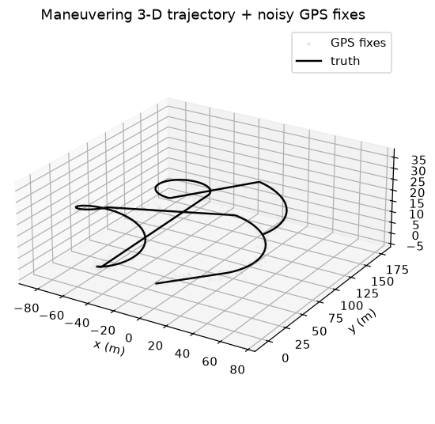
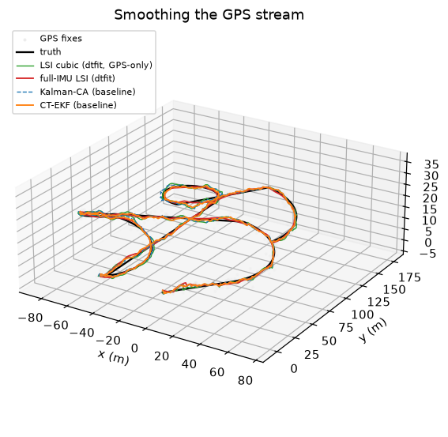
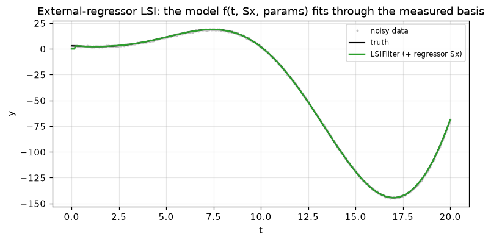
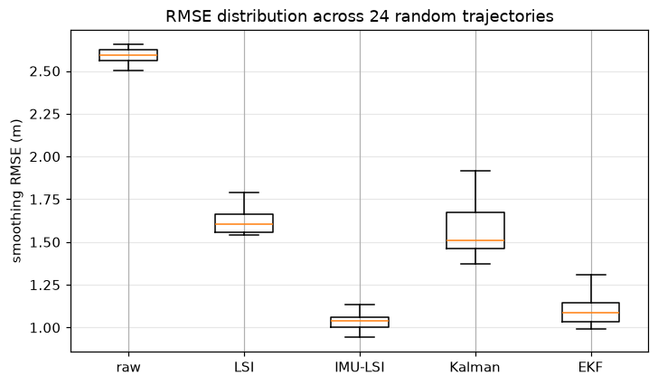

# Domain -- Real-time GPS / inertial trajectory tracking

The control-systems domain: dtfit's streaming **integral** estimators put to work
on the canonical sensor-fusion problem -- online tracking of a maneuvering 3-D
target from a noisy GPS stream and an inertial measurement unit -- head-to-head
against the established recursive trackers a control engineer deploys. Full
runnable reports: the
[`realtime_gps` notebook](https://github.com/ringavirda/science-nonline/blob/main/packages/dtfit-experimental/src/dtfit_experimental/experiments/domains/realtime_gps/realtime_gps.ipynb)
(the synthetic-rig study) and its
[`benchmark_trajectories` notebook](https://github.com/ringavirda/science-nonline/blob/main/packages/dtfit-experimental/src/dtfit_experimental/experiments/domains/realtime_gps/benchmark_trajectories.ipynb)
(well-known trajectories + public RTK/INS datasets) in `dtfit-experimental`. The
**on-silicon twin** runs the same trackers on real hardware (Arduino Nano 33 BLE
Sense + NEO-M8N) and on public RTK/INS datasets -- see
[Real-time GPS / inertial (hardware rig)](Domain-Realtime-GPS-Hardware) and the
[`dtfit-hardware`](https://github.com/ringavirda/science-nonline/blob/main/packages/dtfit-hardware/README.md)
package.

## Intent

Track and forecast a maneuvering vehicle online from a fix-level GPS stream (plus
an IMU) with bounded per-sample cost and a fixed memory budget, survive urban-canyon
dropouts and multipath glitches, and flag a maneuver -- testing dtfit's streaming
`LSIFilter` / `EACFilter` (now with **external regressors**, so a measured
side-channel like an IMU strapdown basis enters the integral model) against the
trackers a maneuvering-target practitioner actually deploys (a constant-acceleration
Kalman, a gyro-aided coordinated-turn EKF, and -- on the position-only benchmarks --
a pos-only CT-EKF and the gold-standard IMM). This de-risks the planned embedded
(Arduino-class) paper *before* buying hardware, and its honest headline is where an
integral, windowed measurement helps (glitch robustness, long-gap coasting, maneuver
detection, sub-kB footprint) and where a recursive coupled-state filter keeps the
edge (multi-step forecast; clean-Gaussian smoothing on the idealized benchmarks).

## Methods under test (dtfit streaming, integral)

- **`LSIFilter`** -- streaming integral least-squares measuring the window's
  **Legendre spectrum**; the trajectory smoother. Fitted per axis on a local
  constant-acceleration **cubic** `c0+c1*t+c2*t**2+c3*t**3` (the robust all-round
  default; the extra curvature term the turn needs) or a **coordinated-turn** model
  `c0+c1*t+c2*sin(c3*t+c4)` -- *nonlinear in parameters*, a shape a linear Kalman-CA
  cannot represent at all, dtfit's differentiator on the maneuvering segment.
  `adapt_noise` self-tunes the measurement noise from an online residual EWMA, and
  `robust=True` winsorizes the projection.
- **`EACFilter`** -- the streaming equal-areas twin; carried here mainly as the
  **honest negative** (an area is the wrong measurement for oscillatory motion, so it
  trails the spectrum filter on turns). Note its `partial_fit` takes one sample at a
  time (the online recursion), the same single-sample contract as `LSIFilter`.
- **Full-IMU strapdown through LSI (external regressor)** -- the 9-DOF IMU (3-axis
  gyro + accelerometer + an absolute magnetometer heading) is strapdown-integrated
  into a washed-out per-axis position basis `S` and fed to `LSIFilter` as an
  **external regressor**: the per-axis model becomes `c0 + c1*t + (quadratic drift)
  + S`. The accelerometer supplies the sensed motion shape, the polynomial absorbs
  residual INS drift, the GPS anchors the absolute path, and the magnetometer is a
  complementary always-on yaw anchor that keeps the dead-reckoned heading honest
  through a GPS dropout (bounding the slow MEMS gyro bias). The drift compensator is
  a **quadratic**, not a cubic -- a cubic overfits GPS noise on clean fixes and
  extrapolates explosively while coasting a gap.
- **fused NIS + CUSUM maneuver detector** (`FusedCUSUM`) -- pools K streams'
  one-step residuals into a chi^2(K) NIS and CUSUMs it (optionally including the
  gyro-rate-change channel). A maneuver moves several axes at once, so the fused
  statistic has far higher SNR than any single-axis test; on a detection the filters
  re-arm via `inflate`.

## Baseline methods (established recursive trackers)

- **constant-acceleration Kalman** (`KalmanCA`, GPS-only) -- the standard motion
  tracker; the same model class as dtfit's local CA cubic, so it can only be matched
  by it (and corner-cuts fast turns).
- **gyro-aided coordinated-turn EKF** (`CTEKFGyro`, GPS + IMU) -- the gold-standard
  recursive tracker: a nonlinear coordinated-turn motion model with the gyro yaw-rate
  as an input, coasting on the gyro through GPS gaps. Its joint `(x, y)` coupled state
  is the structural thing dtfit's *per-signal* integral filters cannot express.
- On the position-only well-known benchmarks (`benchmark_trajectories`): a
  **pos-only CT-EKF** (estimates the turn-rate from position, no gyro), the
  gold-standard **IMM (CV+CT)** interacting-multiple-model tracker, and a
  **Huber-hardened Kalman-CA** (so the glitch column compares hardened-vs-hardened).
- random-walk / hold as references.

## The simulated rig

A long, fully 3-D maneuvering target over 60 s (10 Hz GPS -> 600 epochs): a
nine-segment coordinated-turn flight plan (sweeping & hard turns, 8->16 m/s
accelerations, +3->-2.5 m/s climbs/descents -- a genuine stress test with no
closed-form per-axis formula), a GPS module at fix-level noise (per-axis sigma ~1.5
m, ~2.5 m CEP, realistic for a NEO-M9N over NMEA), and a 9-DOF IMU (3-axis gyro +
accelerometer + magnetometer) consistent with the truth, with realistic
**dropouts** (urban canyon / tunnel) and multipath **glitches**. A `random_plan`
generator lets the batch test (E6) score the approach on many distinct trajectories,
so no value is silently tuned to the one hand-built path. The GPS is modelled at the
**fix** level (truth + noise), matching what a NEO-M9N outputs over NMEA -- so the
sim mirrors the real device.

*The simulated 3-D maneuvering rig trajectory: truth path, noisy GPS fixes, IMU.*

## Results on the synthetic rig (E1-E7)

Comparing dtfit's integral estimators against the GPS-only Kalman and the GPS+IMU
coordinated-turn EKF on the hard 3-D maneuvering run:

- **E1 -- Smoothing + short forecast (clean fixes).** Position-only LSI (`~=` Kalman)
  tops out near the GPS noise floor. Feeding the full IMU through the now
  external-regressor-capable LSI (**full-IMU strapdown LSI**) beats both GPS-only
  methods and **leads the EKF** on smoothing. The EKF holds a slight edge only on the
  multi-step *forecast*, where it rolls its coupled `(x, y)` state forward.
- **E2 -- Dropout coasting (GPS gaps).** The IMU-LSI **dominates** the long-gap
  coasting (3.1 m vs the EKF's 4.6 m at a 30-step gap): the strapdown basis carries
  the sensed motion across the blank while the quadratic-drift model stays bounded.
  Both filters expose `coast(x, order=...)` for anchored dead-reckoning instead of a
  runaway model evaluation off its window.
- **E3 -- Multipath glitch robustness.** The winsorized (`robust=True`) integral
  projection averages a spike over the window and stays usable where a pointwise
  update is thrown -- the integral measurement's clearest win.
- **E4 -- Maneuver detection.** The fused NIS+CUSUM detector is best-in-class,
  **beating the EKF's own residual test**: pooling axes raises the SNR of a
  coordinated turn far above any single-axis test.
- **E5 -- On-MCU budget.** Fixed sub-kB no-malloc state, O(1)/sample, O(1)-memory in
  stream length -- fits an M0+/M4/ESP32; the interpretable trajectory parameters come
  for free.
- **E6 -- Batch over random trajectories.** The E1 smoothing lead holds across many
  independent random plans (decorrelated plan/GPS/IMU seeds), so it is not tuned to
  the one hand-built track.
- **E7 -- More information, richer model.** Carrying the full strapdown IMU model
  inside the LSI filter is what puts dtfit ahead on tracking; the magnetometer,
  folded in as an always-on yaw anchor, both sharpens the lead and makes it robust to
  the slow gyro bias real MEMS sensors carry.

*E1 -- smoothing on the 3-D rig: the full-IMU strapdown LSI vs the GPS-only Kalman and the GPS+IMU coordinated-turn EKF.*

*The external-regressor upgrade exercised in isolation -- an IMU-derived basis inside the integral LSI measurement.*

*E6 -- batch over random coordinated-turn plans; the ranking is not tuned to a single track.*

**Net (simulated rig):** dtfit's integral filters lead on smoothing, coasting,
robustness, detection and footprint, with the EKF retaining only the multi-step
forecast on its coupled motion model -- the one thing a *per-signal* integral filter
structurally cannot express.

## Well-known trajectories & the honest home-turf caveat

The companion `benchmark_trajectories` study drops the gyro and runs **position-only**
on literature-standard trajectories with *exact* analytic truth -- a canonical
CV->CT->CV coordinated-turn maneuver and a figure-8 lemniscate -- Monte-Carlo averaged,
plus a drop-in loader for public **RTK/INS datasets** (GSDC-2022, UrbanNav,
comma2k19). The verified, adversarially-audited finding (no truth leak, dtfit at its
own near-optimal window/order/q config): on these **idealized-Gaussian-noise**
benchmarks the model-matched **recursive trackers win** -- IMM/CT-EKF/Kalman-CA beat
dtfit on clean smoothing (coordinated turn: IMM 1.02 m vs dtfit 1.33 m) and especially
on dropout coasting (IMM 4.3 m vs dtfit 11.4 m). The dropout gap is **structural**: a
windowed integral fit extrapolates a local polynomial across the blank and diverges,
while the recursive filters dead-reckon an explicit velocity/turn-rate state. dtfit's
winsorized robust LSI is a genuine, cheap glitch lever (recovers most glitch error at
`~=0` clean cost) but is **competitive-with, not better than, a symmetrically
Huber-hardened Kalman** (a tie on the coordinated turn, 2.01 vs 2.02; a slight loss on
the smooth figure-8, 1.86 vs 1.58). This is the recursive filters' home turf --
optimal under Gaussian noise with known dynamics -- and it is reported as the honest
negative it is. dtfit's measured edge lives on **real, non-Gaussian/drifting** GPS.

## The on-silicon twin: `dtfit-hardware`

The [`dtfit-hardware`](https://github.com/ringavirda/science-nonline/blob/main/packages/dtfit-hardware/README.md)
package turns the de-risked simulation into a real-silicon rig: the streaming LSI/EAC
trackers running **on an Arduino Nano 33 BLE Sense (M4F)** over a live NEO-M8N fix
stream + onboard 9-DOF IMU, with SD + BLE logging and a phone-side monitor app. Its
[`realtime_gps_hw` notebook](https://github.com/ringavirda/science-nonline/blob/main/packages/dtfit-hardware/src/dtfit_hardware/realtime_gps_hw.ipynb)
reproduces the sim's E1/E2/E3/E5 on **real captured logs** and public RTK/INS
datasets (a held-out-fix / dm-truth proxy, **not** a live-cm claim), and confirms the
on-MCU cost story the embedded domain projected: the `nano_lsi_onboard` firmware emits
**measured** cyc/update, us avg/max and `sizeof` footprint on the M4F (~267 us/update,
sub-kB state, float32 bit-faithful to the PC reference). The honest real-data verdict
from the log-comparison harness (`compare_real.py`): dtfit LSI **wins on the static /
pedestrian regimes** and is **competitive-with -- slightly-behind -- the Kalman on the
fast car drive**, where the higher dynamics favour the recursive coupled state. So the
"a desktop-measured algorithm; a real port would confirm" caveat of the embedded-control
domain now has its on-silicon confirmation.

## Reading it

- **Where the integral measurement wins.** On the synthetic 3-D rig, the full-IMU
  strapdown LSI (external regressor) leads the gold-standard coordinated-turn EKF on
  smoothing, long-gap dropout coasting, glitch robustness, maneuver detection and
  footprint. What it owns is the windowed integral's robustness (winsorized
  projection, bounded coast) plus interpretable parameters at a sub-kB MCU cost.
- **The structural limit.** The EKF's joint coordinated-turn model couples the
  `(x, y)` state, which dtfit's *per-signal* filters (one output at a time) cannot
  express -- so the EKF keeps the multi-step *forecast*. On idealized Gaussian-noise
  position-only benchmarks the recursive trackers (IMM/CT-EKF/Kalman) win outright on
  clean smoothing and dropout coasting; that is their home turf and it is reported
  honestly.
- **The honest real-data result.** On real logs dtfit LSI wins the static / pedestrian
  regimes and is competitive-with / slightly-behind the Kalman on the fast car drive
  -- the same "structured extrapolator, competitive-to-winning when the model matches
  the dynamics, honest second otherwise" pattern the other domains draw, now measured
  on silicon via the `dtfit-hardware` twin.
</content>
</invoke>
