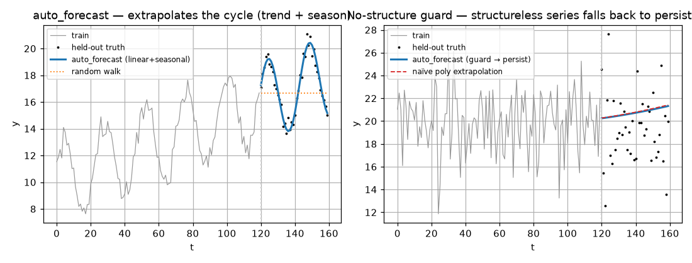

# auto_estimate & auto_forecast -- composed, shape-routed pipelines

> High-level **composition** layer. Source:
> [`auto.py`](https://github.com/ringavirda/science-nonline/blob/main/packages/dtfit/src/dtfit/auto.py).
> `auto_estimate(x, y, expr, var, ...)`, `auto_forecast(x, y, horizon, ...)`.
> API: [../api/auto.md](API-Auto).

These are not new fitting math -- they are the **decision logic** distilled from the
domain validation studies, whose organizing result was that the single biggest
lever is **picking the structurally-correct model / estimator variant**, not the
solver. Each function composes only the validated, stable levers behind one call,
and keeps the studies' honest ceilings (near-random-walk series fall back to
persistence; clean bulk shapes match but do not beat a well-initialized NLLS).

## auto_estimate -- route the estimator to the signal's shape

The parameter-estimation study produced an **applicability map**: with the
shape-matched variant, dtfit's integral estimators tie the NLLS gold standard
across model families. `auto_estimate` encodes that map. Given `(x, y, expr, var)`
it selects the variant whose criterion suits the signal's shape:

| detected/[requested] shape | routes to | why |
|---|---|---|
| **oscillatory** (`freq_param` given, or FFT power share > 0.10) | [`fit_lsi`](Methods-LSI) oscillatory recipe | the spectrum (not an area) observes a cycle |
| **transient / peak** | [`fit_eac(..., window_mode="curvature")`](Methods-EAC) (curvature windows) | windows concentrate on the bend |
| **robust** (outliers) | [`fit_eac`](Methods-EAC) with `loss="soft_l1"` | area integration + window down-weighting |
| **bulk** (default) | the better of `fit_lsi` / `fit_eac` by in-sample RMSE | smooth shapes; pick the lower-residual fit |

**Shape detection** (`shape="auto"`) is an FFT test: a linearly-detrended series is
transformed, and if the dominant spectral peak carries more than 10 % of the
detrended power the signal is treated as oscillatory, else as bulk. Naming a
`freq_param` forces the oscillatory branch. The result is an ordinary
[`FittingResult`](API-Types) from the selected estimator.

## auto_forecast -- structured fit-then-extrapolate, with guards

dtfit forecasts by **fitting an extrapolable parametric structure** and continuing
it -- the opposite of a black-box learner. `auto_forecast` routes the model class
from the data's shape, fits it, and extrapolates `horizon` steps on the uniform
grid, behind two safety guards.

### Model routing (`model="auto"`)

Under `model="auto"` the router (`_auto_model`) picks one of three model classes
from the data's shape:

| condition | model class (`model=` value) |
|---|---|
| saturating positive growth (monotone, large ratio, all positive) | **logistic** (`"logistic"`) $L/(1+e^{-k(x-x_0)})$ |
| a detected seasonal cycle (strength above `season_strength`) | **linear + seasonal** (`"linear_seasonal"`) $a_0+a_1x+A\sin(wx+p)$ |
| otherwise | **poly** (`"poly"`, a quadratic level) $a_0+a_1x+a_2x^2$ |

Each class is fit with the matching stable lever -- the logistic and seasonal fits
use [`fit_lsi`](Methods-LSI) with **data-driven seeds and bounds** (the growth rate is
bracketed by the time span; the seasonal frequency is seeded from
[`fft_frequency_seed`](API-Fitting#fft_frequency_seed)), so the global search
is well-posed.

**Forcing a class.** `model=` also accepts an explicit class, bypassing the router.
The full set is `"auto"` (route by structure), `"logistic"`, `"linear"` (a plain
$a_0+a_1x$ trend), `"poly"` (the quadratic level), `"linear_seasonal"`, and
`"random_walk"`. Note the router only ever chooses among `logistic` /
`linear_seasonal` / `poly`; `linear` and `random_walk` are reachable only by
naming them explicitly (`linear` is also the internal fallback for a failed or
diverging fit).

**Persistence-fallback guard.** Whichever class is chosen, `auto_forecast` first
checks the **no-structure guard** (below); if it fires -- or `model="random_walk"`
is requested outright -- the forecast is just naive persistence of the last value,
with no fitting.

### The two guards

The studies were emphatic that a parametric forecaster must **know when not to
extrapolate**. Two guards enforce that:

- **No-structure guard.** Before trusting the structured model, it is fit on the
  first 80 % of the *training* data and scored against naive persistence on the
  held-out training tail. If the structured fit cannot get near persistence there
  (RMSE more than a factor worse), the series is treated as near-random-walk and
  the forecast **falls back to persisting the last value**. This is what keeps
  dtfit honest on FX-like series, where no parametric model beats "tomorrow =
  today" one step out.
- **Divergence guard.** A quadratic level can extrapolate to absurd values. If the
  forecast leaves a generous band around the observed range, the runaway quadratic
  is **dropped to a linear fit** (and, failing that, to persistence). This prevents
  the classic unstructured-extrapolation blow-up.

The return is the length-`horizon` forecast on the extrapolated grid.

## Why this belongs in the method reference

`auto_estimate` / `auto_forecast` are where the per-method math is *operationalized*
into a usable default. They compose only stable pieces ([`fit_lsi`](Methods-LSI),
[`fit_eac`](Methods-EAC) (including `window_mode="curvature"`),
[`fft_frequency_seed`](API-Fitting#fft_frequency_seed)) -- the conservative
merges the domain studies validated -- and they preserve the honest negatives those
studies reported:

- `auto_estimate` matches, but does not beat, a well-initialized NLLS on clean bulk
  shapes; its edge is robustness, shape-routing and interpretable parameters.
- `auto_forecast` persists on near-random-walk series by design -- the guards are
  features, not workarounds.

## Worked example

**Left:** on a trend-plus-cycle series `auto_forecast` routes to the
linear+seasonal model and **extrapolates the cycle** onto the held-out tail,
where a random walk can only persist a flat line. **Right:** on a structureless
(near-white-noise) series the **no-structure guard** fires and the forecast falls
back to persistence rather than chasing the noise with a polynomial.

## Where it is best applied

**Use `auto_estimate`** when you have a known model form and want the
right-for-the-shape estimator without choosing it yourself; **use `auto_forecast`**
for a structured, guarded forecast of a series with real extrapolable structure
(growth, saturation, a clean cycle). For deliberate control over the estimator,
call the individual methods ([LSI](Methods-LSI), [EAC](Methods-EAC)); for *model* inference
(which family fits at all) use [`suggest_models`](API-Models). The honest
ceilings above are the reason both functions exist as *conservative* composers
rather than aggressive optimizers.
