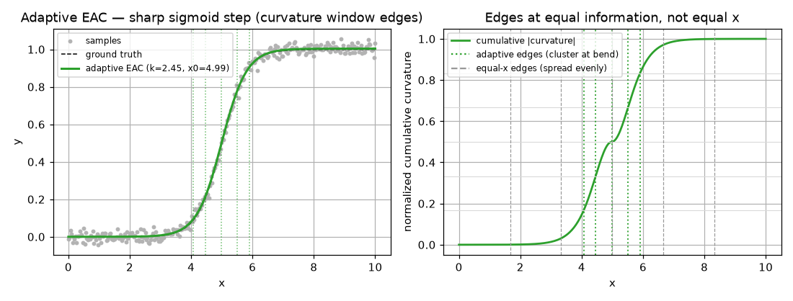
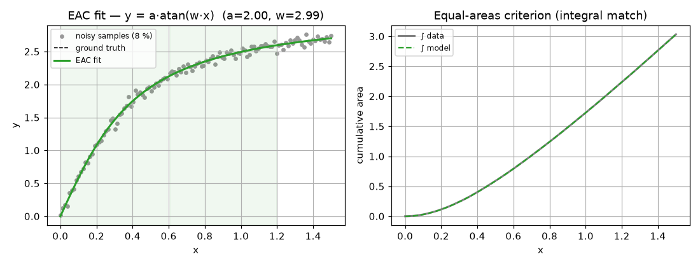

# EAC -- Equal-Areas Criterion

> Numeric batch method, successor to the symbolic DSBE. Source:
> [`methods/_eac.py`](https://github.com/ringavirda/science-nonline/blob/main/packages/dtfit/src/dtfit/methods/_eac.py).
> Invoke via `fit_eac(x, y, expr, var, ...)` -- with `window_mode="curvature"`
> for the curvature variant -- or `NonlineRegressor(..., method="eac")`.

EAC identifies parameters by matching **integral areas** of the model and the
data over a set of windows, rather than matching spectra pointwise. Because
integration is a smoothing (low-pass) operator, EAC never differentiates the data
and is the **most noise-robust** of the batch methods. It is also the fastest, and
is the basis of the streaming [EACFilter](Methods-Equal-Areas-Filter).

## Mathematical grounding

For a model $f(t;\theta)$ with $m$ unknown parameters, split the active region of
the data into $M \ge m$ contiguous windows $W_1,\dots,W_M$ and require the model
area to equal the data area on each:

$$
\int_{W_i} f(t;\theta)\,dt \;=\; \int_{W_i} x_{\text{data}}(t)\,dt,
\qquad i = 1,\dots,M .
$$

That is $M$ equations in $m$ unknowns -- residuals

$$
r_i(\theta) \;=\; \int_{W_i} f(t;\theta)\,dt \;-\; A_i,
\qquad A_i = \int_{W_i} x_{\text{data}}\,dt .
$$

**Connection to the differential spectrum.** The area of a signal over $[0,H]$ is
the integral of its inverse transform,

$$
\int_{0}^{H} x(t)\,dt
   = \sum_{k} X(k)\!\int_0^H\!\Big(\tfrac{t}{H}\Big)^{k}\!dt
   = H\sum_{k} \frac{X(k)}{k+1},
$$

so an area is a **moment of the differential spectrum**. Matching areas over $M$
shifted windows is matching $M$ independent integral functionals of the spectrum --
a weak-form (Galerkin, piecewise-constant test function) identification. Two
analytic functions sharing $m$ such independent moments agree where the model has
$m$ degrees of freedom, so the parameters are recovered.

**Why it is robust.** Zero-mean observation noise integrates toward zero:
$\int_{W} \varepsilon(t)\,dt \to 0$ as the window grows. The data enter EAC only
through their integrals $A_i$, never through a derivative or a high-order
polynomial fit -- so EAC has none of LSI's ill-conditioned high-order discretes and
degrades gracefully as noise rises. The figure below shows the cumulative integral
of model and data lying on top of each other even though the raw samples are
visibly noisy.

### Overdetermined by default

The original EAC used exactly $M=m$ windows -- a determined system with no
redundancy, which discards the very noise averaging that integration buys. The
current method makes $M$ default to **$2m$** (configurable via `n_windows`), an
**overdetermined** least-squares system. The benefits are concrete:

- the random per-window integration errors partly cancel, lowering the estimation
  variance (empirically $\sim15\%$ on the arctan benchmark going from $m$ to $2m$
  windows);
- a parameter covariance can be read off the residual Jacobian
  ([`FittingResult.cov`](API-Types)), which an exactly-determined system
  cannot provide.

`n_windows` is clamped to keep at least 3 samples per window (Simpson's rule needs
three points), and to be $\ge m$ for solvability.

### Window placement -- equal vs. curvature-adaptive

Two placement strategies are shipped:

- **Equal windows** (`fit_eac`, default `window_mode="uniform"`): the active
  region is split into $M$ **equal** spans. Simple and well-conditioned for
  signals whose information is spread fairly evenly.
- **Curvature-adaptive windows** (`fit_eac(..., window_mode="curvature")`): window edges are placed so
  each window carries roughly **equal information**, measured as cumulative
  absolute curvature $|x''(t)|$. Concretely, with $c(t)=\int_0^t |x''|\,ds$
  (a flat floor added so smooth stretches are still covered), the edges are the
  points where $c$ reaches $\tfrac{1}{M},\tfrac{2}{M},\dots$ of its total -- narrow
  windows where the signal bends, wide where it is smooth. For a signal with a
  localized transient (a step take-off, a sharp turn, a peak's rise) this is a
  better-conditioned area-matching system, and the parameter-estimation domain
  study validated it as the **best estimator on concentrated transients and
  rational-saturating shapes** (Michaelis-Menten / Hill / `arctan`). The
  curvature mode uses the **full** record (no `active_ratio` clipping), which is
  part of why it captures a saturating asymptote in the tail.

**Left:** `fit_eac(..., window_mode="curvature")` recovers a sharp sigmoid step (`k=2.45, x0=4.99`),
its window edges (dotted) clustering on the bend. **Right:** the placement
principle -- edges sit at equal *cumulative curvature*, so they bunch where the
curve bends (green) instead of spreading evenly in `x` (grey). Under heavy noise
the curvature estimate softens toward equal spacing.

## Algorithm

1. **Parse** the model; collect the $m$ free parameters $\theta$.
2. **Compile once**: `lambdify` the model and each analytic partial derivative
   $\partial f/\partial\theta_j$ (used for the Jacobian).
3. **Window placement**:
   - `window_mode="uniform"` (default) takes the leading `active_ratio`
     (default 0.8) of the data and splits it into $M$ equal windows
     ($M=$ `n_windows`, default $2m$);
   - `window_mode="curvature"` places $M$ curvature-weighted edges over the
     full record.
4. **Data areas**: $A_i = \int_{W_i} y\,dx$ by Simpson's rule
   ([`simpson_windows`](https://github.com/ringavirda/science-nonline/blob/main/packages/dtfit/src/dtfit/_core/_kernels.py), the
   compiled kernel).
5. **Solve** the $M\times m$ system by least squares using the **analytic
   integrated Jacobian** $J[i,j] = \int_{W_i} \partial f/\partial\theta_j\,dt$ --
   Levenberg-Marquardt (`method="lm"`) by default, or trust-region (`trf`) when
   `bounds` or a robust `loss` (e.g. `"soft_l1"`) is requested.
6. **Return** the fitted $\theta$, a `lambdify`-ed callable model, and (when
   overdetermined) a parameter covariance estimate.

## Robustness to outliers -- the robust loss and `f_scale`

EAC accepts a robust least-squares `loss` (`"soft_l1"`, `"cauchy"`, `"huber"`) for
outlier-contaminated data, with a soft margin `f_scale`. Two facts matter for
using it correctly:

- **The loss acts on the *window-area* residuals**, not on pointwise residuals.
  Integration has already smeared each outlier across the window(s) it falls in,
  so a robust loss can only down-weight a whole contaminated *window* -- it cannot
  isolate an individual outlier. Give it **enough windows** (raise `n_windows`)
  that each outlier stays localized to a few, or the loss has nothing to grip.
- **`f_scale` must match the residual scale.** A robust loss only departs from
  quadratic once a residual exceeds `f_scale`. Window-area residuals are typically
  $\ll 1$, so the scipy default `f_scale=1.0` leaves any robust loss behaving like
  plain `"linear"` least squares. Set `f_scale` near the size of a *clean*
  window's area residual to actually engage the robustness. (A worked example of
  this -- `linear` vs `soft_l1` at matched `f_scale` and window count -- is in
  [example 02](Example-02-Fitting-Methods).)

## Optimizations and guards

- **Analytic integrated Jacobian** -- derivatives are taken symbolically once and
  *integrated*, not finite-differenced, giving an exact, smooth Jacobian for LM
  (faster, more stable convergence than numeric differencing).
- **Compiled Simpson kernel** -- the model and its sensitivities are evaluated once
  over the whole active region per solver step and integrated per window by a
  compiled (native, with a NumPy/SciPy fallback) Simpson kernel, rather than
  re-evaluated window by window.
- **Integration as the denoiser** -- the equal-areas criterion is itself the noise
  guard; no separate pre-filter is needed.
- **Active-region windowing** (`active_ratio`) concentrates equal windows on the
  informative transient. **Caveat:** the default `0.8` assumes the information is
  in a leading transient; for a **saturating** shape whose asymptote (and hence a
  parameter) lives in the *tail*, set `active_ratio=1.0` (or use
  `window_mode="curvature"`, which always uses the full record), or that
  parameter is biased.
- **Overdetermined averaging** (`n_windows` $>m$) -- extra area equations average
  out per-window integration noise and yield a parameter covariance.
- **Bounds / robust loss** -- `bounds=` and a robust `loss=`/`f_scale=` switch the
  solver to trust-region for constrained or outlier-prone fits.
- **Scalar-derivative broadcast** -- a constant $\partial f/\partial\theta_j$ (a
  purely linear parameter) is broadcast to the window grid so Simpson integrates
  it correctly.
- **Singular-endpoint sanitization** -- a transcendental sensitivity can blow up
  at an isolated sample while its window integral stays finite (e.g.
  $\partial_n\,x^{n} = x^{n}\ln x$ is `NaN` at $x=0$, with limit $0$). Such
  measure-zero non-finite samples are replaced by their finite contribution so
  they cannot poison a window area / Jacobian -- without it the solver silently
  stalls at the seed (LM) or crashes (TRF). This is what makes the curvature
  mode recover the **Hill** exponent (whose grid starts at $x=0$).
- **Sample-count guard** -- raises if there are fewer than $2m$ samples, since $m$
  windows of meaningful area cannot otherwise be formed.

## Worked example

`y = a.arctan(w.x)` (truth `a=2.0, w=3.0`), a transcendental **non-Taylor**
saturation curve, with 8 % noise. **Left:** EAC recovers `a~=2.00, w~=2.99` from the
noisy cloud; the shaded bands are the per-parameter integration windows. **Right:**
the equal-areas criterion -- the cumulative integral of the fitted model (dashed)
tracks the cumulative integral of the data, which is the quantity EAC actually
matches.

## Comparison

**Model data -- `y = a.exp(b.x)`, ground truth a=1.0, b=1.2, 5 % noise, n=80.**
Error is against the *clean* signal.

| method | recovered params | R^2 | RMSE | MAPE % | fit (ms) |
|---|---|---|---|---|---|
| LSI | a=1.000, b=1.203 | 0.9999 | 0.01133 | 0.24 | 15.3 |
| **EAC** | a=1.002, b=1.203 | 0.9999 | 0.01641 | 0.41 | 3.4 |
| SciPy `curve_fit` | a=1.000, b=1.204 | 0.9999 | 0.01305 | 0.25 | 0.1 |
| numpy.polyfit (deg 5) | -- | 0.9997 | 0.02302 | 0.85 | 0.1 |

EAC recovers the parameters essentially as well as LSI and the NLS gold standard
while being the **fastest** of the dtfit methods (~=3 ms here -- roughly 5x LSI),
because it solves a small area-matching system instead of a spectral least-squares
problem. That speed and its derivative-free robustness are why EAC is the basis of
the streaming [EACFilter](Methods-Equal-Areas-Filter).

**Real data -- COVID-19 Ukraine** (28-day take-off, 548->8617 cases),
`y = a.exp(b.t)`:

| method | R^2 | RMSE | MAPE % |
|---|---|---|---|
| LSI | 0.9877 | 275.1 | 13.00 |
| **EAC** | 0.8506 | 960.1 | 9.39 |
| SciPy `curve_fit` | 0.9879 | 273.5 | 13.34 |

## Where it is best applied

**Use EAC for:** noise-robust batch fitting of models with **few parameters**
(2-4); transient signals where the early dynamics carry the information; outlier-
prone data (with a robust `loss`/`f_scale` and enough windows); and as a fast,
stable initializer. Prefer it to LSI when the data are noisy enough that a
polynomial spectrum would be unreliable, or when speed matters. Prefer
**`fit_eac(..., window_mode="curvature")`** for peaks and rational-saturating rises.

**Caveats.** EAC's area criterion partly cancels **oscillations** -- for a cycle
use [LSI](Methods-LSI)'s oscillatory recipe or the streaming
[LSIFilter](Methods-Legendre-Filter). Like all the spectral/area methods it assumes a
modest dynamic range -- normalize wide domains first. For real-time tracking of
*time-varying* parameters, use the recursive [EACFilter](Methods-Equal-Areas-Filter).
