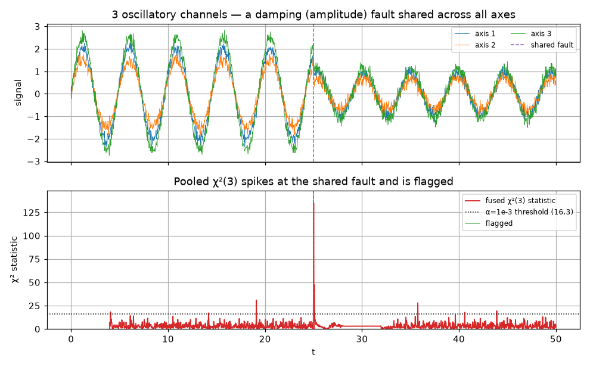

# FilterBank & FusedChiSquareDetector -- multi-stream online estimation

> Numeric **online** methods. Source:
> [`streaming/_bank.py`](https://github.com/ringavirda/science-nonline/blob/main/packages/dtfit/src/dtfit/streaming/_bank.py).
> `FilterBank.from_model(expr, var, n_streams, filter_cls=...)`, then
> `bank.partial_fit(t, y)` / `bank.run(t_seq, Y)`; `det = bank.fused_detector(...)`
> then `det.update(t, y)`.

Many real systems are **several streams of the same model** -- the x/y/z axes of a
trajectory, the channels of a sensor array, the outputs of a multi-axis plant. A
**FilterBank** runs $K$ independent streaming filters
([EACFilter](Methods-Equal-Areas-Filter) or [LSIFilter](Methods-Legendre-Filter)) over those
streams in lockstep, and a **FusedChiSquareDetector** pools their per-stream
innovations into a single fault test with far higher SNR than any one stream.

## FilterBank -- $K$ filters in lockstep

A bank holds $K$ identically-configured filters and routes one sample per stream
to each. There are two drivers, matched to two access patterns:

- **`partial_fit(t, y)`** -- ingest one sample *per stream* (`y` length $K$; `t`
  shared or per-stream) and update every filter in place. This is the
  barrier-synchronized path for when streams must advance together (e.g. a control
  loop reading all axes each tick). With `n_jobs>1` the $K$ updates fan across a
  thread pool -- the per-filter kernels release the GIL, so threading overlaps them;
  for cheap per-step work serial is usually fastest.
- **`run(t_seq, Y, ...)`** -- drive every stream over a whole block at once
  (`Y` is $(\text{n\_steps}, K)$, column $k$ feeding filter $k$). Streams are
  **independent**, so each worker thread takes a disjoint subset of streams and
  runs it to completion with **no per-step synchronization** -- the throughput
  primitive used by the parallel-scaling experiment. Optionally returns the
  per-step tracking history.

Because the filters are independent, a bank is *embarrassingly parallel*; the only
shared work is the optional fused detector below.

## FusedChiSquareDetector -- pooled fault detection

A fault that moves **every** stream -- a damping fault on all axes of an
oscillator, a regime shift across a sensor array -- leaves only a weak signature in
any single stream's innovation, but a strong one in the **sum across streams**.
The detector exploits this.

### Mathematical grounding

Each filter exposes its one-step forecast innovation $r_k = y_k -
\hat y_k$ (`last_residual_`). The detector standardizes each by an online EWMA
estimate of its variance $\hat\sigma_k^2$ and pools the squares into a
**chi-squared statistic**

$$
T \;=\; \sum_{k=1}^{K} \frac{r_k^2}{\hat\sigma_k^2}
\;\;\overset{H_0}{\sim}\;\; \chi^2_{K},
$$

where $H_0$ is "no fault" (independent, unit-variance standardized innovations). A
fault is flagged when $T$ exceeds the $\alpha$-level threshold
$\chi^2_{K,\,1-\alpha}$. Pooling $K$ weak per-stream signals into one $\chi^2_K$
statistic raises the detection SNR by roughly $\sqrt K$ over testing a single axis
-- a fault contributing a $1\sigma$ shift to each of 3 axes gives a $T\approx 3$ per
component but a pooled statistic that clears a tight threshold cleanly.

On a detection the detector (optionally) **re-arms** each filter via
`inflate(factor)` -- multiplying its covariance so new data dominate -- so the whole
bank re-adapts to the post-fault regime at once.

### Guards

The detector inherits the streaming-detector discipline so it does not false-alarm
on ordinary noise:

- **Per-stream self-calibration** -- each $\hat\sigma_k^2$ is an EWMA of that
  stream's own innovation power, so the test is scale-free across heterogeneous
  channels.
- **Warmup** -- detection is suppressed for the first `warmup` steps (default
  $3\times$ window) while the variance estimates and the filters settle.
- **Cooldown** -- after a flag, detection is suppressed for `cooldown` steps
  (default one window), so a single fault is not re-flagged every step.

It exposes `statistic_` (current $T$), `flag_`, `flags_` (the flagged step
indices), and `n_flags_`.

### Validation

Validated in the embedded-control domain study: a **3-axis damping fault** was
flagged within a window at **zero false alarms**, where the pooled $\chi^2_3$ has
far higher SNR than any single axis. The constant-acceleration Kalman baseline is
wired to expose the *same* `inflate` re-arming and innovation statistics, so the
maneuver-detection comparison is driven by identical machinery (see
[../experimental/baselines.md](Experimental-Baselines)).

## Worked example

Three oscillatory channels with a **damping (amplitude) fault shared across all
axes** at the midpoint. **Top:** the three signals collapse in amplitude together.
**Bottom:** the pooled `chi^2(3)` statistic stays low under normal noise, then spikes
far above the `alpha=10^-^3` threshold at the fault and is flagged once -- the shared
change that is weak in any single axis is unmistakable in the sum.

## Where it is best applied

**Use a FilterBank for:** any multi-channel stream of one model -- trajectory axes,
sensor/actuator arrays, multi-output plants -- when you want per-stream online
estimates at bounded cost and (optionally) thread-parallel throughput.

**Add a FusedChiSquareDetector for:** **shared** faults/maneuvers -- a structural
change that moves all channels together -- which a per-stream detector would miss.
Pick `filter_cls=LSIFilter` for oscillatory channels, `EACFilter` for
monotone ones; set `alpha` (false-alarm rate), `inflate` (re-arm strength), and
`warmup`/`cooldown` to the stream. Online detection is fundamentally SNR-limited;
the fusion is precisely the lever that raises the SNR when a fault is shared.
