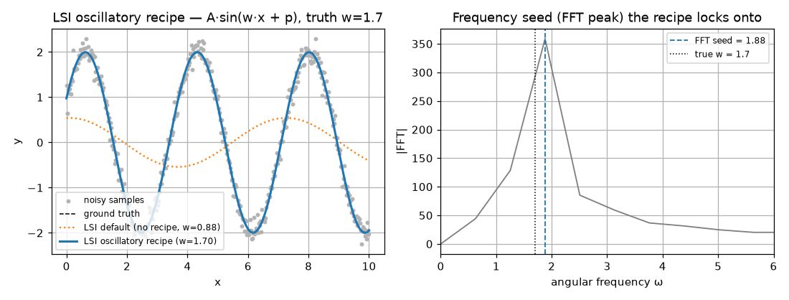
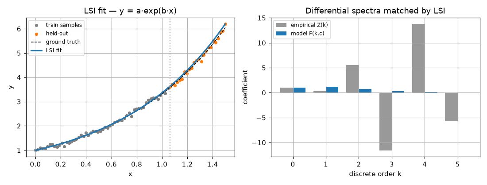
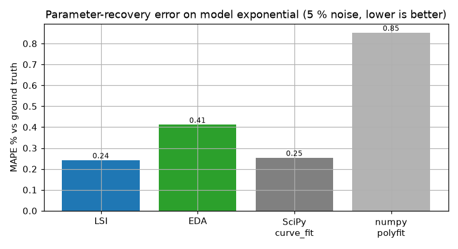

# LSI -- Least-Squares Integral

> Numeric batch method, successor to the symbolic DSBI. Source:
> [`methods/_lsi.py`](https://github.com/ringavirda/science-nonline/blob/main/packages/dtfit/src/dtfit/methods/_lsi.py); the shared
> orthogonal-basis machinery is in
> [`_core/_spectral.py`](https://github.com/ringavirda/science-nonline/blob/main/packages/dtfit/src/dtfit/_core/_spectral.py).
> Invoke via `fit_lsi(x, y, expr, var, ...)`, or
> `NonlineRegressor(..., method="lsi")`.

LSI replaces the **exact** spectra balance of [DSB](Methods-DSB) -- which solves
$F(k;\theta)=Z(k)$ symbolically and is brittle under noise -- with a **weighted
integral least-squares** discrepancy between the empirical and model spectra. It
fits the raw `(x, y)` directly (no symbolic pre-fit) and is the accurate
batch/offline fitter and the natural model-selection tool.

## Mathematical grounding

Consider the function-space $L^2$ reconstruction error over the observation
interval $[0,H]$:

$$
J(\theta) \;=\; \int_{0}^{H}\big[x_{\text{data}}(t) - f(t;\theta)\big]^2\,dt .
$$

Expand both signals in their differential spectra (powers of $t$) and let
$d_k = Z(k) - F(k;\theta)$ be the per-discrete mismatch, so
$x_{\text{data}}(t)-f(t;\theta) \approx \sum_k d_k\,t^{k}$. Then

$$
J(\theta) = \int_{0}^{H}\Big(\sum_k d_k t^{k}\Big)\Big(\sum_j d_j t^{j}\Big)dt
          = \mathbf{d}^{\!\top} M\,\mathbf{d},
\qquad M[k,j] = \frac{H^{\,k+j+1}}{k+j+1}.
$$

This is the integral-OLS normal-equation form. In the **monomial** spectrum $M$ is
a (scaled) Hilbert matrix, whose condition number grows like $(1+\sqrt2)^{4n}$ --
already $\sim10^7$ at order 5 -- and the empirical monomial spectrum from
`numpy.polyfit` is itself an ill-conditioned Vandermonde solve. The original LSI
fought this with an exponential discrete weighting $w_i=e^{-\alpha i}$, which only
mitigates a fundamentally ill-posed basis.

### Reconditioning: an orthogonal-polynomial spectrum

The fix is to change basis. Expand the discrepancy in **Legendre polynomials
$L_j$ on the data interval** instead of monomials. Because the $L_j$ are
*orthogonal*, the Gram matrix is **diagonal**,

$$
\int_{x_0}^{x_N} L_i(u(t))\,L_j(u(t))\,dt = \frac{H}{2j+1}\,\delta_{ij},
\qquad u(t)=\frac{2(t-x_0)}{H}-1,
$$

so the continuous $L^2$ criterion collapses to a perfectly conditioned diagonal
sum of squared coefficient residuals,

$$
J(\theta) \;=\; \sum_{j} \frac{H}{2j+1}\,\big(\beta_j^{\text{data}} - \beta_j^{\text{model}}(\theta)\big)^2 .
$$

The Hilbert matrix is gone. The **empirical** Legendre coefficients
$\beta_j^{\text{data}}$ come from `numpy.polynomial.Legendre.fit` (a
well-conditioned orthogonal-basis least squares, not a raw Vandermonde), and the
**model** coefficients $\beta_j^{\text{model}}(\theta)$ are obtained by
Gauss-Legendre quadrature of the model -- so the model is *integrated exactly*
rather than Taylor-truncated. The $1/(2j+1)$ factor down-weights high orders
intrinsically; an optional `alpha` adds a further $e^{-\alpha j}$ but now
**defaults to 0** -- the orthogonal basis already tames high orders, so the
exponential crutch the original needed is off by default.

Because this is a least-squares relaxation rather than an exact solve, LSI keeps
the differential-transformation structure of DSB while gaining noise tolerance --
at the cost of DSB's closed-form analytic property -- and now does so on a
numerically stable basis.

## Algorithm

1. **Parse** the model `expr`; collect the free parameters $\theta$.
2. **Pre-filter** (optional, default on): Savitzky-Golay smoothing of `y`
   (window <= 11, cubic).
3. **Order**: `k_star` (default 5) or `"auto"` (the Legendre degree minimizing BIC
   of the data fit). The order is floored at `n_params - 1` so the spectral
   residual always carries at least as many equations as parameters -- a
   many-parameter model (e.g. an 8-coefficient Fourier series) stays solvable at
   the default `k_star` instead of yielding an underdetermined least-squares.
4. **Empirical spectrum**: $\beta^{\text{data}}$ = `Legendre.fit(x, y, order).coef`
   on the interval $[x_0,x_N]$.
5. **Model spectrum**: $\beta_j^{\text{model}}(\theta)$ by Gauss-Legendre
   quadrature of the `lambdify`-ed model at fixed nodes (compiled once).
6. **Diagonal weight** $\sqrt{H/(2j+1)\cdot e^{-\alpha j}}$ on the coefficient
   residual $\beta^{\text{data}}-\beta^{\text{model}}(\theta)$.
7. **Solve** the weighted residual:
   - **unbounded**: Levenberg-Marquardt from the supplied/unit start;
   - **bounded** (`bounds=` given): two-stage global search --
     `differential_evolution` then `L-BFGS-B` polish.
8. **Return** the fitted $\theta$, a `lambdify`-ed callable model, and a parameter
   covariance estimate (`FittingResult.cov`) from the residual Jacobian.

## The oscillatory recipe

A smoothed, low-order spectral fit **erases** cycles -- a sinusoid recovers to only
~50 % that way. For oscillatory models LSI applies a validated recipe, switched on
by `oscillatory=True` or by naming the angular-frequency parameter with
`freq_param=`:

- **smoothing off** -- the cycle lives in the high-order spectrum that the
  Savitzky-Golay pre-filter would destroy;
- **order raised** to resolve the dominant cycle -- about $1.4$ cycles over the
  window plus headroom (`_osc_order`), instead of the default 5;
- **frequency seeded** from the data's FFT peak via
  [`fft_frequency_seed`](API-Fitting#fft_frequency_seed) -- the local solve
  cannot lock onto the right cycle without a frequency seed.

With the recipe a sinusoid recovers to **<1 %**. The recipe was validated across
the forecasting and parameter-estimation domain studies (see
[../experimental/](Experimental)).

**Left:** the default (smoothed, low-order) LSI flattens the cycle to a wrong
low-frequency wobble (`w≈0.9`), while the recipe recovers `w=1.70` and overlays
the truth. **Right:** the FFT peak the recipe seeds the frequency from.

## Pluggable basis (generalization)

The LSI derivation needs only that the basis be **orthogonal** on the interval --
nothing is special about Legendre. The shared machinery
([`_core/_spectral.py`](https://github.com/ringavirda/science-nonline/blob/main/packages/dtfit/src/dtfit/_core/_spectral.py))
exposes the same diagonal-weighted spectral match on a choice of basis:

| basis | natural for | orthogonality weight used |
|---|---|---|
| **Legendre** (default) | smooth bulk shapes | $H/(2j+1)$ |
| **Chebyshev** | endpoints emphasized | $T_j$ weight |
| **Fourier** | periodic / seasonal signals (a wiggle is 2-3 harmonics, not many polynomial orders) | $P,\ P/2$ |
| **Laguerre** | decays / transients on $[0,\infty)$ | $e^{-u}$ |

`fit_lsi` hard-codes Legendre; the pluggable form is `fit_lsi_basis` (experimental,
see [../experimental/adaptations-api.md](Experimental-Adaptations-API)), and
the **same** machinery powers the scale backends ([scaling.md](Methods-Scaling)) -- where
the empirical coefficient $\beta_j = (2j+1)/H\cdot\int y\,P_j\,dx$ is used in its
**additive integral** form $\int y\,P_j\,dx$, which sums across a domain partition.

## Optimizations and guards

- **Orthogonal (Legendre) basis** -- the integral criterion becomes a diagonal,
  perfectly conditioned sum of squares; no Hilbert matrix, no Cholesky.
- **Conditioned empirical spectrum** -- `Legendre.fit` replaces the raw
  `numpy.polyfit` Vandermonde.
- **Exact model integration** -- Gauss-Legendre quadrature of the model (compiled
  once via the native `legendre_project` kernel, NumPy fallback).
- **Two-stage global optimization** with bounds (`differential_evolution` ->
  `L-BFGS-B`) escapes the local minima that plague exponential/transcendental
  fits; without bounds, LM from the supplied/unit start.
- **Automatic order selection** (`k_star="auto"`) by BIC; the oscillatory recipe
  raises the order to resolve a cycle.
- **Non-finite guard** -- a parameter vector producing non-finite spectra is
  penalized (`1e6` residual) rather than crashing the solver.

## Worked example

`y = a.exp(b.x)` (truth `a=1.0, b=1.2`), 5 % noise, fit on the first 70 %, the rest
held out. **Left:** LSI recovers the exponential and extrapolates onto the
held-out tail. **Right:** the differential spectra LSI balances -- the empirical
high-order discretes ($k\ge3$) blow up under noise while the model discretes stay
small; the orthonormal weighting keeps the low-order match dominant.

## Comparison

**Model data -- `y = a.exp(b.x)`, ground truth a=1.0, b=1.2, 5 % noise, n=80.**
Error is against the *clean* signal (true parameter recovery).

| method | recovered params | R^2 | RMSE | MAPE % | fit (ms) |
|---|---|---|---|---|---|
| **LSI** | a=1.000, b=1.203 | 0.9999 | 0.01133 | 0.24 | 15.3 |
| EDA | a=1.002, b=1.203 | 0.9999 | 0.01641 | 0.41 | 3.4 |
| SciPy `curve_fit` | a=1.000, b=1.204 | 0.9999 | 0.01305 | 0.25 | 0.1 |
| numpy.polyfit (deg 5) | -- | 0.9997 | 0.02302 | 0.85 | 0.1 |

**Real data -- COVID-19 Ukraine** (cumulative confirmed, 28-day take-off,
548->8617 cases), exponential `y = a.exp(b.t)`:

| method | R^2 | RMSE | MAPE % |
|---|---|---|---|
| **LSI** | 0.9877 | 275.1 | 13.00 |
| EDA | 0.8506 | 960.1 | 9.39 |
| SciPy `curve_fit` | 0.9879 | 273.5 | 13.34 |

LSI lands within a few percent of the NLS gold standard on model data and tracks
the real growth curve at single-digit MAPE. Unlike `polyfit`, LSI returns
interpretable model parameters $(a,b)$, not opaque polynomial coefficients.

## Where it is best applied

**Use LSI for:** accurate **batch / periodic-refit** fitting of models nonlinear
in their parameters (exponential, transcendental, mixed) on noisy real data,
especially when you want a global search over bounded parameters, an oscillatory
fit, or interpretable coefficients. It is the accuracy tier of the batch methods
and the model-selection workhorse (its BIC/order machinery underlies
[`suggest_models`](API-Models)).

**Caveats.** The empirical spectrum is a Maclaurin-type fit, so LSI needs a
**modest dynamic range** -- normalize a wide domain (e.g. to `[0, 1.5]`) and scale
the series to O(1) before fitting. For real-time/streaming use the
[LSIFilter](Methods-Legendre-Filter) / [EDAFilter](Methods-Equal-Areas-Filter); for the most
noise-robust batch fit with few parameters, [EDA](Methods-EDA); at scale (one-pass,
distributed, or many-channel), the [partitioned / batched backends](Methods-Scaling).
