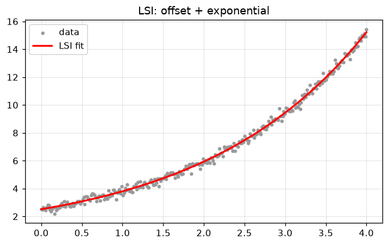
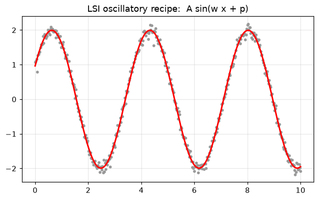
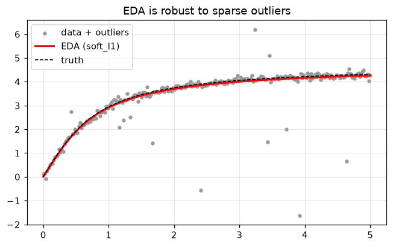
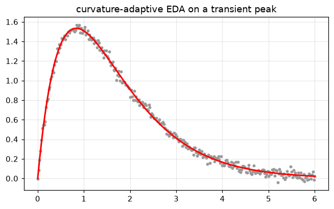
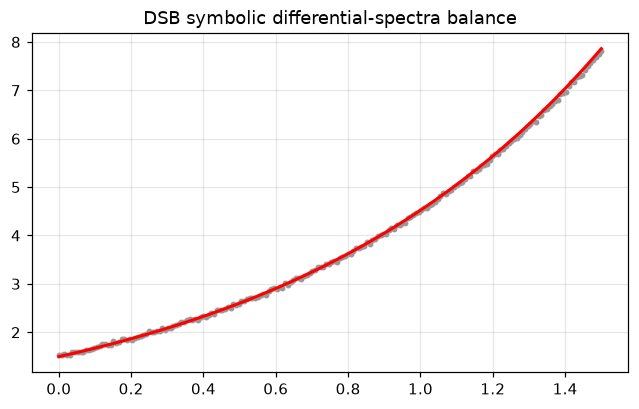

# Fitting methods - LSI, EDA, DSB

Three differential-transformation batch fitters, each with a different
*measurement* of "fit":

- **LSI** (`fit_lsi`) - integral least-squares in a reconditioned **Legendre
  spectrum**. The general default; strong on smooth bulk shapes and (with the
  oscillatory recipe) cycles.
- **EDA** (`fit_eda`, `fit_eda_adaptive`) - **equal-areas** integral matching
  over windows. Strong on transients, peaks and saturating shapes; supports
  robust losses for outliers.
- **DSB** (`fit_dsb`) - symbolic **differential-spectra balance** against a
  polynomial pre-fit; an analytical reference method.

All three return a `FittingResult`.


```python
%matplotlib inline
import warnings
import numpy as np
import matplotlib.pyplot as plt

# Fitting at extreme parameter trials can overflow exp() harmlessly; keep the
# guide output clean.
warnings.filterwarnings("ignore", category=RuntimeWarning)

plt.rcParams["figure.figsize"] = (7, 4)
plt.rcParams["figure.dpi"] = 110
plt.rcParams["axes.grid"] = True
plt.rcParams["grid.alpha"] = 0.3
rng = np.random.default_rng(0)
```

## LSI - `fit_lsi`

`k_star` sets the Legendre spectral order matched against the data.


```python
from dtfit import fit_lsi

x = np.linspace(0, 4, 300)
y = 0.5 + 2.0 * np.exp(0.5 * x) + rng.normal(0, 0.2, x.size)

res = fit_lsi(x, y, "a0 + a1*exp(a2*x)", "x", k_star=6)
print(res.summary())

plt.scatter(x, y, s=8, color="0.6", label="data")
plt.plot(x, res.predict(x), "r-", lw=2, label="LSI fit")
plt.legend(); plt.title("LSI: offset + exponential"); plt.show()
```

    FittingResult: a0 + a1*exp(a2*x)
      a0 = 0.519306 +/- 0.067
      a1 = 1.99565 +/- 0.0486
      a2 = 0.499252 +/- 0.00537
    


    

    


### The oscillatory recipe

A smoothed, low-order spectral fit *erases* cycles. For oscillatory models pass
`freq_param` (its initial guess is seeded from the data's FFT peak via
`fft_frequency_seed`) - this implies the oscillatory recipe (no smoothing, order
raised to resolve the cycle).


```python
from dtfit import fft_frequency_seed

xs = np.linspace(0, 10, 400)
y = 2.0 * np.sin(1.7 * xs + 0.5) + rng.normal(0, 0.10, xs.size)

print("FFT frequency seed:", round(fft_frequency_seed(xs, y), 4))
res = fit_lsi(xs, y, "A*sin(w*x + p)", "x", freq_param="w")
print("recovered:", {k: round(v, 3) for k, v in res.params.items()})

plt.scatter(xs, y, s=8, color="0.6")
plt.plot(xs, res.predict(xs), "r-", lw=2)
plt.title("LSI oscillatory recipe:  A sin(w x + p)"); plt.show()
```

    FFT frequency seed: 1.8802
    recovered: {'A': 1.992, 'p': 0.505, 'w': 1.699}
    


    

    


## EDA - `fit_eda` / `fit_eda_adaptive`

Equal-areas matches *integrals* over windows, so it naturally averages over
sparse outliers. For extra protection, `loss="soft_l1"` down-weights windows an
outlier has contaminated - but note this acts at the **window** level, so it
only bites with *enough windows* (so each outlier stays localized to a few) and
an `f_scale` set near the size of a clean window's area residual; the default
`f_scale=1.0` dwarfs those residuals and silently degrades to `linear`. The
**adaptive** variant places window edges by curvature - narrow where the signal
bends, wide where it is smooth - which suits localized transients and peaks.


```python
from dtfit import fit_eda

x = np.linspace(0, 5, 250)
y = 3.0 * np.arctan(1.5 * x) + rng.normal(0, 0.1, x.size)   # truth: a=3, w=1.5
y_out = y.copy()
idx = rng.choice(x.size, 12, replace=False)
y_out[idx] += rng.normal(0, 3.0, 12)                        # scattered outliers

# Fit over the full curve -- the arctan asymptote (i.e. `a`) lives in the tail,
# so don't clip it with active_ratio -- and split into many windows so each
# outlier stays localized to a few of them. The robust loss then down-weights
# the contaminated windows; `f_scale` is set near a clean window's area residual
# (the default 1.0 dwarfs them and leaves soft_l1 in its quadratic == linear regime).
common = dict(active_ratio=1.0, n_windows=60)
lin = fit_eda(x, y_out, "a*atan(w*x)", "x", loss="linear", **common)
res = fit_eda(x, y_out, "a*atan(w*x)", "x", loss="soft_l1", f_scale=0.05, **common)
print("truth   : {'a': 3.0, 'w': 1.5}")
print("linear  :", {k: round(v, 3) for k, v in lin.params.items()})
print("soft_l1 :", {k: round(v, 3) for k, v in res.params.items()})

plt.scatter(x, y_out, s=10, color="0.6", label="data + outliers")
plt.plot(x, res.predict(x), "r-", lw=2, label="EDA (soft_l1)")
plt.plot(x, 3.0 * np.arctan(1.5 * x), "k--", lw=1, label="truth")
plt.legend(); plt.title("EDA is robust to sparse outliers"); plt.show()
```

    truth   : {'a': 3.0, 'w': 1.5}
    linear  : {'a': 2.952, 'w': 1.512}
    soft_l1 : {'a': 2.961, 'w': 1.501}
    


    

    


```python
from dtfit import fit_eda_adaptive

x = np.linspace(0, 6, 300)
y = 5.0 * x * np.exp(-1.2 * x) + rng.normal(0, 0.03, x.size)   # rise-then-decay peak

res = fit_eda_adaptive(x, y, "a*x*exp(-b*x)", "x", window_mode="curvature")
print("params:", {k: round(v, 3) for k, v in res.params.items()})

plt.scatter(x, y, s=8, color="0.6")
plt.plot(x, res.predict(x), "r-", lw=2)
plt.title("curvature-adaptive EDA on a transient peak"); plt.show()
```

    params: {'a': 4.998, 'b': 1.199}
    


    

    


## DSB - `fit_dsb`

DSB equates the model's Maclaurin spectrum to a polynomial pre-fit's, order by
order. Build the **ascending** polynomial coefficients (the data's Taylor
spectrum) with `find_degree` + `np.polyfit`, then balance. (`NonlineRegressor`
with `method="dsb"` runs this pre-fit for you - notebook 04.)


```python
from dtfit import fit_dsb, find_degree

x = np.linspace(0, 1.5, 200)
y = 1.5 * np.exp(1.1 * x) + rng.normal(0, 0.02, x.size)    # truth: a=1.5, b=1.1

deg = find_degree(x, y)                  # BIC-selected polynomial degree
pc = np.polyfit(x, y, deg)[::-1]         # ascending coeffs = data Maclaurin spectrum
res = fit_dsb(pc, "a*exp(b*x)", "x")
print("polynomial degree:", deg)
print(res.summary())                     # recovers a~1.5, b~1.1

plt.scatter(x, y, s=8, color="0.6")
plt.plot(x, res.predict(x), "r-", lw=2)
plt.title("DSB symbolic differential-spectra balance"); plt.show()
```

    polynomial degree: 4
    FittingResult: a*exp(b*x)
      a = 1.4956 +/- 0.139
      b = 1.10634 +/- 0.0931
    


    

    


## Comparing fits

`fit_report` turns any `FittingResult` into r^2 / RMSE / AIC / BIC (notebook 07).


```python
from dtfit import fit_eda
from dtfit.diagnostics import fit_report

x = np.linspace(0, 3, 200)
y = 1.4 * np.exp(0.8 * x) + rng.normal(0, 0.15, x.size)
for name, r in [("LSI", fit_lsi(x, y, "a*exp(b*x)", "x")),
                ("EDA", fit_eda(x, y, "a*exp(b*x)", "x"))]:
    rep = fit_report(r, x, y)
    print(f"{name}:  r2={rep['r2']:.4f}   rmse={rep['rmse']:.4f}   aic={rep['aic']:.1f}")
```

    LSI:  r2=0.9985   rmse=0.1513   aic=-751.4
    EDA:  r2=0.9985   rmse=0.1515   aic=-750.9
